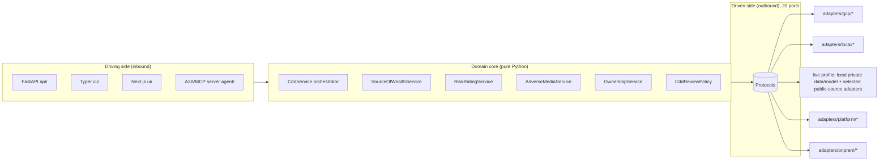
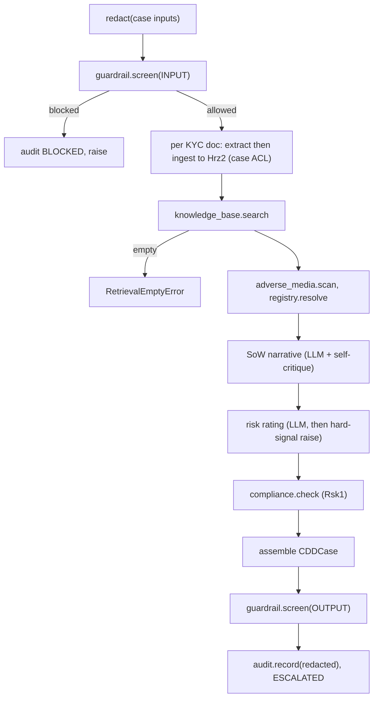
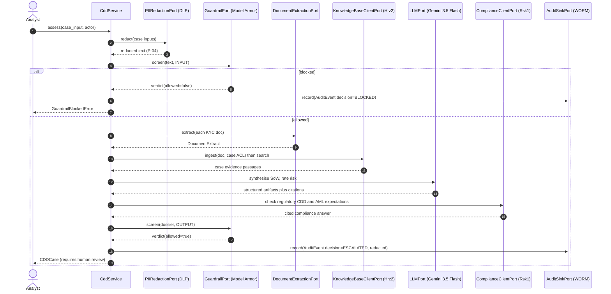
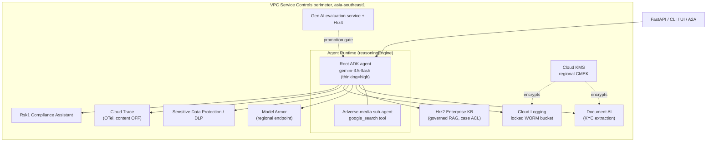
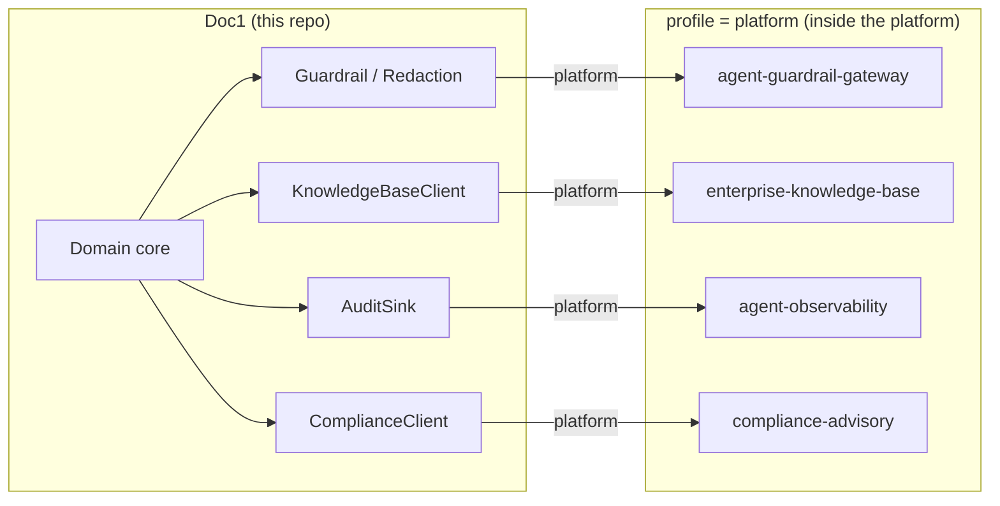

# Architecture: Doc1 CDD + Source-of-Wealth Agent

This document goes deeper than the [README](README.md): the complete port to adapter
table, the assessment pipeline as a sequence diagram, the runtime topology on Agent
Runtime, the relationship to the platform dependencies, and two reusable principle
catalogues (§6 portability, §7 security) written so other projects can lift the
patterns: each principle states the rule generically, how this repo implements it, and
the command that proves it.

The contract layer is authoritative: see [`SPEC.md`](SPEC.md). This file describes how the
pieces fit together; it does not redefine them.

---

## 1. Hexagonal overview

Doc1 is a **ports-and-adapters** (hexagonal) application. The domain core in
[`src/cdd_sow_research/domain/`](src/cdd_sow_research/domain/) owns all orchestration and has
**no** dependency on Google Cloud, ADK, FastAPI, or any framework (only the Python standard
library). Everything the domain needs from the outside world is a `typing.Protocol`
**port**; concrete **adapters** are bound to ports by dotted path in
[`config/settings.yaml`](config/settings.yaml) and instantiated lazily by the `Container`.



The `Container` selects one exact runtime map
(`gcp` | `local` | `live` | `platform` | `onprem`) and one independent exact identity
binding. Every runtime/data port has an explicit entry; neither selector falls back to a
generic managed binding. Because every adapter constructor is
`def __init__(self, settings: Settings) -> None` and **all** Google Cloud SDK imports are
**lazy**, the local/onprem/test profile imports and runs with **no GCP SDK installed**.
The `local` family is a WORKING offline stack (SQLite FTS5 retrieval, a deterministic
schema-driven LLM, a heuristic guardrail, regex DLP, a hash-chained append-only SQLite
audit with JSONL export/restore via `cdd-sow audit`), so the whole pipeline runs end to
end on a laptop with no Google Cloud, no API key and no emulators; `onprem` is the
fail-fast sovereign migration target. Parity is tested two ways: structurally (every
adapter satisfies its Protocol) and behaviorally
(`tests/contract/test_behavioral_parity.py` puts the same request through the local
in-process adapter, the platform HTTP client and the onprem placeholder).

### 1.1 Kernel vs vertical (the fork boundary inside `domain/`)

The domain models are split into a reusable kernel and a CDD vertical, so a team building
a different document-diligence product (credit memos, claims, trade finance) knows exactly
what it keeps and what it rewrites:

| Layer | Files | A fork... |
|---|---|---|
| **Kernel** (vertical-neutral) | [`domain/kernel.py`](src/cdd_sow_research/domain/kernel.py) (citations/provenance, LLM envelope, guardrail/redaction, WORM `AuditEvent`, `EvalReport`, `AgentCard`, `Severity`), [`domain/serialization.py`](src/cdd_sow_research/domain/serialization.py), [`domain/value_bands.py`](src/cdd_sow_research/domain/value_bands.py), the deterministic engine mechanics in `gap_analysis.py` / `source_of_funds_service.py` | keeps untouched |
| **Policy** (bank-owned numbers) | [`domain/policy.py`](src/cdd_sow_research/domain/policy.py) dataclasses, populated from the `policy:` section of [`config/settings.yaml`](config/settings.yaml) (tolerances, scorecard weights and tables, FATF country lists, review cadences, escalation bands) | overrides via configuration, never code |
| **Vertical** (CDD/SoW artifacts) | [`domain/models.py`](src/cdd_sow_research/domain/models.py) (dossier, SoW case, screening, scorecard, SoF, monitoring artifacts), the narrating services, [`domain/prompts.py`](src/cdd_sow_research/domain/prompts.py), local-profile fixtures, eval golden sets | rewrites for its own artifacts |

Two mechanics make the boundary real:

- **Open taxonomy axis.** `WealthSourceKind`, `FundsOriginKind` and `DocType` are
  `enum.StrEnum` reference vocabularies (members ARE their string values), and the
  reconciliation/gap engines are typed on plain `str` kinds. A deployment adds kinds via
  the policy tables (e.g. `policy.gap.mandatory_docs`) without touching engine code;
  serialized JSON values are unchanged either way.
- **Policy as configuration.** Every threshold a compliance function tunes lives in
  `domain/policy.py` with defaults equal to the historical constants, is parsed from
  `settings.yaml` by `config.py`, and reaches the engines via `from_policy(...)`
  constructors threaded through `api/deps.py`. `tests/unit/test_risk_policy.py` proves
  the defaults reproduce the reference behavior and that overrides change outcomes.

Backward compatibility: `models.py` re-exports every kernel name, so
`from cdd_sow_research.domain.models import Citation` keeps working across the 50+ modules
that import it.

---

## 2. The 21 ports to adapter table

Every port is an `@runtime_checkable` `Protocol` under
[`src/cdd_sow_research/ports/`](src/cdd_sow_research/ports/). The `gcp` column is the primary
managed-service adapter; the `local` column is the SDK-free offline implementation; the
`platform` column (where present) is a thin HTTP client to a sibling service; the `onprem`
column is a placeholder stub that constructs cleanly and satisfies the Protocol but raises
`NotImplementedError` (the migration target is a sovereign platform, no third-party product
is named). Under `local` the platform-client ports use in-process implementations, not HTTP
to siblings.

| # | Port (`Protocol`) | Concern | `gcp` adapter | `local` adapter | `platform` adapter | `onprem` placeholder |
|---|-------------------|---------|---------------|-----------------|--------------------|----------------------|
| 1 | `DocumentExtractionPort` | KYC extraction | `gcp.document_ai_extraction` | `local.extraction` (plain-text / pypdf) | n/a | `onprem.extraction` |
| 2 | `KnowledgeBaseClientPort` | Governed RAG (Hrz2, R3) | `gcp.agent_search_kb` | `local.knowledge_base` (SQLite FTS5) | `platform.remote_knowledge_base` | `onprem.knowledge_base` |
| 3 | `DocumentStorePort` | Uploaded evidence custody, plus `restore` for bundle reload (P-12) | `gcp.document_store` (regional CMEK GCS) | `local.document_store` (SQLite blobs) | `gcp.document_store` (explicit reuse) | `onprem.document_store` |
| 4 | `AdverseMediaPort` | Adverse media | `gcp.gemini_adverse_media` | `local.adverse_media` (egress off) | n/a | `onprem.adverse_media` |
| 5 | `CorporateRegistryPort` | UBO / ownership | `gcp.registry_lookup` | `local.registry` (deterministic UBO) | n/a | `onprem.registry` |
| 6 | `ComplianceClientPort` | Regulatory check (Rsk1) | n/a | `local.compliance` (in-process) | `platform.remote_compliance` | `onprem.compliance` |
| 7 | `LLMPort` | Reasoning / triage | `gcp.gemini_llm` | `local.llm` (deterministic schema-driven) | n/a | `onprem.llm` |
| 8 | `GuardrailPort` | Screening (Hrz1, R1) | `gcp.model_armor_guardrail` | `local.guardrail` (heuristic) | `platform.remote_guardrail` | `onprem.guardrail` |
| 9 | `PIIRedactionPort` | PII redaction (Hrz1, R1) | `gcp.dlp_redaction` | `local.redaction` (regex) | `platform.remote_redaction` | `onprem.redaction` |
| 10 | `AuditSinkPort` | WORM audit (Hrz5, R2) | `gcp.cloud_logging_audit` | `local.audit` (hash-chained append-only SQLite) | `platform.remote_audit` | `onprem.audit` |
| 11 | `ReviewRouterPort` | Maker-checker routing (Hrz7, R8) | `gcp.review_router` | `local.review_router` | `gcp.review_router` (reused) | `onprem.review_router` |
| 12 | `ObservabilityTracerPort` | Tracing + FinOps | `gcp.cloud_trace_tracer` | `local.tracer` (no-op) | `platform.otlp_tracer` (OTLP to the Hrz5 collector, Cloud Trace fallback) | `onprem.tracer` |
| 13 | `EvaluationGatePort` | Eval gate (Hrz4, R5) | `gcp.genai_eval` | `local.evaluation` (offline gate) | `platform.remote_evaluation` | `onprem.evaluation` |
| 14 | `AgentRegistryPort` | A2A registry (Hrz3, R4) | `gcp.a2a_registry` | `local.registry_agent` (in-process) | `platform.remote_registry` | `onprem.registry_agent` |
| 15 | `ToolCatalogPort` | Governed MCP tools (Hrz3) | `gcp.mcp_tool_catalog` | `local.tool_catalog` (in-process) | n/a (no Hrz3 tools contract) | `onprem.tool_catalog` |
| 16 | `CaseStorePort` | Durable long-running SoW cases | `gcp.firestore_case_store` (regional CMEK Firestore) | `local.case_store` (in-process) | `gcp.firestore_case_store` (vertical-owned) | `onprem.case_store` |
| 17 | `SanctionsListProviderPort` | Sanctions/PEP/watchlist snapshot | `gcp.sanctions_provider` (synced CMEK bucket) | `local.sanctions_provider` (bundled snapshot) | `gcp.sanctions_provider` (explicit reuse) | `onprem.sanctions_provider` |
| 18 | `BrowserFlowStorePort` | Citation continuation and Mode 5 grant state | `gcp.firestore_browser_flow_store` (regional transactional Firestore) | `local.browser_flow_store` (transactional SQLite) | `gcp.firestore_browser_flow_store` (vertical-owned shared state) | `onprem.browser_flow_store` |
| 19 | `MonitoringStorePort` | Perpetual-KYC baselines + review queue | `gcp.monitoring_store` (regional CMEK Firestore) | `local.monitoring_store` (in-process, ACL-enforced) | `gcp.monitoring_store` (vertical-owned) | `onprem.monitoring_store` |
| 20 | `OwnershipGraphPort` | ONE cited registry hop for the UBO-graph walk (traversal stays in the engine) | `gcp.ownership_graph` (grounded one-hop lookup) | `local.ownership_graph` (fictional multi-jurisdiction fixture) | `gcp.ownership_graph` (explicit reuse) | `onprem.ownership_graph` |
| 21 | `IdentityPort` | End-user identity (authn) | `gcp.iap_identity` (verify IAP assertion) | `local.identity` (seeded dev persona) | `gcp.iap_identity` (explicit reuse) | `onprem.identity` |

> Dotted paths are relative to the `cdd_sow_research.adapters` package; the fully-qualified
> bindings in [`config/settings.yaml`](config/settings.yaml) under `adapters:` are the build
> contract (module paths and class names there are fixed). Seven ports have a sibling-service
> `platform` adapter, matching the platform services Doc1 consumes (Hrz1 x2, Hrz2, Hrz5, Hrz4,
> Rsk1, Hrz3); `IdentityPort` additionally has a `platform` binding that reuses the gcp IAP adapter.

---

## 3. The assessment pipeline

The `CddService` orchestrator owns the pipeline and calls only ports. Because the dossier
handles customer PII (rule R1), the full safety pipeline runs (redact, then screen both
directions). As a flowchart:



> All steps wrapped in `tracer.span`.

As a sequence:



Key invariants:
- **Redact before everything**: customer PII never reaches the model, the Hrz2 index, a trace
  span, or the WORM sink (P-04, R1). The `AuditEvent` stores `redacted_prompt` and
  `redacted_response`.
- **Both directions screened**: INPUT before ingest/retrieval, OUTPUT before return (Hrz1).
- **Hard signals raise the band**: a sanctions or terrorism adverse-media hit forces
  PROHIBITED, a PEP owner forces at least HIGH; the model can never soften them.
- **Always reviewed**: the dossier is consequential, so `requires_human_review` is always
  true and the audit decision is ESCALATED (P-06).

---

## 4. Runtime topology on Agent Runtime

In the `gcp` profile, the ADK agent is hosted on **Agent Runtime** (a `reasoningEngine`
resource) inside a VPC-SC perimeter in `asia-southeast1`. The `google_search` adverse-media
tool lives in its **own sub-agent** because only one built-in tool is allowed per agent.



- **One region for everything** (`asia-southeast1`); regional endpoints plus per-service
  CMEK give the residency guarantee a global endpoint would not.
- **The governed RAG store is Hrz2**, not a Doc1-owned backend; case documents are ingested with
  `case:<subject_id>` ACL tags and retrieved only by case principals (R3).
- **Eval gate** is a promotion-time check, not an inline request dependency.

---

## 5. Dependency relationship to the platform

Doc1 (catalog **Doc1**, group `doc`) exercises the whole platform. The dependency rules R1..R6
require that those concerns are consumed from the platform when present rather than
re-implemented. Doc1 satisfies this two ways without changing the domain: the `gcp` adapters
call managed services directly (standalone), and the `platform` adapters delegate over HTTP.



| Dependency | Repo | Backs Doc1 ports | HTTP contract (SPEC §6) |
|------------|------|----------------|-------------------------|
| **Hrz1** Guardrail Gateway | `agent-guardrail-gateway` | `GuardrailPort`, `PIIRedactionPort` | `POST /v1/guardrail/screen`, `POST /v1/redact` |
| **Hrz2** Enterprise KB | `enterprise-knowledge-base` | `KnowledgeBaseClientPort` | `POST /v1/ingest`, `POST /v1/search` |
| **Hrz3** Registry | `agent-registry` | `AgentRegistryPort` | `POST/GET /v1/agents` |
| **Hrz4** AI Quality | `model-quality-gate` | `EvaluationGatePort` | `POST /v1/evaluations`, `POST /v1/gate` (both `{target, dataset_id, bundle: "doc1-cdd-sow"}`) |
| **Hrz5** Observability/Audit | `agent-observability` | `AuditSinkPort` | `POST /v1/audit` |
| **Rsk1** Compliance Assistant | `compliance-advisory` | `ComplianceClientPort` | `POST /ask` |

The sibling-backed `platform` adapters are thin HTTP clients whose JSON field names mirror
the domain dataclasses exactly (enums as strings). Other platform ports use explicit managed,
vertical-owned, disabled, or placeholder bindings. There is no implicit fallback, so swapping
a direct adapter for a remote client remains a configuration change, never a domain change.

---

## 6. Portability principles (a reusable catalogue)

The target is to convert lock-in from an open-ended exposure into a priced, controlled risk.
It has to hold at three layers: **compute** (where the decision logic runs), **data** (records,
evidence, audit trails), and **experience/identity** (where users reach the system and how they
sign in). Each principle below states the target and then separates the implemented mechanism
from its proof. The current offline script covers the runtime seam, local identity, and audit
properties only:

```bash
PYTHONPATH=src python scripts/portability_demo.py    # exit 0 only if its named checks hold
```

### 6.1 Compute layer

| # | Principle (generic) | Mechanism in this repo | Proof |
|---|---------------------|------------------------|-------|
| PT-1 | **Pure decision core.** The domain imports nothing from any vendor: no cloud SDK, no web framework, not even the config parser. Everything external is a narrow interface. | [`domain/`](src/cdd_sow_research/domain/) is stdlib-only; the 19 interfaces live in [`ports/`](src/cdd_sow_research/ports/) as `@runtime_checkable typing.Protocol`s. | `grep -rE "google|fastapi|httpx|pydantic|yaml" src/cdd_sow_research/domain/` returns nothing. |
| PT-2 | **One construction convention, config-driven binding.** Every adapter is built the same way from one settings object, and the port-to-adapter wiring is data (a config file), not code. Swapping vendors is an edit to config, reviewable in a diff. | `Adapter(settings: Settings)` for all 40+ adapters; dotted-path bindings under `adapters:` in [`config/settings.yaml`](config/settings.yaml); the `Container` resolves them lazily, one `cached_property` per port. | `tests/contract/test_port_parity.py::test_adapter_constructs_with_single_settings_arg` |
| PT-3 | **Runtime binding is config-driven, and identity is an independent axis.** A runtime profile selects a coherent adapter family; offline and sovereign profiles must never silently fall back to managed adapters. Identity must be selected separately so a sign-in choice cannot change compute or data custody. | `CDD_PROFILE`, `CDD_IDENTITY_PROFILE`, and `CDD_CHANNEL_PROFILE` are independent exact selectors. Every runtime/data port and enabled identity mode has an explicit binding; missing or invalid combinations fail startup. | Configuration and parity tests cover the exact maps; the full Modes 4/5 synthetic gate covers valid channel/identity combinations. |
| PT-4 | **Vendor imports are lazy.** SDK imports live inside methods or `TYPE_CHECKING`, never at module top level, so every module imports on a machine with no vendor packages installed. | All `adapters/gcp/*` and `agent/*` imports are in-method; the GCP SDKs live in the optional `[gcp]` extra. | The whole gate runs in a venv with only `[dev]` installed (CI does exactly this). |
| PT-5 | **The offline profile WORKS: it is not a mock.** Ship a real, deterministic, in-process implementation of every port (embedded index, schema-driven LLM stand-in, heuristic guardrail, regex redaction, chained audit). Make it the default for dev, tests and CI so it can never rot. | The `local` family: SQLite FTS5 KB, deterministic LLM, heuristic guardrail, regex DLP, hash-chained SQLite audit. `local` is the adapter family an unset `CDD_PROFILE` binds, so the offline stack always starts; naming it is still required to get the dev relaxations. | `cdd-sow assess "Acme Holdings Pte Ltd (FICTIONAL)" --type entity` prints a cited dossier with no cloud. |
| PT-6 | **The exit target exists on day one, as a fail-fast placeholder.** Stubs construct cleanly and satisfy every interface. Consequential operations raise on use; explicitly reviewed optional ports may return safe defaults. Interface drift breaks CI, and nothing consequential silently returns a fabricated answer. | `adapters/onprem/*` use `NotImplementedError` for consequential work; the CLI maps it to exit 2 with the migration note. The optional tracer is a no-op and adverse-media search models an air-gapped empty result. [`docs/onprem-migration.md`](docs/onprem-migration.md) is the checklist. | `pytest tests/contract -q` |
| PT-7 | **Parity is tested behaviorally, not just structurally.** "Implements the interface" is weak; put the *same request* through every implementation and require identical behavior at the boundary (same domain objects, same verdicts, byte-identical audit payloads, fail-fast where documented). | [`tests/contract/test_behavioral_parity.py`](tests/contract/test_behavioral_parity.py): local in-process vs platform HTTP client (sibling mocked at the documented SPEC §6 contract) vs onprem placeholder, for redaction, guardrail, audit and retrieval. | `pytest tests/contract/test_behavioral_parity.py -q` |

### 6.2 Data layer (where switching cost compounds)

| # | Principle (generic) | Mechanism in this repo | Proof |
|---|---------------------|------------------------|-------|
| PT-8 | **Logical records are separated from physical stores.** The domain owns plain, framework-free record types; serialization to/from an open format is a documented, deliberate function, not an ORM side effect. | Frozen stdlib dataclasses in [`domain/models.py`](src/cdd_sow_research/domain/models.py); `to_jsonable` / `audit_event_from_jsonable` in [`domain/serialization.py`](src/cdd_sow_research/domain/serialization.py). | `tests/unit/test_audit_chain.py::test_audit_event_jsonable_round_trip` |
| PT-9 | **Search indexes are derived assets**: expensive to compute, cheap to recompute. Never let the index be the only home of the evidence; re-ingesting sources into a new backend must rebuild it. | Case documents are ingested *into* the KB port from source bytes; the local FTS5 index self-seeds and rebuilds from the same ingest call that Agent Search receives. | The KB parity test ingests the same document into two implementations and gets the same passages back. |
| PT-10 | **The audit trail must survive (and prove) the move.** Append-only, every entry cryptographically chained to its predecessor, stored and exported in a plain documented format, with a verified export/reload round-trip. Round-trip verification is what upgrades "we can export" from a claim to a capability. | `entry_hash = SHA-256(prev_hash \|\| record)` in [`adapters/local/audit.py`](src/cdd_sow_research/adapters/local/audit.py); `cdd-sow audit verify\|export\|restore` (JSON Lines; restore re-verifies every link). Under `gcp` the locked WORM bucket plus Cloud Logging export APIs give the managed equivalent. | `pytest tests/unit/test_audit_chain.py -q`; Acts 3-4 of the tour doctor a record (caught) and reload the export on a fresh store (chain intact). |

### 6.3 Experience / identity layer

| # | Principle (generic) | Mechanism in this repo | Proof |
|---|---------------------|------------------------|-------|
| PT-11 | **Identity is verified on the system's own side**, from a cryptographically signed credential, never trusted from the host application, and the verification regime is itself an adapter: dev personas offline, platform-injected assertion in managed mode, standard OIDC federation for any external IdP. | Exact identity modes cover seeded personas, IAP, Mode 6 OIDC sessions, Mode 4 OAuth access tokens, Mode 5 embedded grants, and the on-premises placeholder. Token types keep separate issuers, audiences, claims, and verifiers. | Local/IAP/OIDC unit tests plus the full synthetic Modes 4/5 gate prove RSA and EC issuers, rotation, negative boundaries, and leak-free browser chains. Named production registrations remain separate. |
| PT-12 | **Every UI integration tier stays open**: native integration, isolated embed, and standalone access, so the capability is not welded to one host application. | Native, isolated Mode 4 direct-token, isolated Mode 5 brokered-PKCE, and standalone flows are implemented. Both isolated modes use a dedicated agent origin and same-origin iframe/API, so parent-to-agent API CORS is not the integration mechanism. Reusable production images, Firestore state, KMS signing and embed-compatible edge Terraform are implemented. Named DNS/IdP/BFF registrations, origins/CSP, target-host evidence and the separately deployed IAP-protected Mode 6 edge remain open. | The full local synthetic gate passes Chromium, Firefox, and WebKit. See [`docs/embedding-and-identity.md`](docs/embedding-and-identity.md), [`docs/named-production-deployment-dossier.md`](docs/named-production-deployment-dossier.md) and [`docs/embedding-implementation-plan.md`](docs/embedding-implementation-plan.md). |

### 6.4 Infrastructure as a replaceable input

| # | Principle (generic) | Mechanism in this repo | Proof |
|---|---------------------|------------------------|-------|
| PT-13 | **Infra names and postures are variables, not literals.** A second enterprise (or a second instance in the same project) must be a `tfvars` file, not a fork: name prefix, region from an allowlist, and explicit toggles for the org-level and irreversible pieces. | [`infra/terraform/variables.tf`](infra/terraform/variables.tf) + [`naming.tf`](infra/terraform/naming.tf): `name_prefix`, `region`/`allowed_regions`, `enable_vpc_sc`, `enable_org_policies`, `worm_locked`; three worked scenarios in [`terraform.tfvars.example`](infra/terraform/terraform.tfvars.example). | `terraform -chdir=infra/terraform validate`; CI runs fmt + validate. |
| PT-14 | **Outputs are the contract between infra and app.** Every Terraform output names the exact environment variable the app reads, and the app's config resolves those variables with safe defaults, so "deploy" is apply-then-export, never editing code. | [`outputs.tf`](infra/terraform/outputs.tf) descriptions carry the `CDD_*` names; [`config/settings.yaml`](config/settings.yaml) reads `${CDD_...:-default}` tokens (with real type coercion for booleans in `config.py`). | [`docs/runbook.md`](docs/runbook.md) §1 is a copy-paste export block. |

---

## 7. Security principles (a reusable catalogue)

Same format: the rule, the mechanism here, the proof. The theme is *by construction, not
by convention*: every control is enforced in code or infra and has a test or a fail-fast
error, so a regression is a red build rather than a policy violation discovered later.

### 7.1 Data protection in the request path

| # | Principle (generic) | Mechanism in this repo | Proof |
|---|---------------------|------------------------|-------|
| SC-1 | **Redact before everything.** PII is removed at the boundary, before any model call, index write, trace span or audit record, so no downstream system ever holds raw identifiers. | `redaction.redact` is step 1 of `CddService.assess`; the `AuditEvent` stores only `redacted_prompt`/`redacted_response` (P-04, R1). | `tests/unit/test_cdd_service.py::test_redaction_runs_before_ingest_and_search`, `::test_redacted_audit_has_no_raw_pii` |
| SC-2 | **Screen both directions.** Guardrail the INPUT before retrieval/model work and the OUTPUT before returning it; a block is audited and raised, never swallowed. | `guardrail.screen(INPUT)` then `screen(OUTPUT)` around the pipeline; blocked verdicts audit `BLOCKED` and raise `GuardrailBlockedError` (the API maps it to a structured envelope, not a 500). | `::test_blocked_input_raises_and_audits`; the guardrail behavioral-parity test. |
| SC-3 | **Never answer ungrounded.** Empty retrieval is a hard error, not a degraded answer; every generated claim carries source-and-page provenance a reviewer can check. | `RetrievalEmptyError` on empty search; `Citation` on every artifact; `citation_accuracy` is a promotion-gate metric. | `::test_empty_knowledge_base_raises`; `make eval`. |
| SC-4 | **Tenant/case scoping at the retrieval layer.** Evidence is ingested with case-scoped ACL tags and retrieved only by case principals, so cross-case leakage is a query-shape impossibility rather than a filter hoping to hold (R3). | `case:<subject_id>` ACL tags on ingest; `acl_principals` on every `RetrievalQuery`. | The KB parity test round-trips documents with their ACL tags intact. |

### 7.2 Decision integrity

| # | Principle (generic) | Mechanism in this repo | Proof |
|---|---------------------|------------------------|-------|
| SC-5 | **Deterministic hard signals the model cannot soften.** Consequential floors (sanctions hit ⇒ PROHIBITED, PEP owner ⇒ at least HIGH) are applied *after* the LLM by pure code, so no prompt or model change can lower them. | `RiskRatingService` applies the deterministic band raise after the LLM rating; screening/scorecard engines are pure functions. | `tests/unit/test_sub_services.py`, `test_scorecard.py`, `test_screening.py` |
| SC-6 | **Maker-checker on every consequential output.** The system never auto-actions: the dossier always requires human review, and the audit decision is ESCALATED, so four-eyes is structural (P-06). | `CddReviewPolicy.requires_review()` returns `True` unconditionally; snapshots seal only under a distinct approver. | `::test_normal_path_audited_as_escalated`; the review-policy unit tests. |
| SC-7 | **Quality is a promotion gate, not a dashboard.** Groundedness, risk-band accuracy, citation accuracy and PII safety are scored against thresholds and a failing score blocks the build/promotion. | [`eval/run_eval.py`](eval/run_eval.py) (pii_safety ≥ 0.99); CI enforces it; at promotion the Hrz4 service is the authority (R5). | `make eval` exits non-zero on any miss. |

### 7.3 Identity and secrets

| # | Principle (generic) | Mechanism in this repo | Proof |
|---|---------------------|------------------------|-------|
| SC-8 | **Resolve identity server-side; ignore client-asserted actors.** The request body's actor/ACL claims are discarded; the audit actor and entitlement principals come only from a verified credential, and failure to verify is a 401 (fail closed). | [`api/security.py`](src/cdd_sow_research/api/security.py) `get_principal`; adapters verify the IAP assertion or the agent's own session cookie. | `tests/unit/test_identity.py`, `test_oidc_session_identity.py` |
| SC-9 | **Pin algorithms and keep token-type policies distinct.** JWT verification pins accepted algorithms, resolves keys only from reviewed issuer/JWKS policy with a bounded cache, and fails closed. ID tokens, OAuth access tokens, sessions, and embed tokens must not share audience or claim semantics. | Mode 6 ID tokens, Mode 4 access tokens, Mode 5 subject credentials, BFF `private_key_jwt`, and dedicated Doc1 embed tokens use separate policies and verifiers over reviewed low-level JWKS primitives. | Unit, integration, and three-browser synthetic evidence cover RSA/EC, rotation, token-type confusion, replay, wrong issuer/audience/client/tenant/origin, and leak scans. |
| SC-10 | **Config holds the *names* of secrets, never values.** Settings reference the environment variable that holds each secret (`client_secret_env`, `session_signing_key_env`); values are read at adapter construction and never logged or serialized. | [`config/settings.yaml`](config/settings.yaml) `identity:` block; `IssuerSettings` docstrings state the rule. | `grep -i "secret" config/settings.yaml` shows names only. |

### 7.4 Auditability and detection

| # | Principle (generic) | Mechanism in this repo | Proof |
|---|---------------------|------------------------|-------|
| SC-11 | **WORM plus bounded tamper evidence.** A per-record hash chain detects in-place edits and broken internal links and travels with the export. The chain alone cannot detect tail truncation or a fully recomputed history; that requires an independently protected head anchor or immutable storage. | Locked Cloud Logging bucket (retention a variable, lock a deliberate toggle) in `gcp`; SHA-256 chained SQLite plus optional external head anchor in `local`; both write already-redacted events. | `cdd-sow audit verify`; the in-place-edit and anchored-history tests in `test_audit_chain.py`. |
| SC-12 | **Record AND detect.** Audit logs nobody reads are not a control: log-based metrics and alert policies surface guardrail blocks, SA-key creation, VPC-SC denials and CMEK changes to an operator. | [`infra/terraform/monitoring.tf`](infra/terraform/monitoring.tf): four security metrics + alert policies (channels a variable). | `terraform validate`; alert policies exist even with no channel wired. |
| SC-13 | **Traces carry telemetry, not content.** Spans and token metrics support debugging and FinOps; message-content capture stays OFF because customer PII must never reach the tracing backend. | `CloudTraceTracerAdapter` (OTel, content off); `record_token_usage` emits counts only. | Port contract: `ObservabilityTracerPort` has no content-bearing method. |

### 7.5 Residency and platform hardening

| # | Principle (generic) | Mechanism in this repo | Proof |
|---|---------------------|------------------------|-------|
| SC-14 | **Residency by construction.** One region selected at deploy from a reviewed allowlist (unapproved region fails at `terraform plan`); regional service endpoints only, never global; an Org Policy makes out-of-region resource creation impossible rather than avoided. | `region`/`allowed_regions` cross-validation; regional Model Armor/Discovery endpoints derived from `CDD_REGION`; `gcp.resourceLocations` project policy (toggleable for non-admin deploys). | `terraform plan` with an off-list region fails with the P-03 message. |
| SC-15 | **CMEK does not cascade: bind it everywhere, explicitly.** Each service that touches the data gets its own key binding and its own service-agent grant; assume nothing inherits encryption. | [`kms.tf`](infra/terraform/kms.tf): one regional ring/key, explicit bindings for Document AI, Agent Runtime, Logging, GCS; `prevent_destroy` on the key. | Every CMEK-capable resource in the stack names the key. |
| SC-16 | **Blast-radius controls default on, with an explicit dry run.** VPC-SC perimeter around the AI/data APIs (dry-run first, then enforce), least-privilege per-workload service accounts, exportable SA keys forbidden, uniform bucket access required. | [`vpc_sc.tf`](infra/terraform/vpc_sc.tf) (`vpc_sc_enforce` toggle), [`iam.tf`](infra/terraform/iam.tf) (two scoped SAs), [`org_policy.tf`](infra/terraform/org_policy.tf). | Dry-run violations surface via the SC-12 alerts before enforcement flips. |
| SC-17 | **Graceful degradation is a design decision, listed per step.** Best-effort steps (extraction, compliance enrichment) degrade with a recorded warning; safety-critical steps (redaction, guardrail, grounding, audit) hard-fail. Write the list down so nobody "fixes" a hard failure into a silent skip. | `CddService.assess`: extraction/ingestion/compliance failures degrade; blocked input, empty retrieval and audit failures raise. | The pipeline unit tests assert both halves of the list. |

### 7.6 Why this shape (summary)

- **Vendor-dependency containment (P-02):** the domain depends on Protocols, not SDKs; the
  fail-closed exit contract and current runtime/data seams are rehearsed offline
  (`scripts/portability_demo.py`). Cross-host channel and identity conformance is separately
  proven by `scripts/embed_portability_demo.py`; working on-premises and named production
  deployments remain separate acceptance work.
- **Testable without the cloud:** the SDK-free profiles run the entire suite and the full
  pipeline with no Google Cloud packages installed (PT-4, PT-5).
- **Residency and auditability by construction:** controls are code and infra with tests
  and fail-fast errors (SC-1..SC-17), not conventions in a policy document.
