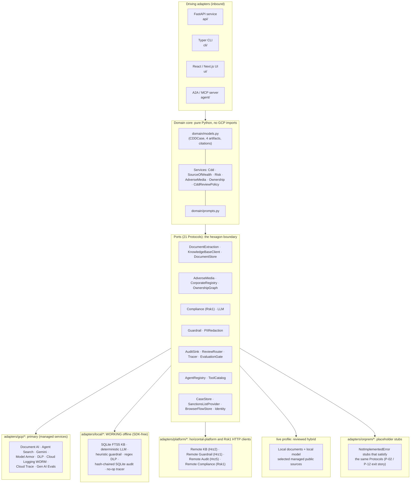
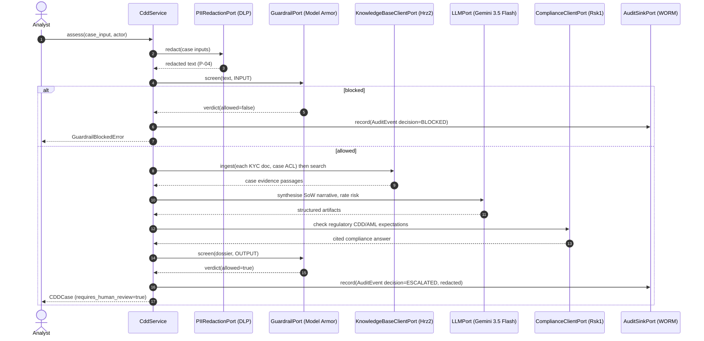
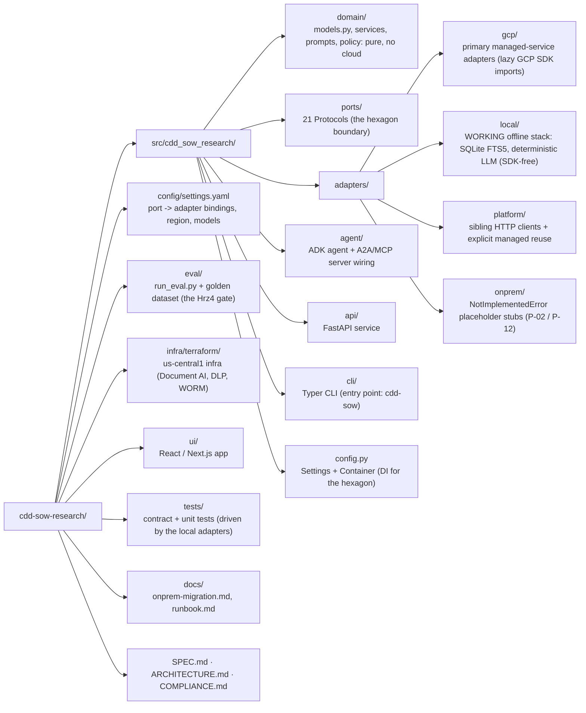

# Doc1: CDD + Source-of-Wealth Agent

**Industries:** Banking, Wealth & asset management, Crypto & digital assets, Insurance, Real estate, Legal, Accounting

> Grounded research agent that turns a customer's KYC pack, corporate registries and
> adverse media into a cited **CDD dossier**: a source-of-wealth narrative, a risk
> rating, adverse-media findings, and a beneficial-ownership / UBO summary, with a full
> audit trail. Built ports-and-adapters on the **Gemini Enterprise Agent Platform**,
> with a configurable deployment region defaulting to `us-central1`.

[](LICENSE)
[](pyproject.toml)

> **Reference build, not affiliated with, endorsed by, or sponsored by Google.**
> This is a public engineering portfolio piece. "Gemini Enterprise Agent Platform",
> "Document AI", "Agent Search", "Model Armor", and other Google Cloud product names are
> trademarks of Google LLC and are used here only to describe the architecture. No
> warranty; see [`LICENSE`](LICENSE). The synthetic KYC data is fictional: do not deploy
> against live customer data without your own legal, security, and model-risk sign-off.

---

## 1. What Doc1 produces

Doc1 turns days of analyst work into minutes: it assembles a **CDD dossier** (`CDDCase`)
bundling four cited, audited artifacts, each carrying source-grade provenance (document,
registry, media, or regulation, with a **page**):

| # | Artifact | Domain type | Sub-service |
|---|----------|-------------|-------------|
| 1 | **SourceOfWealthNarrative**: cited narrative broken into wealth sources | `SourceOfWealthNarrative` | `SourceOfWealthService.build()` |
| 2 | **RiskRating**: band (low/medium/high/prohibited) with weighted factors | `RiskRating` | `RiskRatingService.rate()` |
| 3 | **AdverseMediaFinding[]**: negative-news hits from public-web grounding | `tuple[AdverseMediaFinding]` | `AdverseMediaService.scan()` |
| 4 | **OwnershipSummary**: corporate-ownership / UBO picture | `OwnershipSummary` | `OwnershipService.resolve()` |

The `CddService.assess()` orchestrator runs the whole pipeline and bundles the result.

Onboarding is not the end of the relationship, so Doc1 also keeps it current. Alongside the
risk-based *schedule* (periodic review), the **perpetual-KYC** module watches for *change*:
it diffs the current sanctions, adverse-media and corporate-registry picture against the
last accepted baseline, re-scores the relationship in deterministic code over bank-owned
policy weights, and places an explainable item on a review queue routed to Hrz7. Every
figure is computed, never generated: the model writes the paragraph, not the number. See
[SPEC.md §10](SPEC.md#10-perpetual-kyc-implemented).
Catalog identity: **Doc1**, group **`doc`** (document-heavy verticals), priority **P1**,
buyer **Financial Crime / Private Bank**. Mandatory platform dependencies: **Hrz1**
Guardrail, **Hrz2** Enterprise KB, **Hrz3** Registry, **Hrz4** AI Quality, **Hrz5**
Observability/Audit, and **Rsk1** Compliance Assistant; see
[§9 Platform dependencies](#9-platform-dependencies).

Every artifact, citation and case input is a pure-stdlib dataclass in
[`src/cdd_sow_research/domain/models.py`](src/cdd_sow_research/domain/models.py), the heart of
the hexagon, with **zero** dependency on Google Cloud, ADK, or any framework.

---

## 2. Architecture: the hexagon

The domain core owns all orchestration and speaks only to **ports** (Python `Protocol`s).
Four baseline adapter families implement those ports; the `live` hybrid profile deliberately
composes local private-data/model adapters with selected managed public-source adapters. Runtime
changes through `CDD_PROFILE`, while channel and identity are selected independently. None of
those changes edits the domain. This is executable evidence for the runtime seam in General
Principle **P-02**; the `onprem` adapters remain fail-fast migration placeholders.



- **Driving (inbound) adapters**: the API, CLI, UI, and the A2A/MCP server, which translate
  external requests into domain calls.
- **Domain core**: the orchestrator and its sub-services build the dossier by composing port
  calls. It never imports a cloud SDK.
- **Ports**: 19 `typing.Protocol`s under
  [`src/cdd_sow_research/ports/`](src/cdd_sow_research/ports/). Each is `@runtime_checkable` so
  contract tests can assert any adapter satisfies it.
- **Driven (outbound) adapters**: `gcp` (primary, real SDK calls), `local` (a WORKING
  SDK-free offline stack, see §4.1), `live` (local private-document/model processing plus
  selected public-source adapters), `platform` (sibling-service clients plus reviewed
  managed adapters for vertical-owned capabilities), and `onprem` (placeholder stubs).

See [`ARCHITECTURE.md`](ARCHITECTURE.md) for the full port table, the assessment-pipeline
sequence diagram, and the runtime topology.

---

## 3. Pinned GCP stack (current GA names, mid-2026)

> Platform note: the product is **Gemini Enterprise Agent Platform**; the API host is
> still `aiplatform.googleapis.com`. Everything is pinned to
> the selected deployment region (default `us-central1`). The authoritative source for
> the stack is [`SPEC.md`](SPEC.md) §3.

| Concern | Service (current name) | Identifier |
|---------|------------------------|------------|
| Agent framework | ADK (Python) | `google-adk==2.3.0` |
| Reasoning model | Gemini 3.5 Flash | `gemini-3.5-flash` (thinking=high) |
| Triage model | Gemini 3.1 Flash-Lite | `gemini-3.1-flash-lite` |
| Unified SDK | Google GenAI SDK | `google-genai` |
| Document extraction | **Document AI** | `google-cloud-documentai` |
| Governed RAG store | **Hrz2 Enterprise KB** (Agent Search behind it) | `google-cloud-discoveryengine` |
| Adverse media | Gemini API `google_search` tool | `google-genai` (own sub-agent) |
| Runtime | **Agent Runtime** (ex-Agent Engine) | `google-cloud-aiplatform[agent_engines,adk]` |
| Guardrail | Model Armor | `modelarmor.us-central1.rep.googleapis.com` |
| PII redaction | Sensitive Data Protection / DLP | `google-cloud-dlp` `deidentifyContent` |
| Audit (WORM) | Cloud Logging locked bucket | retention 180 days (six months) |
| Tracing | Cloud Trace via OpenTelemetry | content capture **OFF** |
| Eval gate | Gen AI evaluation service + Hrz4 | `vertexai.Client(...).evals` |
| Interop | A2A v1.0 + MCP 2025-11-25 | AgentCard `/.well-known/agent-card.json` |
| Sovereignty | VPC-SC, regional CMEK, Org Policy | `us-central1` |

**Gotchas honoured by the build** (SPEC §3): regional endpoints plus per-service CMEK for
residency (the *global* endpoint gives none); message-content capture is **OFF** in spans
(customer PII); the locked log bucket is **irreversible** (retention is a Terraform var);
the build **never** uses the floating ADK default model or `gemini-2.0-flash`; only one
built-in tool per agent, so `google_search` lives in its own adverse-media sub-agent.

---

## 4. Quickstart

### 4.1 `local` profile: a WORKING offline run, no GCP

The `local` profile is the default for development, tests and CI. It runs the **whole
assessment pipeline end to end** with no Google Cloud, no API key and no emulators: a
self-seeding SQLite FTS5 case corpus grounds a deterministic, schema-driven LLM, with a
heuristic guardrail, regex DLP, a hash-chained append-only SQLite audit (tamper-evident;
verify/export/restore via `cdd-sow audit`) and a no-op tracer. **No Google Cloud SDK is
required** (the GCP SDKs live in the `[gcp]` extra).

```bash
git clone https://github.com/portable-genai/cdd-sow-research.git
cd cdd-sow-research

python3.12 -m venv .venv && source .venv/bin/activate
pip install -e ".[dev]"          # core + dev tooling, NO google-cloud-* packages

export CDD_PROFILE=local
make lint test                   # ruff + mypy + pytest -m 'not integration'

# Run a real cited dossier offline. The local knowledge base self-seeds a tiny synthetic
# case corpus on first use, so no ingestion step is needed to ground this run:
cdd-sow assess "Acme Holdings Pte Ltd (FICTIONAL)" --type entity --jurisdiction SG
```

That prints a cited CDD dossier (source-of-wealth narrative with page-level citations, a
risk band, beneficial owners, the human-review banner), proving the domain runs entirely
off-cloud. To seed your own corpus, ingest case documents through the knowledge-base port
(`knowledge_base.ingest(...)`); the FTS5 index makes them searchable in the same run.

Optional higher-fidelity local runs route the in-process stores to Google's official
emulators when `FIRESTORE_EMULATOR_HOST` (or `PUBSUB_EMULATOR_HOST` /
`STORAGE_EMULATOR_HOST`) is set AND the `[gcp]` client lib imports; the google client is
imported lazily, only on that branch. The default `local` run needs none of them.

### 4.2 `live` profile: real documents, real subjects, on your own machine

The `local` profile answers from a fixture corpus, which is what makes it deterministic
and CI-friendly, and also what makes it a demo. The `live` profile is the one an analyst
actually uses: upload the real KYC pack for a real company or person and get a dossier
grounded in those files, cited page by page.

It splits the work along a data boundary rather than a vendor one:

| Capability | Where it runs | What leaves the machine |
|---|---|---|
| Reading uploaded documents (text layer, and transcribing scanned pages) | local vision model | nothing |
| Source-of-wealth narrative, self-critique, risk rating | local model | nothing |
| Evidence index, document custody, audit trail | local SQLite | nothing |
| Adverse media, corporate registry / UBO | Gemini with `google_search` grounding | the subject's **name** only |

Customer documents never leave the machine. The two cloud-bound ports need a live web
index, which a laptop cannot provide, and they are given a name to search for, never
document content. Every port is bound explicitly for this profile in
[`config/settings.yaml`](config/settings.yaml), so reading down the `live:` column shows
exactly where each capability runs.

```bash
pip install -e ".[live,dev]"     # pypdf, pypdfium2, pillow, google-genai

# 1. A local OpenAI-compatible model server, serving a Gemma build. For example, with MLX:
python -m mlx_vlm.server --model mlx-community/gemma-4-26b-a4b-it-8bit --port 8001
#    Ollama and vLLM work too: point CDD_LIVE_LLM_URL at the full chat-completions path.

# 2. Google credentials for the two grounded research capabilities:
gcloud auth application-default login
export GOOGLE_CLOUD_PROJECT=your-project

export CDD_PROFILE=live
export CDD_TRIAGE_MODEL=gemini-3.5-flash   # see the note on regional availability below

make run-api                     # :8090
make run-ui                      # :3000, then upload documents and name a subject
```

Settings live under `live:` in `config/settings.yaml` and every one is env-overridable:
`CDD_LIVE_LLM_URL` (default `http://127.0.0.1:8001/chat/completions`), `CDD_LIVE_LLM_MODEL`,
`CDD_LIVE_VISION_MODEL` (defaults to the same multimodal model), `CDD_LIVE_TIMEOUT`,
`CDD_LIVE_OCR`, `CDD_LIVE_MAX_OCR_PAGES` (the per-document transcription budget), and
`CDD_LIVE_RENDER_DPI`.

Things worth knowing before you run it:

- **Model ids are regional.** The pinned triage model is not served in every region, and
  a model that 404s makes the grounded research silently return nothing. Pin what your
  region serves with `CDD_TRIAGE_MODEL` / `CDD_REASONING_MODEL`.
- **A build takes minutes, not seconds.** Several local model calls run per dossier, plus
  a page transcription for every scanned page. That is the cost of keeping the documents
  on the machine.
- **The index starts empty and stays honest.** The fixture corpus is never seeded into a
  live index, and a case with nothing readable indexed is refused as ungrounded rather
  than answered from guesswork.
- **Screening needs real lists.** The bundled watchlist snapshot is fictional, so it never
  matches a real name. Refresh it with
  `PYTHONPATH=src python scripts/sync_sanctions.py --out src/cdd_sow_research/adapters/local/data/sanctions_snapshot.json`
  (one-time egress to the publishers; screening itself stays offline and deterministic).
- The compliance warnings in [COMPLIANCE.md](COMPLIANCE.md) apply in full: this is a
  reference build, not a system cleared for live customer data.

### 4.3 `onprem` profile: the fail-fast sovereign migration target

The on-prem profile binds every port to a placeholder adapter. Consequential operations
raise `NotImplementedError`; explicitly reviewed optional ports may return a safe default,
such as no public-web findings in an air-gapped profile. The contract tests confirm those
placeholders satisfy the same 18 runtime/data Protocols as the GCP and local adapters, while
`IdentityPort` has its own exact binding matrix. The behavioral-parity
suite (`tests/contract/test_behavioral_parity.py`) puts the same request through every
SDK-free implementation of a port, so the **exit / portability** contract (P-12) is
executable; a primary CLI command under `onprem` exits 2 with the migration message. This proves the
interface contract and fail-closed exit target, not a working on-premises deployment. See
[`docs/onprem-migration.md`](docs/onprem-migration.md) and the runnable portability tour
(`PYTHONPATH=src python scripts/portability_demo.py`, [DEMO §4](DEMO.md)).

```bash
export CDD_PROFILE=onprem
cdd-sow assess "Acme Holdings Pte Ltd (FICTIONAL)" --type entity   # exits 2, migration note
```

### 4.4 `gcp` profile: real managed stack in `us-central1`

```bash
pip install -e ".[gcp,dev]"      # adds google-adk, google-genai, documentai, dlp, ...

export GOOGLE_CLOUD_PROJECT=your-sg-project
export CDD_PROFILE=gcp                       # real managed stack. Always set a profile: an unset CDD_PROFILE binds the offline adapters but refuses the no-auth dev personas
export CDD_KMS_KEY="projects/.../locations/us-central1/keyRings/.../cryptoKeys/..."
gcloud auth application-default login

make tf-plan                      # review, then terraform apply (see docs/runbook.md)
make run-api                      # FastAPI on :8090, profile=gcp
```

Everything is keyed off [`config/settings.yaml`](config/settings.yaml), which resolves
`${ENV_VAR}` tokens at load time. Switching profiles never touches code, only the
`CDD_PROFILE` env var (or the `profile:` key).

---

## 5. Running the surfaces

| Surface | Command | Notes |
|---------|---------|-------|
| **API** (FastAPI) | `make run-api` | REST plus the A2A AgentCard at `/.well-known/agent-card.json`; OpenAPI at `/docs`. Default port 8090. |
| **CLI** (Typer) | `cdd-sow assess "Acme Holdings" --type entity` | Entry point `cdd-sow = cdd_sow_research.cli.main:app`. Sub-commands: `assess`, `source-of-wealth`, `adverse-media`, `perpetual-kyc`, `perpetual-kyc-queue`, `serve` (the API under uvicorn), `eval` (the promotion gate), and `audit verify|export|restore` (the tamper-evident audit trail). |
| **UI** (React / Next.js) | `make run-ui` | Talks to the API; renders the dossier with inline citation chips, plus the perpetual-KYC panel (re-score arithmetic, signals and the review queue). |

---

## 6. The R1 safety pipeline (customer PII)

Doc1 handles customer KYC, so the full Hrz1 guardrail plus DLP-redaction pipeline is mandatory
(rule R1). Every assessment redacts before any model, index, registry or audit call, and
screens both directions:



---

## 7. The eval gate (Hrz4 / P-08)

No build is promoted without passing a quality gate. `eval/run_eval.py` scores a synthetic
golden set on **sow_groundedness** (>= 0.80), **risk_band_accuracy** (>= 0.80),
**citation_accuracy** (>= 0.90), **pii_safety** (>= 0.99), and **pkyc_priority** (>= 0.90).
The report passes only if every metric clears its threshold.

`pkyc_priority` is deliberately scored against an independent oracle: each golden case
declares the change to simulate and the queue priority plus re-score direction that change
must produce, so a mis-tuned perpetual-KYC engine turns the metric red instead of agreeing
with itself.

```bash
make eval        # runs eval/run_eval.py; non-zero exit fails the gate
```

CI enforces it in [`.github/workflows/eval-gate.yaml`](.github/workflows/eval-gate.yaml);
at promotion the live Hrz4 service (`EvaluationGatePort.gate`) is the authority. See
[`COMPLIANCE.md`](COMPLIANCE.md) for how this maps to the model-risk principle.

---

## 8. Security and residency posture

| Control | How it is enforced |
|---------|--------------------|
| **Region** (selectable, default `us-central1`) | Region is chosen at deploy from a residency allowlist and validated to fail fast at `terraform plan`; every service and SDK call targets that one region; a `gcp.resourceLocations` Org Policy hard-restricts resource creation to it. |
| **VPC Service Controls** | All managed services sit inside a service perimeter (dry-run first, then enforced) so case data cannot egress. |
| **CMEK** (regional) | Customer-managed Cloud KMS keys (`CDD_KMS_KEY`) encrypt Document AI outputs, the KB, and the log bucket. |
| **PII redaction before model** (**P-04**) | `DlpRedactionAdapter` de-identifies inbound text before it reaches the model, the index, a span or the audit sink. |
| **Guardrail screening** (Hrz1, **R1**) | `ModelArmorGuardrailAdapter` screens INPUT and OUTPUT for prompt injection, jailbreak, sensitive data, and malicious URLs. |
| **WORM audit** (**R2**) | `CloudLoggingAuditAdapter` writes already-redacted `AuditEvent`s to a locked Cloud Logging bucket (retention 180 days by default). |
| **Case-scoped ACL** (**R3**) | KYC documents are ingested into Hrz2 with `case:<subject_id>` ACL tags and retrieved only by case principals. |
| **Maker-checker** (**P-06**) | `CddReviewPolicy` always sets `requires_human_review`; HIGH/PROHIBITED or sanctions/terrorism hits escalate. |
| **Citations** | Every claim carries a source-and-page `Citation` so an analyst/MLRO can verify it. |
| **Channel and identity portability** | Modes 4 and 5, the immutable `/agent` artifact, strict MessagePort transport, Mode 6 fallback, direct-token verification, and the brokered PKCE grant are implemented. The full synthetic gate passes in Chromium, Firefox, and WebKit with RSA/EC issuers, rotation, negative paths, and leak scans. See [`docs/embedding-and-identity.md`](docs/embedding-and-identity.md) and [DEMO §4](DEMO.md). Production enablement remains. |
| **Runtime, data, and audit exit** (**P-12**) | `adapters/onprem/*` placeholders plus [`docs/onprem-migration.md`](docs/onprem-migration.md) preserve the sovereign runtime contract without domain changes; the audit trail is hash-chained and exports/reloads in open JSONL (`cdd-sow audit`); and a complete case exports as a `cdd-case-bundle/v1` archive carrying the dossier AND every source document's original bytes, reloading on a different deployment with document ids and digests intact (`cdd-sow bundle`). `scripts/portability_demo.py` proves the runtime-seam, audit-data and case-data claims offline. Working on-premises adapters remain the open gap: a bundle reload against the `onprem` document store still fails fast by design. |

The full mapping of every General Principle (P-01..P-12) and dependency rule (R1..R6) to a
concrete control in this repo is in [`COMPLIANCE.md`](COMPLIANCE.md).

---

## 9. Platform dependencies

Doc1 exercises the whole platform. When deployed standalone, the `gcp` adapters call the
managed services directly. Inside the full platform, supported shared capabilities delegate
over HTTP; vertical-owned capabilities continue to use reviewed managed adapters. Priority 1
in the embedding plan made every such binding explicit (contracts in
[`SPEC.md`](SPEC.md) §6).

| Dep | Repo | Doc1 ports it backs | `platform` adapter |
|-----|------|-------------------|--------------------|
| **Hrz1** Guardrail Gateway | `agent-guardrail-gateway` | `GuardrailPort`, `PIIRedactionPort` | `RemoteGuardrailAdapter`, `RemoteRedactionAdapter` |
| **Hrz2** Enterprise KB | `enterprise-knowledge-base` | `KnowledgeBaseClientPort` | `RemoteKnowledgeBaseAdapter` |
| **Hrz3** Registry | `agent-registry` | `AgentRegistryPort` | `RemoteRegistryAdapter` |
| **Hrz4** AI Quality | `model-quality-gate` | `EvaluationGatePort` | `RemoteEvaluationAdapter` |
| **Hrz5** Observability/Audit | `agent-observability` | `AuditSinkPort` | `RemoteAuditAdapter` |
| **Rsk1** Compliance Assistant | `compliance-advisory` | `ComplianceClientPort` | `RemoteComplianceAdapter` |

Doc1's governed RAG store **is** Hrz2: it ingests the case's KYC documents into Hrz2 (with case
ACL tags) and retrieves via Hrz2, rather than building a separate retrieval backend. See
[`ARCHITECTURE.md`](ARCHITECTURE.md) §6 for the dependency relationship in detail.

---

## 10. Repository layout



---

## 11. Documentation map

- [`DEMO.md`](DEMO.md): step-by-step demo guide: the long-running SoW case (local,
  offline, presenter-controlled), the one-shot dossier on the managed GCP stack, and the
  offline **portability-seam tour** (profile swap, port parity, tamper-evident audit,
  open-format round-trip, complete case/document bundle export and reload, local identity
  resolution), plus the full synthetic three-browser
  channel/identity proof, with each evidence boundary, prerequisite, and setup link.
- [`SPEC.md`](SPEC.md): the authoritative build specification (locked decisions, pinned
  stack, adapter convention, pipeline, HTTP contracts).
- [`ARCHITECTURE.md`](ARCHITECTURE.md): the port table, assessment pipeline sequence,
  runtime topology, platform dependencies, and two **reusable principle catalogues**
  (portability PT-1..PT-14, security SC-1..SC-17), each principle stated generically
  with its mechanism here and the command that proves it.
- [`docs/embedding-and-identity.md`](docs/embedding-and-identity.md): the corrected native,
  sandboxed, and standalone channel and identity implementation and production boundary for
  Modes 1 to 6.
- [`docs/ui-portability-decision-comparisons.md`](docs/ui-portability-decision-comparisons.md):
  comparison tables for the credible UI portability alternatives and the reasons for the
  selected Mode 4/5 decisions.
- [`docs/embedding-implementation-plan.md`](docs/embedding-implementation-plan.md): the top five
  priorities, delivered sequence, completion gates, and remaining external production blockers
  for Modes 4/5.
- [`docs/named-production-deployment-dossier.md`](docs/named-production-deployment-dossier.md):
  non-secret inputs, owners, approvals and evidence required for one named institution.
- [`docs/named-production-runbook.md`](docs/named-production-runbook.md): rollout, rollback,
  Firestore recovery, key rotation and incident operations for the reusable production edge.
- [`.env.example`](.env.example) and [`.env.secrets.example`](.env.secrets.example): the
  separated non-secret and secret deployment-input contract. `make deploy-env-check` validates a
  placeholder draft; `make deploy-preflight` rejects placeholders before production commands,
  and `make deploy-verify-secrets` binds exact Secret Manager versions to reviewed digests.
- [`COMPLIANCE.md`](COMPLIANCE.md): every General Principle and dependency rule mapped to a
  concrete control in this repo.
- [`docs/onprem-migration.md`](docs/onprem-migration.md): the exit/portability checklist.
- [`docs/runbook.md`](docs/runbook.md): deploy, region fail-fast, key rotation, retention.
- [`docs/sow-longitudinal-audit-design.md`](docs/sow-longitudinal-audit-design.md):
  long-running, stateful Source-of-Wealth **cases** (weeks of RM↔client iterations) with
  an audit-first output: grouped sources, proofs, computed gaps, and client information
  requests. The pure-domain core is implemented (`domain/gap_analysis.py`,
  `value_bands.py`, `case_policy.py`, `rfi_drafting.py`, `sow_case_service.py`, the
  `CaseStorePort`); run the end-to-end demo with
  `PYTHONPATH=src python scripts/sow_demo.py` and render the audit-first view with
  `scripts/render_sow_ui.py` / `ui/components/SowAuditView.tsx`.
- [`CONTRIBUTING.md`](CONTRIBUTING.md): how to set up, lint, test, and contribute
  (including the touch list for adding a new port or sub-service).
- [`docs/ADOPTING.md`](docs/ADOPTING.md): fork this repo as your institution's base: the
  kernel-vs-vertical boundary, the `scripts/rename_fork.py` rebrand, and the human
  decisions (region, IdP, PII pack, risk policy, fixtures, eval golden set).
- [`docs/faq/`](docs/faq/): role-specific FAQs, for security, portability, features,
  adoption, and compliance teams, each cross-referencing the sibling catalog systems this
  repo integrates rather than duplicates.
- [`common-base-practices.md`](https://github.com/portable-genai/.github/blob/main/common-base-practices.md):
  the generalised practices catalogue (~35 checkable practices with audit commands) for
  assessing any repo in the catalog against this base's standards. It lives in the shared
  organization profile repository because it is a cross-repo document; this repo is its
  reference build.

---

## Cost and latency

Size this system's cost and latency with the shared interactive calculator: [**live**](https://portable-genai.github.io/cost-latency-calculator/calc/calculator.html?system=Doc1) or the [in-repo page](cost-latency-calculator.html). The engine and the pricing book are maintained once in [cost-latency-calculator](https://github.com/portable-genai/cost-latency-calculator).

## License

Apache-2.0 © 2026 Ashish Awasthi. See [`LICENSE`](LICENSE).

> Again: this is an independent reference build and is **not affiliated with, endorsed by,
> or sponsored by Google LLC**. Google Cloud product names are used descriptively only.
