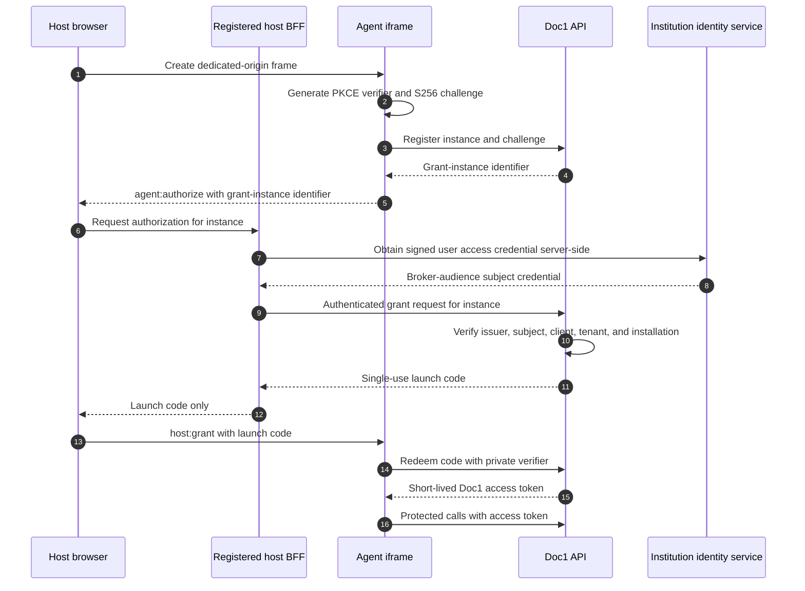

# Embedding and identity: client integration guide

This guide defines how an enterprise client can run the Doc1 CDD and Source-of-Wealth
Agent as a native integration, a sandboxed embed, or a standalone application. It also
defines how identity remains server-verified and independent of the selected channel,
infrastructure, model, and data-store profile.

The design follows the catalog's portability model:

1. experience and identity are portable across channels and identity providers;
2. processing is portable across runtime and model adapters; and
3. records and audit evidence are portable across storage adapters.

Modes 4 and 5 are the implemented reference for the first layer. Their full synthetic
browser and identity conformance gate passes. That evidence is bounded to channel and
identity; it does not, by itself, prove compute, data, audit-record, or whole-system
portability.

The credible alternatives and the reasons for the selected choices are compared in
[`ui-portability-decision-comparisons.md`](ui-portability-decision-comparisons.md).

## 1. Status and non-negotiable invariants

| Capability | Status |
|---|---|
| Mode 1, same-origin reverse-proxy iframe with IAP | Implemented |
| Mode 2, standalone behind IAP | Application pattern implemented; production UI/IAP deployment not provisioned here |
| Mode 3, local offline personas | Implemented |
| Mode 4, direct-token isolated embed | Implemented; full synthetic conformance passes |
| Mode 5, brokered isolated embed | Implemented; full synthetic conformance passes |
| Mode 6, standalone OIDC session | Flow and synthetic fallback implemented and tested; separate production deployment remains |

The following invariants apply to every secure mode:

- The backend resolves a verified `Principal`; it never trusts a request-body actor,
  tenant, group, role, or ACL.
- The verified subject becomes the audit actor.
- Tenant and entitlement principals are derived server-side and flow into governed
  document custody and retrieval.
- Unknown or incomplete identity configuration fails closed.
- Local mode uses seeded fictional personas and no IdP, directory, cloud credential, or
  network service.
- Mode 6 remains the universal top-level fallback when framing or embedded authorization
  is unavailable. For Modes 4/5 it is a separately configured standalone instance of the
  same artifact, not a second credential type accepted by the embedded API.
- Modes 1 to 3 and Mode 6 remain valid alongside Modes 4 and 5.

Current code provides these reusable seams:

- [`IdentityPort`](../src/cdd_sow_research/ports/identity.py) and the API
  [`CurrentPrincipal`](../src/cdd_sow_research/api/security.py) dependency;
- IAP, local-persona, on-prem placeholder, and OIDC-session identity adapters;
- trusted-issuer configuration, OIDC discovery, PKCE login, session verification, and a
  bounded JWKS cache under [`adapters/oidc`](../src/cdd_sow_research/adapters/oidc/);
- server-derived tenant and case ACL tags in
  [`CddService`](../src/cdd_sow_research/domain/cdd_service.py);
- API and Next.js security-header baselines;
- Mode 6's tested top-level OIDC Authorization Code with PKCE flow;
- the immutable loader, strict MessagePort protocol, installation manifest, authenticated
  JSON/form/blob transport, and in-frame viewer;
- the Mode 4 OAuth access-token verifier;
- the Mode 5 BFF broker, PKCE-bound one-time grant, dedicated Doc1 token, replay state,
  transactional browser-flow store, and durable security-event outbox.

The code and synthetic-evidence gate in
[`embedding-implementation-plan.md`](embedding-implementation-plan.md) passes. Its separate
production gate remains open.

## 2. Portability model: independent axes

A channel is not an identity provider, and an identity provider is not a compute profile.
The deployment must compose these choices explicitly.

### 2.1 Channel profiles

| Channel | Browser shape | Trust and adoption trade-off |
|---|---|---|
| `native` | Capability is served under the host's origin, usually through a BFF or reverse proxy | Deepest integration. The host can read and script the surface and is inside the data trust boundary. |
| `sandboxed` | Capability runs in a dedicated cross-origin iframe | The surrounding host cannot read or script the agent document. Integration needs a small loader or iframe tag and an embedded identity path. |
| `standalone` | Capability opens as a top-level application | Lowest integration effort and widest browser and IdP compatibility. The user leaves the host page. |

### 2.2 Identity profiles

| Identity profile | Credential verified by Doc1 | Intended channels |
|---|---|---|
| `local-persona` | Seeded fictional persona selector | Local only |
| `iap` | IAP-injected signed assertion | Native or standalone GCP |
| `oidc-session` | Agent-issued first-party session after top-level OIDC login | Standalone |
| `oauth-access-token` | Institution-issued Doc1-audience OAuth access token | Sandboxed Mode 4 or native trusted BFF |
| `embedded-grant` | Agent-issued token obtained by redeeming an iframe-bound, single-use launch grant | Mode 5 |
| `onprem` | Client IdP adapter | Private or sovereign deployment after implementation |

Independence does not mean every combination is safe. Startup enforces an explicit
channel/identity compatibility matrix:

| Channel | Allowed identity modes |
|---|---|
| `native` | `iap`, `oauth-access-token`, and explicit loopback-only `local-persona` |
| `sandboxed` | `oauth-access-token` or `embedded-grant` |
| `standalone` | `iap`, `oidc-session`, `onprem`, and explicit loopback-only `local-persona` |

Any other combination requires a reviewed extension and fails closed by default.

### 2.3 Runtime profiles

The current `CDD_PROFILE` selects the compute and data adapter family:

- `local`: working offline stack;
- `live`: local document and model processing with selected cloud web sources;
- `gcp`: managed GCP stack;
- `platform`: shared Hrz and Rsk services; and
- `onprem`: fail-fast migration placeholders.

Identity selection is independent from `CDD_PROFILE`. Selecting OIDC identity
must not silently select GCP extraction, storage, model, guardrail, or audit adapters.
The container has two exact maps: runtime selects the 18 runtime/data ports,
while identity mode alone selects `IdentityPort`. No missing entry inherits a GCP adapter.
Network exposure, persona/CORS behavior, HSTS, and authentication rate limits follow
identity, channel, and deployment policy rather than compute choice. Thus secure OIDC can
run with local compute behind ingress, while a local persona remains loopback-only even if
the runtime is GCP.
Section 12 defines the configuration contract.

### 2.4 Retiring the legacy `CDD_STANDALONE` switch

The current `deployment.standalone` / `CDD_STANDALONE` boolean is not a channel profile.
It conflates whether `/auth/*` is mounted with whether shared platform services own
identity, guardrail, DLP, and audit. That meaning fails for valid combinations such as a
sandboxed deployment that owns its controls or a standalone deployment behind IAP.

The target design retires the boolean from application routing:

- `channel.mode` controls browser shape and framing;
- `identity.mode` controls accepted credentials and whether `/auth/*` exists;
- `CDD_PROFILE` plus explicit adapter bindings controls processing and data services; and
- deployment infrastructure controls which managed resources are provisioned.

During migration the legacy value is only a deprecated compatibility input. It is never
an alias for `channel.mode=standalone`. Startup may reject a conflict with explicit
identity or control-ownership behavior the old flag actually governed, but never rejects
an independently valid channel merely because its label differs from the legacy boolean.

## 3. Mode map

Mode numbers are compatibility labels. The channel and identity profiles are the durable
architecture.

| Mode | Channel | Identity | Status | Use when |
|---|---|---|---|---|
| 1 | Native, same-origin iframe | IAP | Implemented | The host controls its edge and accepts IAP or WIF. |
| 2 | Standalone | IAP | Application pattern built; production edge open | A separate GCP console is acceptable. |
| 3 | Standalone local | Local persona | Implemented | Evaluation, CI, and offline demonstration. |
| 4 | Sandboxed, dedicated origin | Direct OAuth access token | Implemented; synthetic conformance passes | The host already has a Doc1-audience token and accepts being a trusted credential courier. |
| 5 | Sandboxed, dedicated origin | Brokered launch grant | Implemented; synthetic conformance passes | The host must not receive a reusable Doc1 credential or read the sensitive panel. |
| 6 | Standalone | OIDC session | Flow and synthetic fallback built; production deployment open | Lowest-cost universal integration or fallback from any framed mode. |

The previous Mode 5 design, a same-origin proxy that injected an authorization header, is
not a cross-origin mode. It is retained as the trusted BFF variant of the native channel
in Section 8.

## 4. Current channels and flows

### 4.1 Mode 1: native same-origin reverse proxy

The host serves the UI and API beneath its own origin:

```nginx
location /agent/ {
    proxy_pass         http://agent-ui.internal:3000/;
    proxy_set_header   Host              $host;
    proxy_set_header   X-Forwarded-Proto $scheme;
    proxy_set_header   X-Forwarded-For   $proxy_add_x_forwarded_for;
}

location /agent/api/ {
    proxy_pass         http://agent-backend.internal:8090/;
    proxy_set_header   Host              $host;
    proxy_set_header   X-Forwarded-Proto $scheme;
}
```

The UI is built for the host path:

```bash
NEXT_PUBLIC_BASE_PATH=/agent
NEXT_PUBLIC_API_BASE=/agent/api
NEXT_PUBLIC_EMBED=1
```

The host mounts it:

```html
<iframe
  src="/agent/"
  title="CDD and Source-of-Wealth Agent"
  style="width:100%; min-height:720px; border:0;">
</iframe>
```

This mode has no cross-origin CORS or third-party-cookie problem. It also has no origin
isolation from the host. Same-origin host JavaScript can inspect the iframe, so this mode
is appropriate only when the host is inside the Doc1 data trust boundary.

The framed document is served by Next.js. Therefore the Next.js response, not an API
response, is the load-bearing location for its `frame-ancestors` policy.

### 4.2 Mode 2: standalone behind IAP

The UI is a top-level application behind an HTTPS load balancer and IAP. The backend
verifies the injected assertion using the configured IAP audience. The client can
federate its workforce IdP into IAP where appropriate.

The application behavior and IAP verifier are present. This repository's reusable edge is for
application-authenticated Modes 4/5 because an IAP redirect in front of the loader or iframe would
break cross-origin embedding. The separate standalone Mode 2/6 Cloud Run/load-balancer/IAP edge
remains external until a named institution supplies the target project, domain, identity
registrations, immutable image digests and approvals, then applies and evidences that edge.

### 4.3 Mode 3: local offline personas

Local mode is a development and proof profile, never a production authentication mode:

```bash
CDD_PROFILE=local make run-api

cd ui
npm install
npm run dev
```

The current code also admits the persona picker under `live`. Phase 1 removes that
runtime-derived identity inference: `live` must select identity explicitly, and
`local-persona` is allowed only on a loopback-bound process with an explicit
insecure-demo acknowledgement. Secure identities never advertise or trust
`X-Dev-Persona`.

### 4.4 Mode 6: standalone OIDC session

The Mode 6 application flow is implemented and tested. Once the separately configured
standalone service is deployed, the host integration is only:

```html
<a href="https://agent.example/" target="_blank" rel="noreferrer">
  Open CDD and Source-of-Wealth Agent
</a>
```

The top-level application currently performs OIDC Authorization Code with PKCE:

1. `/auth/login` selects an allowlisted issuer and creates PKCE, state, and nonce.
2. The IdP authenticates the user in a top-level browsing context.
3. `/auth/callback` validates state, redeems the code, verifies the returned ID token
   against the issuer and client audience, and checks the OIDC nonce.
4. Doc1 issues its own short-lived `HttpOnly; Secure; SameSite=Strict` session cookie.
5. `OidcSessionIdentityAdapter` verifies that session locally on every protected request.

An ID token is correct at this OIDC callback because it authenticates the user to the
registered OIDC client. It must not be reused as an API access token in Modes 4 or 5.

The current callback still permits email in place of `sub` and may mint an empty tenant.
Phase 1 removes both behaviors: every secure identity requires the original non-empty
`sub`, retains email only as display metadata, and maps one non-empty tenant through
reviewed issuer policy.

Before Mode 6 is a production fallback, discovery must also verify that the returned
discovery `issuer` exactly matches configured policy, require HTTPS for authorization,
token, JWKS, and logout endpoints except explicit loopback development, constrain endpoint
hosts to reviewed issuer policy, and constrain outbound egress. The current discovery
helper does not yet enforce all of those endpoint checks.

ID-token verification must also require `azp` to equal the configured client when `aud`
contains multiple values. Issuer policy selects and discovery confirms the exact
token-endpoint authentication method (`client_secret_basic`, `client_secret_post`,
`private_key_jwt`, or an explicitly approved public-client `none`); no implementation
silently downgrades to another method.

`SameSite=Strict` alone is not a CSRF boundary because sibling origins may be same-site.
Every unsafe Mode 6 cookie-authenticated route, including logout, requires the canonical
agent `Origin`, same-origin Fetch Metadata, and a stateless CSRF token. Session minting
places a CSPRNG nonce in the signed `HttpOnly` session, or derives an equivalent HMAC from
the signed session `jti`. An authenticated same-origin `private, no-store` bootstrap
returns the value to the UI, which holds it only in memory and sends it in
`X-CSRF-Token`. The server compares the header in constant time with the verified signed
claim or derivation. It keeps no CSRF process state and puts the value in no second
cookie, storage, log, or cache. Missing, wrong, sibling-origin, or cross-session signals
fail closed. Modes 4 and 5 use their separate bearer transport and installation binding.

## 5. Common architecture for Modes 4 and 5

### 5.1 Dedicated-origin topology

The reference topology uses one fixed `/agent` mount path in every channel:

```text
Host page:  https://portal.bank.example
Agent UI:   https://doc1.bank-agent.example/agent/embed/{installation_id}/
Agent API:  https://doc1.bank-agent.example/agent/api/...
Fallback:   https://doc1.bank.example/agent/
```

The UI and API share the agent origin. This has four benefits:

- the host and agent remain separated by the browser's same-origin policy;
- iframe API calls are same-origin and need no CORS;
- API responses and the Mode 5 token remain inside the agent browsing context; and
- parent origins are handled only by `frame-ancestors` and the message protocol.

Mode 4 is the stated exception: its access token originates in host JavaScript before
transfer, so the host is already inside that token's API-data trust boundary.

A cross-origin iframe's API `Origin` is the iframe origin, not the parent portal origin.
Parent framing policy and API CORS policy must not be conflated.

The public route contract is:

```text
Next-owned UI:       /agent/ and /agent/embed/{installation_id}/
Next static assets:  /agent/_next/... and /agent/embed/v1/cdd-agent.js
Top-level fallback:  /agent/embed/{installation_id}/fallback
Public API:          /agent/api/v1/...
Public auth:         /agent/auth/...
Internal FastAPI:    /v1/..., /auth/..., /healthz
```

Hrz9 is the current native Mode 1 host. It exposes the canonical `/agent/*` surface to the
unmodified Doc1 artifact, keeps `/apps/doc1` as a tested compatibility entry, and selects
native channel plus local-persona or IAP identity explicitly. Its build, proxy, asset, API,
identity, and RM-journey evidence close the internal canonical-artifact dependency.

The local proof includes an ingress or reverse proxy that strips `/agent/api` before
FastAPI and maps `/agent/auth` to `/auth`. Production DNS, TLS, and load-balancer setup may
change, but this public route contract does not.

OIDC redirect and cookie behavior follows the public route, not FastAPI's stripped
internal path. The standalone deployment has an explicitly configured canonical external
origin and exact redirect URI such as
`https://doc1-standalone.example/agent/auth/callback`. Login and token exchange use that
same registered value rather than deriving authority from `Host` or forwarded headers.
The `__Secure-` transaction cookie is scoped to `/agent/auth`. The
`__Host-cdd_session` cookie keeps `Path=/`, as required by the browser-enforced
`__Host-` prefix, and the standalone deployment uses a dedicated origin rather than
co-hosting unrelated applications. The local ingress test must execute the complete
redirect callback and prove that both cookie attributes and transaction delivery survive
prefix stripping.

The isolated agent deployment selects `oauth-access-token` or `embedded-grant` identity
exactly. The fallback URL points to a separate standalone deployment selecting
`oidc-session`. Both run the same immutable application artifact and may use the same
tenant-authorized data adapters, but no protected API route guesses identity from a bearer
header versus a cookie.

### 5.2 Correct iframe sandbox

The loader creates:

```html
<iframe
  src="https://doc1.bank-agent.example/agent/embed/inst_demo_bank/"
  sandbox="allow-scripts allow-same-origin"
  allow=""
  referrerpolicy="no-referrer"
  title="CDD and Source-of-Wealth Agent"
  style="width:100%; min-height:480px; border:0;">
</iframe>
```

`allow-same-origin` is required. Without it, the iframe is assigned an opaque `null`
origin, which is incompatible with exact `postMessage` origin checks and same-origin API
calls. The child remains cross-origin from the parent because it is served from a
different origin.

Never use `allow-scripts allow-same-origin` when the child is actually served from the
parent's origin. In that topology the child can remove its sandbox. Mode 1 is a trusted
native integration and must not claim a hostile-host sandbox.

For `channel.mode=sandboxed`, manifest validation compares canonical origins and rejects
any installation whose parent origin equals the agent origin. This is a startup invariant,
not a documentation convention.

The initial feature set deliberately keeps `allow-forms`, `allow-downloads`,
`allow-popups`, and `allow-popups-to-escape-sandbox` absent. File input plus `fetch` does
not require forms. Section 9.1 defines the in-frame document and citation journey.
Camera, microphone, geolocation, payment, clipboard, and USB remain denied.

### 5.3 Installation registry

The host receives one public, opaque `installation_id`. It is routing metadata, not
identity or authority.

One non-secret, versioned deployment manifest is the source for both the Next.js process
and FastAPI. Both read the same exact manifest bytes, validate the schema version, compute
the same SHA-256 digest, and fail startup on invalid or unavailable policy. Next.js must
not maintain a second parent-origin registry for CSP.

An installation record contains:

- exact allowed parent origin or origins;
- tenant identifier;
- accepted issuer and subject-token audience or client;
- Doc1 resource audience and permitted scopes;
- selected Mode 4 or Mode 5 credential transport;
- supported loader, protocol, and API major versions;
- UI theme policy and bounded presentation options;
- Mode 6 fallback URL;
- residency and deployment identifiers; and
- enabled sandbox capabilities.

The initial document route is:

```text
/agent/embed/{installation_id}/
```

The server resolves the installation before authentication and emits the exact
`Content-Security-Policy: frame-ancestors ...` response header. The browser needs that
policy on the first navigation response, before any access token exists. `frame-ancestors`
must not be placed in a `<meta>` element.

Dynamic embed HTML and installation bootstrap use `Cache-Control: private, no-store` so a
revoked parent, tenant policy, or fallback target is not replayed from a browser or shared
cache. Every authenticated JSON, multipart result, stream, and document response is also
`private, no-store`. Only versioned non-secret loader and `_next` assets use public
immutable caching; no service worker caches protected responses.

On every authenticated request, Doc1 requires:

```text
verified token tenant == installation tenant
verified token issuer == installation issuer policy
verified token audience contains the Doc1 resource
verified token scopes authorize the requested operation
```

The host cannot choose tenant, issuer, audience, API base, or authorization policy through
custom-element attributes, query parameters, or messages.

The first secure release uses one institution per deployment. The installation contract
is still used from day one so a later shared registry does not change the external API.
Secret values are not stored in the manifest. It may contain names of secret references.

Startup enforces that statement rather than leaving it as guidance:

- the set of non-empty installation tenants has cardinality exactly one and equals the
  configured deployment tenant;
- every installation's `identity_mode` equals the deployment's one exact identity mode;
- every issuer-policy ID resolves to exactly one enabled verifier policy compatible with
  that tenant, identity mode, credential type, audience, and allowed client; and
- missing, duplicate, wildcard, disabled, cross-tenant, or incompatible policy resolution
  fails before the service accepts traffic.

### 5.4 Loader and distribution contract

The plain iframe plus message protocol is the normative integration contract. The custom
element is a dependency-free convenience wrapper:

```html
<script
  src="https://doc1.bank-agent.example/agent/embed/v1/cdd-agent.js"
  integrity="sha384-..."
  crossorigin="anonymous">
</script>

<cdd-agent installation-id="inst_demo_bank" theme="light"></cdd-agent>
```

Rules:

- publish immutable major-versioned URLs such as `/agent/embed/v1/cdd-agent.js`;
- publish the exact SRI digest and never use a floating `latest`;
- derive the agent origin from the pinned script or a signed installation bootstrap;
- allow only `installation-id` and bounded presentation hints in markup;
- immediately render a host-DOM fallback anchor whose target is the agent-owned
  `/agent/embed/{installation_id}/fallback` route, without waiting for the iframe;
- provide a plain imperative JavaScript API as the lowest common denominator; and
- treat React, Angular, and Vue wrappers as examples, not protocol dependencies.

SRI proves the bytes of the referenced script to a cooperative host. It does not stop a
malicious host from removing or replacing the whole integration.

Because the script is loaded cross-origin with `crossorigin="anonymous"`, its response
must include a public static-asset CORS policy, such as `Access-Control-Allow-Origin: *`,
plus `Cross-Origin-Resource-Policy: cross-origin`, a JavaScript content type,
`X-Content-Type-Options: nosniff`, and immutable cache headers. This exception is for the
non-secret versioned loader asset only. It does not enable API CORS.

The client portal must also approve the integration in its own CSP. At minimum its
`script-src` permits the immutable loader origin or matching CSP hash, and its `frame-src`
permits the dedicated agent origin. For example:

```text
Content-Security-Policy:
  default-src 'self';
  script-src 'self' https://doc1.bank-agent.example 'sha384-REVIEWED_LOADER_DIGEST';
  frame-src https://doc1.bank-agent.example;
```

The SRI value and CSP hash are generated from the same released loader bytes. A bank may
choose the hash-only variant supported by its CSP policy. Without the host-owned
`script-src` and `frame-src` approval, the browser correctly blocks the integration.

### 5.5 Message protocol

The handshake is host-initiated because the iframe cannot know which of several allowed
parent origins loaded it, and `referrerpolicy=no-referrer` deliberately provides no hint:

1. The loader derives the exact agent origin from its pinned script URL and creates a
   CSPRNG `channel_id` with at least 128 bits of entropy plus a `MessageChannel`.
2. After iframe load, it sends `host:init` to the exact agent `targetOrigin` and transfers
   one port. The message contains installation ID, supported protocol versions, channel
   ID, and loader build, but no credential.
3. The iframe's temporary global listener requires `event.source === parent`, validates
   `event.origin` against the installation's parent-origin policy, validates the closed
   message schema and installation, and accepts the transferred port.
4. The iframe acknowledges `agent:ready` on that port. Both sides remove temporary global
   listeners and use only the dedicated `MessagePort`.

`channel_id` identifies the browser protocol session. It is never reused as the Mode 5
`grant_instance_id`, which is created by the Doc1 API only after the channel exists.

Every envelope contains:

```json
{
  "protocolVersion": 1,
  "channelId": "opaque-channel-id",
  "sequence": 1,
  "type": "agent:ready",
  "payload": {}
}
```

| Message | Direction | Content |
|---|---|---|
| `host:init` | host to iframe, one global message | Installation ID, offered versions, channel ID, loader build, transferred port |
| `agent:ready` | iframe to host, dedicated port | Selected version, capabilities, channel ID |
| `agent:authorize` | iframe to host, dedicated port | Mode 5 grant-instance ID requiring authorization |
| `host:credential` | host to iframe | Mode 4 access token and expiry |
| `host:grant` | host to iframe | Mode 5 single-use launch code and expiry |
| `agent:auth-expiring` | iframe to host | Refresh or repeat-launch signal |
| `agent:resize` | iframe to host | Bounded height |
| `host:theme` | host to iframe | Allowlisted theme tokens |
| `agent:error` | iframe to host | Sanitized code and retry or fallback category |
| `agent:open-standalone` | iframe to host | Request for a user-activated Mode 6 fallback |

The protocol must:

- validate `event.origin` against the installation's exact parent or agent origin;
- validate `event.source` and the transferred port;
- use an exact `targetOrigin`, never `*`;
- validate every payload against a frozen schema and strict size limits;
- reject unsupported versions, stale sequence values, and unknown message types; and
- carry no dossier text, document bytes, token in error details, subject PII, case ID, or
  sensitive navigation URL.

The parent origin observed by agent-owned iframe code is recorded as
`browser_observed_parent_origin`. It must match installation policy, but it must not be
described as a cryptographic identity claim.

### 5.6 Runtime configuration

One immutable UI artifact must serve every installation. The iframe fetches a runtime
bootstrap from its own origin through the public API route:

```text
GET /agent/api/v1/embed/installations/{installation_id}
```

The response contains only non-secret effective configuration and is bound to the
canonical deployment manifest. Build-time `NEXT_PUBLIC_*` values remain development
defaults, not tenant authority.

Runtime bootstrap cannot change Next.js `basePath`, because that value changes asset URLs
at build time. The reference artifact therefore has one canonical `/agent` base path in
native, sandboxed, and standalone deployments. A native BFF preserves that path instead
of choosing a tenant-specific mount. The standalone root may redirect to `/agent/`.

Hrz9 consumes the canonical `/agent` build and retains `/apps/doc1` only as a compatibility
entry. The same-artifact claim therefore includes the native host while remaining bounded
to the Doc1 UI and API artifacts; Hrz9 shell and proxy assets are host integration artifacts.

### 5.7 Browser-flow state and citation continuation

`BrowserFlowStorePort` is the one runtime/data boundary for short-lived browser flow
state. P2 adds it for Mode 6 citation continuations; P4 extends it with a separate Mode 5
grant record. Closed record variants and state machines prevent a citation ticket from
being consumed as a grant code.

The port supports CSPRNG opaque values with at least 128 bits of entropy, stored only as
hashes; actor, tenant, installation, flow-kind, expiry, and evidence binding; atomic
compare-and-transition; and a sanitized security-event outbox in the same transaction.
It exposes no method that reads a plaintext ticket, code, credential, or verifier.
It also stores the bounded citation ledger emitted by the real one-shot CDD response,
keyed by citation ID, tenant, and verified source actor. A response exposes a continuation
ID only after the current document-store metadata resolves under that actor's server-derived
case scope. This avoids treating the separate longitudinal `SowCase` ledger as if the
one-shot `/v1/cdd` route had populated it.

The `local` proof uses transactional SQLite shared by its isolated and standalone processes.
`gcp` and `platform` use regional transactional Firestore with a sanitized atomic outbox and
server-side TTL cleanup. `live` remains explicitly disabled and `onprem` has a fail-fast
placeholder until a client adapter exists. Startup rejects a dependent feature when its binding
is disabled and rejects SQLite for production or multi-replica use. Adding this port changes the
target count from 17 to 18 runtime/data ports and from 18 to 19 domain ports including
`IdentityPort`. The API-layer `AuthenticationPort` is outside both counts.

The public-citation continuation is:

1. The one-shot assessment atomically records only its currently resolvable custody
   citations for the verified actor; the response emits IDs only for those records.
2. The authenticated iframe sends only one emitted server-owned citation ID through its
   normal bearer transport.
3. Doc1 rechecks installation, tenant, case, emitted-citation binding, current document
   custody, and source policy, then maps the embedded actor to exactly one expected
   Mode 6 actor through reviewed server-side policy.
4. The store creates a subject-bound citation ticket with at most 60 seconds lifetime.
   The response contains only a manifest-owned Mode 6 URL with the opaque ticket in its
   fragment, never the original URL or a host-supplied redirect.
5. A typed request lets the loader expose a user-activated host-DOM continuation link.
   The Mode 6 page reads the fragment, immediately removes it with
   `history.replaceState`, and posts the ticket body to a same-origin start endpoint.
6. The start endpoint atomically moves `REGISTERED` to `AUTH_PENDING`, binds an internal
   reference into the signed `HttpOnly` OIDC transaction cookie, and starts normal
   Authorization Code with PKCE.
7. The callback requires the exact expected actor and tenant, consumes the flow once,
   reauthorizes the citation, and renders a clean confirmation page. Only a final user
   action may navigate to the server-held, revalidated HTTPS original.

The allowed citation states are `REGISTERED -> AUTH_PENDING -> CONSUMED`, plus expiry
from either live state. A second start, callback replay, actor mismatch, authorization
change, target-policy failure, or expired ticket fails closed. Deployments whose IdP
uses pairwise subjects need a reviewed immutable subject-link policy; email is never a
linking key.

## 6. Mode 4: direct-token isolated embed

### 6.1 Trust statement

Mode 4 is the lower-friction compatibility path. The host already possesses a short-lived
OAuth access token for the Doc1 resource and transfers it to the iframe.

The host is:

- not trusted to assert unsigned identity, tenant, groups, roles, or ACLs;
- trusted as a credential courier because its JavaScript sees the access token; and
- inside the credential and API-data trust boundary for that token's lifetime.

The cross-origin iframe still protects its DOM, rendered KYC data, in-memory state, and
agent-origin storage from ordinary host JavaScript. It does not make a credential that
already passed through the host secret from that host.

### 6.2 Token contract

The production credential is an OAuth access token for Doc1. A plain OIDC ID token is not
accepted as an API bearer.

The initial portable profile is a signed JWT access token with:

- protected JOSE header `typ: at+jwt`;
- allowlisted asymmetric signing algorithm;
- exact `iss`;
- `aud` containing the Doc1 resource identifier;
- `sub`, interpreted only together with the exact issuer so subjects cannot collide
  across institutions;
- `client_id` or an equivalent authorized-party binding;
- required `exp` and `iat`, plus `nbf` validation when present or when installation policy
  requires it;
- `exp - iat` no greater than the issuer policy's configured maximum; the reference
  default is 300 seconds and the deployment ceiling is 900 seconds;
- `jti` for safe audit correlation;
- narrow Doc1 `scope`;
- tenant claim mapped through issuer-specific policy; and
- groups, roles, or entitlements only through allowlisted claim mappings.

The resource server verifies signature, issuer, audience, time claims, token type, client,
tenant, and required scope on every request. A JWKS error, unknown key, unsupported
algorithm, missing claim, or policy mismatch fails closed.

Version 1 does not claim revocation lookup merely because `jti` exists. If a deployment
requires pre-expiry revocation, its issuer policy must configure and test an authoritative
introspection or revocation source; only a one-way token or `jti` correlation hash may
enter audit.

The request supplies `installation_id` only as a selector. Doc1 then binds the verified
token to that installation through either an issuer-signed installation claim or a
reviewed mapping in which the issuer, authorized client, and tenant tuple resolves to
exactly one installation. A selector supplied by the iframe is never sufficient authority.

Issuer metadata and JWKS locations come only from reviewed installation configuration or
validated discovery for an allowlisted issuer. A token-controlled `jku`, `x5u`, issuer,
or key URL is never fetched. Production egress policy constrains discovery and JWKS
destinations.

An access-token `jti` is not single-use. The same access token may authorize multiple API
calls until expiry. It is logged only as a non-reversible hash or safe correlation value,
never as the token itself.

Opaque access tokens verified through standards-based introspection are a later adapter,
not a change to `IdentityPort`.

### 6.3 Flow

1. The iframe completes the origin-checked channel handshake.
2. It emits `agent:authorize`.
3. The host obtains a Doc1-audience access token from its authorization server, directly
   or through standards-based token exchange.
4. The host sends `host:credential` over the instance-bound `MessagePort`.
5. The iframe keeps the token in memory only and attaches it to every protected request.
6. `OAuthAccessTokenIdentityAdapter` verifies it and produces the authenticated context.
7. Before expiry the iframe requests another credential.

RFC 8693 token exchange is one way to acquire a narrowed token. It is not a mandatory
dependency for every adopter.

### 6.4 Applicability limit

A pure SPA can use Mode 4 only when it already has a suitable signed Doc1 access token.
Browser code cannot safely manufacture a confidential-client credential, and Doc1 does
not weaken audience checks to make an unrelated host token work.

If the host cannot obtain the required token, use Mode 5 or Mode 6.

## 7. Mode 5: brokered isolated embed

### 7.1 Security objective

Mode 5 preserves the dedicated-origin iframe while ensuring that reusable Doc1
credentials never pass through host JavaScript. The host transports only a short-lived,
single-use launch code that cannot be redeemed without a verifier held inside the agent
iframe.

The implemented reference uses Authorization Code with PKCE semantics and a
replaceable embedded-authorization broker. The broker can be deployed with Doc1 for the
portable demonstration or replaced by an institution-approved standards service.

### 7.2 Flow



The iframe registers its challenge directly with Doc1 before the host receives the
instance identifier. A parent that merely observes that legitimate instance and launch
code cannot redeem it without the iframe's verifier. The grant request is server-to-server
from a registered host BFF, and the browser never receives the subject credential.

PKCE is not proof that code is running in the genuine Doc1 iframe. An actively malicious
host backend with valid delegation authority can register its own challenge and request a
grant. Mode 5 therefore removes the reusable token from the ordinary host front end; it
does not remove the registered BFF, identity service, or broker from the authorization
trust boundary. Client authentication, least privilege, user-intent controls, and audit
govern that residual risk.

The reference flow also assumes a cooperative, non-compromised parent origin. Exact
`Origin`, Fetch Metadata, and CSRF checks do not stop same-origin host XSS from using the
victim's host session to ask an honest BFF to authorize an attacker-created PKCE
instance. Where that threat is in scope, require an independent transaction confirmation
or step-up on a BFF- or agent-controlled surface before issuing the grant.

### 7.3 Broker and grant rules

- The v1 subject credential is an RFC 9068 JWT OAuth access token. It requires protected
  `typ=at+jwt`, a deployment-pinned asymmetric algorithm and key, exact institutional
  issuer, broker audience, original `sub`, authorized client, non-empty policy-mapped
  tenant, narrow grant scope, required `iat` and `exp`, and validated optional `nbf`.
  The reference maximum `exp - iat` is 300 seconds, the deployment ceiling is 900
  seconds, and allowed clock skew defaults to 30 seconds with a 60-second ceiling.
- ID tokens and all other token types are rejected. A different external token type is
  accepted only through a separately configured RFC 8693 exchange policy that names the
  source type. An unsigned host assertion is never sufficient.
- One such policy is implemented: the OIDC ID-token profile. An installation that sets
  `subject_token_type: urn:ietf:params:oauth:token-type:id_token` resolves its subject
  policy from `identity.embedded_grant.id_token_subject_issuers` and is verified by
  `adapters/oidc/id_token_subject.py`, which pins the exact issuer, the audience (a
  dedicated OAuth client id used for nothing else), the authorised party, the hosted
  domain and the validity window. It is a sibling of the RFC 9068 verifier, never a
  relaxation of it: an access token presented as an ID token fails on its protected `typ`,
  and an ID token presented as an API bearer is still refused everywhere else. The
  verifier reports no scopes, because an ID token has no `scope` claim; the broker grant
  scope and the installation's resource scopes come from reviewed installation policy,
  and the host's requested scopes are still intersected with the installation's and the
  BFF client's permitted sets, so this profile can never widen a grant.
- The grant endpoint is server-to-server only. The registered BFF authenticates with
  mTLS or `private_key_jwt`; the authenticated client is bound to the installation.
- A `private_key_jwt` assertion follows the registered client policy: protected pinned
  asymmetric algorithm and key, `iss=sub=client_id`, exact grant-endpoint `aud`, required
  `iat` and `exp` with no more than 60 seconds lifetime, and a CSPRNG `jti` atomically
  consumed in shared replay state. Token-controlled `jku` and `x5u` are forbidden.
  Registration binds the key to the installation and defines rotation and revocation.
- Before requesting a grant, the BFF authenticates its browser session, binds that session
  and current user intent to the instance and broker subject, and enforces CSRF, exact
  `Origin`, and Fetch Metadata policy on the host-facing request.
- The subject credential stays in the BFF and has a broker-specific audience and grant
  scope. It is never sent through host JavaScript.
- The subject credential must be intended for the configured launch broker or accepted
  through a documented token-exchange policy. It is never accepted directly on ordinary
  Doc1 resource endpoints.
- The launch code is bound to installation, instance, PKCE challenge, verified source
  issuer and subject, tenant, client, scopes, parent-origin policy, and expiry.
- Opaque grant-instance IDs and launch codes come from a cryptographically secure random
  generator with at least 128 bits of entropy. Only code hashes are persisted and comparisons
  are constant-time.
- Registration creates `REGISTERED` with a lifetime no greater than 120 seconds. Successful
  BFF authorization atomically changes it once to `CODE_ISSUED`. A repeated, retried, or
  concurrent authorization cannot mint a second code; a lost response requires a new
  registration.
- The code has a maximum lifetime of 60 seconds and never outlives the registration or
  subject credential. Redemption atomically changes `CODE_ISSUED` to `CONSUMED`.
  `REGISTERED` and `CODE_ISSUED` may instead become `EXPIRED`; no other transition is
  valid.
- The code verifier has at least 256 bits of entropy and uses `S256`.
- The issued Doc1 token has a maximum default lifetime of five minutes.
- The issued token uses JOSE `typ=at+jwt` plus a required
  `token_use=doc1-embedded-grant` claim, a distinct issuer and asymmetric signing key set,
  audience, installation, tenant, authenticated BFF client, exact signed `source_iss`,
  original signed `source_sub`, and effective scopes. Its canonical actor is derived from
  `(source_iss, source_sub)`; the Doc1 token issuer and BFF client are separate identities.
- Its protected `alg` must match the deployment-pinned allowlist (`ES256` by default;
  `RS256` is the supported compatibility choice), never a value selected by token content.
- It requires `iat` and `exp`, validates optional `nbf`, permits at most 30 seconds of
  configured clock skew, and enforces `exp - iat <= 300 seconds`. Its expiry is no later
  than `min(iat + 300 seconds, subject_credential.exp)` after the upstream credential has
  first passed its own time checks. Effective scopes are an intersection, never an
  expansion.
- Embed-token signing keys are separate from Mode 6 session-cookie keys and support a
  bounded accepted-key rotation window.
- No refresh token is stored in the browser. Reauthorization repeats the launch flow.
- Grant state extends the P2 `BrowserFlowStorePort`: transactional SQLite for the local
  proof, explicit disabled or placeholder bindings elsewhere, and shared atomic storage
  for production.
- Registration, authorization, and consume transitions atomically append a sanitized
  security-event outbox record in the same store transaction. An idempotent dispatcher
  delivers those records to `AuditSinkPort`; audit outage or a crash cannot erase the
  authorization chain. Event IDs deduplicate retries, and no credential, code, verifier,
  document, or raw PII enters the outbox.
- Mode 5 resource endpoints accept only the embedded-grant token type selected for that
  deployment. They do not fall back to a host subject token or Mode 6 cookie.

### 7.4 No-second-login prerequisite

Mode 5 avoids a second user interaction only when the host or its backend can obtain a
signed user credential that the configured institution identity service and launch
broker recognize.

If the institution cannot issue or exchange such a credential, no browser protocol can
create verified identity from the host's unsigned session claim. The correct fallback is
Mode 6 top-level OIDC.

### 7.5 DPoP hardening

DPoP is not required for the first Mode 5 slice. PKCE protects the launch code, the
same-origin policy confines the resulting token to the agent frame, and strict CSP
reduces iframe XSS risk.

A later DPoP profile may:

- generate a non-extractable P-256 key in the iframe;
- bind the issued access token through `cnf.jkt`;
- attach a unique proof to each API request; and
- replay-check the proof's `jti`, `htu`, `htm`, `iat`, token hash, and optional server
  nonce in shared storage.

The access token's own `jti` remains reusable. DPoP also does not stop malicious code
already executing inside the iframe from using the legitimate key, so CSP and output
sanitization remain load-bearing.

## 8. Native trusted BFF integration

The old Mode 5 header-injection design belongs here.

A host with a server tier may proxy UI and API under its own origin and obtain the user's
Doc1 access token server-side. This deployment selects `channel.mode=native` and
`identity.mode=oauth-access-token`; it is not Mode 4 because no isolated cross-origin
channel exists. The BFF must:

- strip inbound `Authorization`, cookie, persona, actor, tenant, group, role, and ACL
  headers before proxying;
- authenticate the host session;
- obtain a user-specific Doc1 access token from the configured authorization server;
- inject only that verified credential upstream;
- enforce CSRF, Origin, and Fetch Metadata controls for state-changing browser requests;
  and
- never use a service token as a substitute for the acting human when audit and
  entitlement decisions require that human.

This channel avoids browser token handoff, CORS, and third-party cookies. It also places
the host inside the complete Doc1 trust boundary. Same-origin host code can inspect the
agent DOM and responses. That is native integration, not sandboxed isolation.

## 9. Authorization, tenancy, and document custody

Tenant isolation is already enforced for tagged case evidence:

- the API derives tenant from the verified `Principal`;
- `CddService` stamps `case:<id>` and `tenant:<tenant>` tags;
- retrieval requires every evidence tag to be present in the server-derived query
  principals; and
- cross-tenant cases return no tagged passages.

Untagged passages are intentionally public reference data under the knowledge-base port
contract. Changing that policy is separate from Modes 4 and 5.

`IdentityPort` continues to return the domain-facing `Principal`. A transport-facing
`AuthenticationPort` selected by exact identity mode performs credential verification once
and returns `AuthenticatedIdentity { principal, evidence }`. It may be implemented by the
same adapter class, with `IdentityPort.resolve()` as the compatibility view that returns
only `principal`. The request dependency calls the richer method, stores a request-scoped
`AuthenticatedContext`, and never re-verifies through an adapter-specific side channel.
This transport contract is outside the runtime/data adapter map and does not add a domain
dependency on OAuth or browser types.

`IdentityEvidence` contains server-verified issuer, original `sub`, token type, authorized
client, effective scopes, installation, assurance, and safe token correlation. The
authoritative human key is the structured `(issuer, sub)` pair. `Principal.subject` and
`user:` entitlement use a deterministic issuer-qualified encoding of that pair; email is
verified display metadata only, never the actor or an identity-link key. Every secure
identity requires a non-empty policy-mapped tenant.

Route-level dependencies authorize required scopes against that context before calling the
domain service. Domain code receives `Principal`; audit receives a sanitized evidence
projection.

The delivered embedded-identity boundary:

- requires the verified token tenant to match the installation tenant;
- requires scope or entitlement before each case and document operation;
- preserves the existing object-level case checks;
- rejects an empty tenant in secure embedded profiles; and
- tests issuer, installation, tenant, and case boundaries together.

### 9.1 One authenticated UI transport

Every protected UI call must use one transport abstraction:

- JSON requests;
- multipart uploads;
- metadata listings;
- deletes;
- document bytes;
- citation document fetches; and
- health or capability calls that are intentionally protected.

In Modes 4 and 5 that transport adds
`X-CDD-Installation-ID: <installation_id>` and the exact
`X-CDD-Manifest-SHA256: <digest>` to every protected JSON, multipart, stream, and blob
request. The installation header is a non-authoritative selector. The API requires both,
resolves the installation from the canonical manifest, rejects manifest-byte drift, and
compares the installation to
`AuthenticatedContext.installation` before any route or domain operation. Missing,
unknown, or A-token-from-B-iframe values fail closed and are audited. Standalone/native
deployments use their configured surface identity and do not infer installation from an
optional header.

Multipart upload and protected document reads use the same authenticated transport as JSON.
Protected document and citation links cannot use an ordinary `<a>` navigation because it
cannot attach an authorization header.

The reference solution for protected documents is a mandatory authenticated in-frame
viewer:

1. fetch through the shared authenticated transport;
2. validate declared and detected media type, byte size, and page/image limits;
3. render text and images inside a modal owned by the iframe;
4. render PDFs to canvas with a pinned, self-hosted PDF.js build rather than a browser
   plug-in, nested frame, or new window;
5. permit only the viewer's required `img-src 'self' blob:` and
   `worker-src 'self' blob:` CSP sources; and
6. revoke every object URL and worker on close, error, or component cleanup.

Mode 4/5 never uses `target=_blank` for protected files and does not add download or popup
sandbox capability. Browser tests cover PDF, image, and text evidence in Chromium,
Firefox, and WebKit.

For public-web citations, the embedded evidence card shows the source title, sanitized
origin, retrieved timestamp, excerpt, and provenance needed for review. It does not expose
an ordinary external `_blank` link from the sandbox. Opening the live original uses the
opaque Mode 6 continuation in Section 5.7 after top-level authentication and a final
confirmation. The host receives only the short-lived ticket URL, never the original
target, a reusable credential, or sensitive query values.

## 10. Content security and browser controls

The framed Next.js document must emit the effective security policy. The API header is
defense in depth but cannot control whether the browser embeds a different UI response.
`ui/proxy.ts` resolves policy from the same canonical deployment manifest as FastAPI and
fails closed if the manifest or installation is invalid.

Required production directives include:

- exact per-installation `frame-ancestors`;
- `default-src 'self'`;
- nonce or hash based `script-src` without production `unsafe-inline`;
- bounded `style-src`;
- `connect-src 'self'`;
- `object-src 'none'`;
- `base-uri 'self'`;
- bounded `form-action`;
- `frame-src` only when a documented nested frame is required;
- `Referrer-Policy: no-referrer`;
- `X-Content-Type-Options: nosniff`; and
- HSTS at the HTTPS edge.

Next.js nonce plumbing and Trusted Types need a browser render test because static type
checking does not prove hydration under a strict policy.

### 10.1 One policy module, one enforcement point

The policy is built once, in `ui/lib/csp.mjs`, and emitted from exactly one place,
`ui/proxy.ts`. Both halves of that sentence are load bearing.

**One module.** The per-installation embed documents were nonced correctly while the
standalone console was served `script-src 'self' 'unsafe-inline'` from the static
`headers()` table in `ui/next.config.mjs`. A static table cannot express a per-request
value, and a script nonce is exactly that, so the console's policy fell back to an
allowance broad enough that any injected inline script runs. The two policies have been
replaced by one function that both surfaces call, with `frame-ancestors` as the only
directive that varies: the console reads it from the deployment, an embed document
overrides it with that installation's registered parent origins.

**One enforcement point.** `ui/next.config.mjs` now emits no `Content-Security-Policy` at
all. Two layers both setting the header give the browser two independent policies to
satisfy, and the stricter wins per directive, so a leftover static table silently
intersects away the nonce the proxy just minted.

**The nonce needs dynamic rendering.** Next can only stamp a per-request nonce onto the
script tags of a dynamically rendered route. Minting a nonce for a statically prerendered
page is strictly worse than not minting one, because `'strict-dynamic'` switches off the
`'self'` fallback that was at least loading the chunk scripts, and nothing carries the
nonce. `ui/app/layout.tsx` therefore sets `export const dynamic = "force-dynamic"`, and
`ui/next.config.mjs` refuses to build or boot without it.

**Proof by execution.** Header assertions cannot see this failure: the header is
byte-identical in the working and the broken case. `ui/scripts/assert-hydratable.mjs`
starts the built server, fetches the standalone console and one embed document, and asserts
that every script tag in each carries the served nonce, that the CSP declares every required
directive, that no directive is empty, and that only one policy is present. It runs last in
`make ui-check` and in CI, against the artefact the build just produced.

`frame-ancestors` for the standalone console comes from `CDD_FRAME_ANCESTORS`, resolved the
same three ways `WebSecuritySettings` resolves it in `src/cdd_sow_research/config.py`, so the
two halves of the embedding posture cannot disagree:

| `CDD_FRAME_ANCESTORS` | Result |
|---|---|
| unset | `frame-ancestors 'self'` plus `X-Frame-Options: SAMEORIGIN` |
| `'none'` | `frame-ancestors 'none'` plus `X-Frame-Options: DENY` |
| one or more origins | those origins, and no `X-Frame-Options` (the legacy header cannot express an allowlist) |
| set but naming nothing (`""`, whitespace, separators) | REFUSED at build and boot |
| any wildcard | REFUSED at build and boot |

The last two rows are why the variable is read in three states rather than two. An empty
`frame-ancestors` directive is a parse error that browsers discard, which removes the
framing restriction altogether, and inheriting the unset default would make a deployment
that lost the variable indistinguishable from one that was locked down on purpose.

## 11. Audit and assurance

Audit records for Modes 4 and 5 add policy-derived or cryptographically verified fields:

- issuer-qualified verified subject and tenant;
- identity source and issuer;
- assurance, `acr`, or `amr` where available;
- authorized client and effective scope;
- installation ID;
- authorized parent origin;
- channel and identity profiles;
- resolved deployment-manifest hash;
- loader, protocol, UI-build, and API versions;
- safe token correlation hash;
- outcome and rejection reason code; and
- trace identifier.

Separately labelled client-observed telemetry may include
`browser_observed_parent_origin`. It is never used for authorization, non-repudiation, or
proof of caller identity.

Tokens, launch codes, PKCE verifiers, document content, and raw PII are never logged.

The API security dependency puts `AuthenticatedContext` on request state. Domain decision
events receive a sanitized identity-evidence projection through the application service,
while grant registration, authorization, redemption, expiry, replay rejection, and
authentication failures produce dedicated security audit events. Configured
`authorized_parent_origin` and browser-observed parent origin are separate fields.

Maker-checker remains mandatory. A framed parent that is allowed to embed Doc1 can still
deny service, overlay the frame, or attempt user-interface redress. Consequential approval
should use a visible confirmation and may require a Mode 6 top-level step-up with fresh
MFA. Origin isolation does not prove user intent.

## 12. Target configuration model

The approved target keeps runtime and identity independent:

```yaml
# Isolated embed deployment
profile: local

public:
  origin: https://doc1.bank-agent.example
  mount_path: /agent

identity:
  mode: embedded-grant
  trusted_issuers:
    - policy_id: demo-bank-launch
      issuer: https://idp.demo-bank.example
      subject_audience: doc1-launch-broker
      tenant: demo-bank
      algorithms: [RS256, ES256]

channel:
  mode: sandboxed
  installation_manifest: ${CDD_INSTALLATION_MANIFEST}
```

The non-secret manifest selected above is consumed unchanged by Next.js and FastAPI:

```json
{
  "schema_version": 1,
  "deployment_manifest_id": "doc1-demo-bank-embed",
  "build_id": "doc1-ui-api-build",
  "installations": {
    "inst_demo_bank": {
      "tenant": "demo-bank",
      "parent_origins": ["https://portal.demo-bank.example"],
      "resource_audience": "https://doc1.example/api",
      "scopes": ["cdd.read", "cdd.write", "documents.read", "documents.write"],
      "identity_mode": "embedded-grant",
      "issuer_policy_id": "demo-bank-launch",
      "protocol_versions": ["1"],
      "public_mount_path": "/agent",
      "loader_version": "v1",
      "fallback_url": "https://doc1-standalone.example/agent/"
    }
  }
}
```

The Mode 6 fallback is a second deployment manifest for the same build:

```yaml
# Standalone fallback deployment
profile: local

public:
  origin: https://doc1-standalone.example
  mount_path: /agent

identity:
  mode: oidc-session
  session_signing_key_env: CDD_SESSION_SIGNING_KEY
  redirect_uri: https://doc1-standalone.example/agent/auth/callback
  trusted_issuers:
    - policy_id: demo-bank-workforce
      issuer: https://idp.demo-bank.example
      client_id: doc1-standalone
      client_secret_env: CDD_OIDC_CLIENT_SECRET
      token_endpoint_auth_method: client_secret_basic
      tenant: demo-bank
      algorithms: [RS256, ES256]

channel:
  mode: standalone
```

`public.origin` is a reviewed HTTPS authority, with an explicit loopback-only development
exception. Both processes use it for origin equality checks, audit, loader/fallback URLs,
and redirect validation; neither derives authority from `Host` or forwarded headers.
Fields ending in `_env` name secret-bearing environment variables and never contain the
secret itself.

`CDD_PROFILE` continues to select compute and data adapters. A new explicit identity
setting, exposed through `CDD_IDENTITY_PROFILE` or the equivalent settings field, selects
the identity adapter.

Startup resolves every port, channel, and identity choice into one deployment manifest,
validates the combination and the one-institution invariants in Section 5.3, and records
a stable manifest hash. The target after migration rejects every missing or implicit
identity binding. A custom identity choice must never obtain unrelated GCP adapters
through profile fallback.

For one compatibility release only, a missing identity override produces a logged
deprecation warning and maps:

| Runtime profile | Default identity when no explicit override exists |
|---|---|
| `local` | `local-persona` |
| `live` | No implicit identity; startup fails until explicitly configured |
| `gcp` | `iap` |
| `platform` | `iap` |
| `onprem` | `onprem` |

An explicit override always wins after compatibility validation. After that release the
table is removed and all identity selection is explicit; `live` already has no
compatibility inference.

`live` processes real uploaded documents and therefore does not silently inherit
`local-persona`. An operator may select that demo identity only explicitly, on loopback,
with the existing insecure-demo acknowledgement enabled. A non-loopback `live` service
without a secure identity fails startup.

The historical `CDD_PROFILE=oidc-session` pseudo-runtime is not inferred. It currently
falls through to unrelated GCP adapter bindings for non-identity ports. Startup must reject
it with an actionable migration message requiring both a real runtime profile and
`CDD_IDENTITY_PROFILE=oidc-session`.

## 13. Threat model

| Threat | Mode 4 control and residual risk | Mode 5 control and residual risk |
|---|---|---|
| Host reads rendered KYC data | Dedicated origin blocks DOM access, but the host possesses an API token and is trusted for that data | Dedicated origin blocks DOM access and the front end receives only a PKCE-bound launch code; the registered BFF remains in the authorization trust boundary |
| Unsigned host identity | Server verifies OAuth access token | Broker verifies subject credential and issues iframe-bound token |
| Host steals reusable Doc1 token | Not prevented; host is the trusted courier | Token never traverses host JavaScript |
| Spoofed message | Exact origins, source, instance, schema, sequence, and `MessagePort` | Same |
| Malicious site frames Doc1 | Per-installation `frame-ancestors` | Same |
| Cross-tenant access | Installation, issuer, token tenant, entitlement, case, and evidence tags must all match | Same |
| Launch-code replay | Not applicable | Atomic `BrowserFlowStorePort` state transition plus PKCE |
| Access-token replay after leakage | Short expiry; optional later DPoP | Short expiry; optional later DPoP |
| Iframe XSS | Strict CSP, sanitization, no persistent token storage | Same |
| Allowed parent clickjacks user | Visible confirmation and top-level step-up for consequential action | Same |
| Same-origin host XSS creates its own grant | Host is already trusted with the Mode 4 token | Origin/CSRF checks do not stop host XSS; require an independent BFF/agent-controlled confirmation or step-up where this threat is in scope |
| Loader replaced by host | Outside SRI's protection; Mode 4 already trusts host | Host may deny or replace integration; observing a legitimate launch code does not reveal the token, but a malicious authorized BFF can abuse its own delegation and is controlled separately |

## 14. Fallback behavior

The portable fallback ladder is:

1. refresh or repeat the selected Mode 4 or Mode 5 authorization flow;
2. show a structured, sanitized embedded error with a retry action;
3. offer Mode 6 top-level OIDC through a user-activated new tab; and
4. permit local persona selection only in an explicitly local deployment.

The design does not use the Storage Access API or an in-frame IdP redirect as its normal
fallback. Those paths reintroduce browser-specific third-party storage and IdP framing
constraints.

The baseline sandbox does not grant popup capability. The loader renders an ordinary
host-DOM fallback anchor adjacent to the iframe before any handshake. The loader knows
only its own pinned origin and the installation ID, so the link targets
`/agent/embed/{installation_id}/fallback` on the agent origin. A user-click top-level
request lets the server resolve the reviewed manifest and return a `302` only to that
installation's allowlisted Mode 6 URL. The route accepts no caller-selected redirect,
returns `404` for an unknown installation, and uses `Cache-Control: no-store`.

This works even when `frame-ancestors` blocks the iframe or the iframe never becomes ready;
it does not require API CORS or a child-to-parent bootstrap message. A direct user click
opens the new tab and preserves browser activation. A future in-frame popup profile must
explicitly add and test the minimum sandbox capability.

The fallback URL targets the separately configured `oidc-session` deployment. The
embedded deployment does not accept a Mode 6 cookie, and the standalone deployment does
not accept Mode 4 or Mode 5 bearer types. Credential presence never selects the verifier.

Public citation originals use the same standalone identity surface but a distinct
subject-bound `BrowserFlowStorePort` record. The standalone callback must resolve the
same expected issuer-qualified actor and tenant before it consumes the continuation.

Secure deployments never downgrade to a local persona.

## 15. Portability evidence

The executable channel-and-identity proof for Modes 4 and 5 uses the same immutable
Doc1 UI and backend artifacts across:

- a plain HTML host and at least one framework host;
- two distinct host origins;
- two synthetic standards-conforming issuers, including RS256 and ES256;
- issuer key rotation;
- Mode 4 direct-token and Mode 5 brokered-grant journeys;
- Chromium, Firefox, and WebKit;
- a framing-denied journey that reaches Mode 6; and
- local and managed runtime manifests where credentials are available.

The proof includes negative cases for:

- wrong parent origin or message source;
- unsupported protocol version;
- wrong issuer, audience, token type, client, scope, or tenant;
- expired token;
- reused or expired launch code;
- repeated or concurrent authorization of one grant instance;
- PKCE mismatch;
- installation and token tenant mismatch;
- cross-tenant case and document access;
- JWKS failure and key rotation;
- missing shared browser-flow state in a multi-instance configuration;
- wrong-actor, replayed, expired, or target-tampered citation continuation; and
- token or PII appearing in message or audit payloads.

The evidence artifact records:

- commands and manifest differences;
- UI and backend build digests;
- protocol and installation versions;
- test and browser results;
- verified principal and authorization outcome;
- audit entries and manifest hashes; and
- screenshots of the two hosts and the Mode 6 fallback.

The full production-module synthetic run passes in Chromium, Firefox, and WebKit. It
captures 21 screenshots and proves RSA and EC issuers, key rotation, Mode 4 and Mode 5
positive flows, the named negative paths, and a clean token/PII leak scan. This is local
synthetic conformance, not target-hosting or production evidence.

The broader portability demonstration may link this channel and identity proof to the
existing compute-adapter and audit-export proofs. It must not claim a working sovereign
runtime while on-prem adapters remain placeholders, or a complete data exit while only
audit records are exported.

## 16. Completion gates for Modes 4 and 5

**Code and synthetic evidence status: complete locally.** The following gate passes:

- channel, identity, and runtime profiles are independent, every runtime/data-port binding
  is explicit, and `IdentityPort` is selected only by exact identity mode;
- the dedicated-origin iframe, installation-specific `frame-ancestors`, same-origin
  iframe/API, immutable loader, protocol, and host/iframe CSP tests pass;
- Mode 4 accepts only a policy-compliant Doc1 OAuth access token and states its host trust;
- Mode 5 binds a CSPRNG single-use grant to the iframe challenge, keeps reusable
  credentials out of parent JavaScript, and passes host-BFF session, user-intent, CSRF,
  Origin, and Fetch Metadata tests;
- access-token `jti` values are not incorrectly consumed as one-time values;
- all protected JSON, multipart, and document paths use the authenticated transport;
- public citation originals use the one-time, actor-bound Mode 6 continuation without
  exposing their target or a reusable credential to host JavaScript;
- audit records contain the verified channel and identity context without secrets;
- the two-host, two-issuer, three-browser conformance demonstration passes;
- Hrz9 consumes the canonical `/agent` artifact behind its compatibility entry route and
  records the same Doc1 build digest; and
- the separately configured Mode 6 fallback passes the canonical public callback and
  cookie contract.

The catalog therefore reports implementation and synthetic conformance complete, with the
exact production-enablement gap. It must not report no gap.

**Production status: blocked on named external enablement.** Production is complete only
after a named deployment also proves production DNS, TLS,
ingress and immutable images; real issuer and BFF registrations; a shared atomic
regional Firestore `BrowserFlowStorePort` plus JTI replay store under multi-replica failure;
approved Cloud KMS key custody, rotation, and revocation; deployed installation and client-portal CSP policy; target-host
cross-browser and alert evidence; the separately hosted Mode 6 fallback; and an owned
runbook. Only then may the catalog remove the Modes 4/5 production gap.

Neither gate proves a working sovereign runtime or complete case/document data exit.

## 17. Standards references

- [HTML iframe sandbox](https://html.spec.whatwg.org/multipage/iframe-embed-object.html#attr-iframe-sandbox)
- [HTML cross-document messaging](https://html.spec.whatwg.org/multipage/web-messaging.html)
- [Content Security Policy `frame-ancestors`](https://www.w3.org/TR/CSP3/#directive-frame-ancestors)
- [RFC 7636, Proof Key for Code Exchange](https://www.rfc-editor.org/rfc/rfc7636)
- [RFC 7523, JWT bearer assertions for OAuth client authentication](https://www.rfc-editor.org/rfc/rfc7523)
- [RFC 7662, OAuth token introspection](https://www.rfc-editor.org/rfc/rfc7662)
- [RFC 8693, OAuth token exchange](https://www.rfc-editor.org/rfc/rfc8693)
- [RFC 9068, JWT profile for OAuth access tokens](https://www.rfc-editor.org/rfc/rfc9068)
- [RFC 9449, OAuth DPoP](https://www.rfc-editor.org/rfc/rfc9449)
