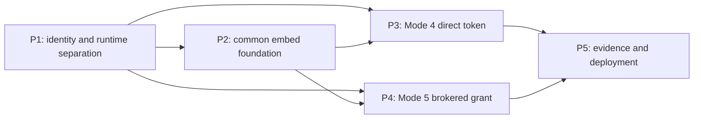

# Embedding implementation plan: Modes 4 and 5

This plan implements the corrected design in
[`embedding-and-identity.md`](embedding-and-identity.md). It treats portability as three
independent choices:

1. channel: native, isolated embed, or standalone;
2. identity: local persona, IAP, direct access token, brokered grant, or OIDC session;
3. runtime: local, live, GCP, platform, or on-premises.

Mode numbers remain compatibility labels. They are not deployment profiles and must not select
the whole adapter graph.

The alternative approaches and the reasons for each selected decision are compared in
[`ui-portability-decision-comparisons.md`](ui-portability-decision-comparisons.md).

## 1. Current status

| Capability | Status | Evidence |
|---|---|---|
| Mode 1, native same-origin IAP | Implemented | Same-origin UI/API, server-verified IAP identity, profile-gated adapters |
| Mode 2, standalone IAP | Application pattern implemented; deployment incomplete | IAP verifier and standalone behavior exist, but this repo does not provision the application service, UI hosting, load balancer, or IAP edge |
| Mode 3, local personas | Implemented | Offline identity adapter and seeded personas |
| Mode 6, standalone OIDC session | Flow and local hardening complete; production deployment remains | Authorization Code + PKCE, strict subject/tenant/session controls, public prefix and cookie contract, discovery validation, CSRF, and synthetic fallback pass |
| Mode 4, direct-token isolated embed | Implemented; synthetic conformance passes | Production-module access-token verifier, strict browser transport, RSA/EC issuer and rotation evidence |
| Mode 5, brokered isolated embed | Implemented; synthetic conformance passes | BFF client authentication, PKCE grant, dedicated token, replay state, transactional outbox, and browser evidence |
| Cross-host and cross-issuer proof | Complete synthetically | One immutable artifact, two hosts, RSA and EC issuers with rotation, three browsers, negative paths, and leak scan |
| Production UI hosting for isolated embed | Not implemented | The Dockerfile packages the API. Terraform provisions supporting infrastructure but no application service, UI, or embed ingress. |

The existing `scripts/portability_demo.py` proves the local runtime/port seam, local identity
resolution, audit tamper evidence, and open-format export/reload. It does not execute an external
identity swap or prove that one UI artifact works in different parent origins or with different
issuers.

## 2. Top five priorities and outcomes

These priorities are ordered by dependency closure and security risk, not by demo appearance.

| Priority | Outcome | Why it comes now | Current status |
|---|---|---|---|
| **P1** | Separate identity/channel security posture from runtime and make both adapter maps exact | Without this, identity can select unrelated managed adapters, runtime can weaken bind/CORS/HSTS posture, and missing platform bindings can fall through to GCP. It also makes the existing Hrz9 native launch explicit instead of relying on legacy inference. Every later mode depends on fail-closed selection. | Complete |
| **P2** | Build the shared isolated-embed foundation and browser-flow state | Modes 4 and 5 need the same dedicated-origin UI, installation policy, loader, MessagePort protocol, authenticated transport, document viewer, CSP, audit context, and atomic browser-flow state. This phase also closes the Hrz9 `/apps/doc1` to canonical `/agent` migration. | Complete locally |
| **P3** | Implement Mode 4 direct-token identity | This is the smaller end-to-end embed slice and validates issuer, audience, tenant, UI transport, and browser boundaries before the broker is added. | Complete locally; production registration is external |
| **P4** | Implement Mode 5 brokered PKCE grant | This is the recommended isolated-front-end integration because the reusable Doc1 token never crosses host JavaScript. The registered host BFF remains an authenticated authorization client. P4 depends on P1 and P2 and reuses P3 claim-policy primitives, not its ID-token verifier. | Complete locally; production IdP, BFF, and storage choices are external |
| **P5** | Produce channel/identity proof and production deployment controls | The claim needs the same artifact in two hosts, two issuers, browser tests, negative tests, fallback, deployable UI, and audit evidence. Runtime and data-exit claims remain separately bounded. | Full synthetic evidence complete; named production enablement blocked externally |

P1 through P4 and the full synthetic portion of P5 are complete locally. Production closure
for P5 still needs the client and cloud inputs listed in Section 12.2.

## 3. Delivery principles

- Preserve Modes 1, 2, 3, and 6. All work is additive until compatibility tests prove otherwise.
- Keep the domain core independent of browser and identity protocols.
- Select identity explicitly and exactly. Unknown identity modes fail startup.
- Use one identity mode per deployment surface. An isolated Mode 4/5 deployment and its Mode 6
  fallback are separate configurations of the same artifact; protected routes never autodetect a
  verifier from credential presence.
- Use one fixed public mount path, `/agent`, for native, isolated, and standalone channels.
  Next.js `basePath` is a build-time setting, so varying it per installation would require
  multiple UI builds and defeat the same-artifact proof.
- Serve the framed UI and its API from the same agent origin. Cross-origin applies between the
  parent and iframe, not between the iframe and API.
- Resolve installation policy before authentication only through an opaque
  `installation_id`. Never accept issuer, audience, tenant, parent origin, or API base as trusted
  values from the parent.
- Keep tokens in memory. Do not put access tokens or grant codes in URLs, storage, cookies, logs,
  or ordinary `window.postMessage` payloads.
- Treat Mode 4 as a trusted-host integration. DOM isolation does not make the host unable to see
  a token that the host supplies.
- Treat Mode 5 as the preferred isolated-front-end integration. Browser JavaScript carries a
  single-use launch code, while the iframe owns the PKCE verifier and receives the Doc1 token
  directly. The registered BFF, identity service, and broker remain in the authorization trust
  boundary.
- Use structured, server-derived audit context. Client observations may be recorded only when
  clearly labelled as observations.
- Do not remove the catalog gap until the executable evidence gate passes.

## 4. Dependency map



P3 is not a prerequisite for the Mode 5 protocol, but delivering it first exercises the common
issuer and authorization policy with less moving state.

### 4.1 Internal Hrz9 dependency

Hrz9 (`journey-portal`) is the existing Mode 1 host. Its internal workspace dependency is
closed: the Doc1 artifact stays fixed at `/agent`, and Hrz9 retains `/apps/doc1` only as a
compatibility entry.

- P1 updated the Hrz9 launcher to set both axes explicitly. Local native journeys use
  `CDD_CHANNEL_PROFILE=native` and `CDD_IDENTITY_PROFILE=local-persona`, remain loopback-only,
  and retain the insecure-demo acknowledgement. Secure hosted journeys use
  `CDD_CHANNEL_PROFILE=native` and `CDD_IDENTITY_PROFILE=iap`. A `live` runtime never selects
  identity implicitly.
- P2 made Hrz9 expose `/agent/*`, including `/agent/_next/*` and `/agent/api/*`, to the
  canonical Doc1 `/agent` artifact. The existing `/apps/doc1` entry URL remains as a tested
  redirect to `/agent/`; the canonical artifact emits only `/agent` asset and API URLs.
- P2 added cross-repository build, proxy, asset, API, identity, and existing RM-journey tests.

The byte-identical native claim is now available and remains bounded to the Doc1 UI and API
artifacts. Hrz9 consumes the canonical `/agent` build and the cross-repository journey gate
passes. Hrz9 shell code, its reverse-proxy configuration, and deployment manifests are host
integration artifacts and are not expected to be byte-identical to Doc1.

## 5. Phase 0: design and status correction

Status: complete.

Work:

1. Replace the old six-way profile taxonomy with independent channel, identity, and runtime axes.
2. Correct the iframe sandbox to `allow-scripts allow-same-origin`.
3. Define Mode 4 as direct access-token delivery by an explicitly trusted host.
4. Define Mode 5 as a brokered, PKCE-bound, single-use grant.
5. Reclassify server-side credential injection as the native trusted-BFF pattern.
6. Keep Modes 4 and 5 marked proposed until code and browser evidence exist; that gate is
   now satisfied.
7. Correct the scope of the existing portability demo.

Acceptance:

- Design, implementation plan, audit, FAQ, demo, architecture, and catalog status agree.
- Status transitions occur only after their matching evidence gate.
- All links and Mermaid diagrams validate.

## 6. Phase 1: separate identity from runtime

Status: complete.

### 6.1 Goal

Make identity an explicit deployment axis so `local` compute can use OIDC and GCP compute can use
IAP without inventing pseudo-runtime profiles such as `oidc-session`. One deployment selects one
identity policy. Combining multiple credentials on one protected route is out of scope.

### 6.2 Delivered changes

| Work | Files |
|---|---|
| Add `identity.mode` with `CDD_IDENTITY_PROFILE` override. Canonical values: `local-persona`, `iap`, `oidc-session`, `oauth-access-token`, `embedded-grant`, `onprem`. | `src/cdd_sow_research/config.py`, `config/settings.yaml`, `.env.example` |
| Add `channel.mode` with `CDD_CHANNEL_PROFILE` override. Canonical values are `native`, `sandboxed`, and `standalone`; no channel is inferred from a credential or the legacy standalone flag. Sandboxed startup requires a valid installation manifest and dedicated public origin. | `src/cdd_sow_research/config.py`, `config/settings.yaml`, `.env.example` |
| Make the Hrz9 Mode 1 launcher pass explicit native channel and identity settings. P2 now serves the canonical `NEXT_PUBLIC_BASE_PATH=/agent` artifact and keeps `/apps/doc1` as a compatibility entry. Local journeys select acknowledged loopback `local-persona`; secure hosted journeys select `iap`. | `../journey-portal/scripts/run_journeys.py`, Hrz9 launcher/config tests |
| Keep `CDD_PROFILE` as the runtime adapter profile. Remove identity from the implied fallback behavior of that value. | `src/cdd_sow_research/config.py`, `src/cdd_sow_research/api/deps.py` |
| Remove the generic runtime-to-`gcp` adapter fallback. Every named runtime must bind every runtime/data port explicitly, including intentional `platform` reuse of a GCP adapter; unknown or incomplete profiles fail startup. `IdentityPort` is removed from this runtime map and keyed only by exact identity mode. | `src/cdd_sow_research/config.py`, `config/settings.yaml`, `tests/contract/test_port_parity.py` |
| Retire `deployment.standalone` / `CDD_STANDALONE` from application auth and route selection. It is a deprecated control-ownership compatibility input, never the channel axis. `channel.mode` controls framing, `identity.mode` controls `/auth/*`, adapter bindings control services, and infrastructure inputs control provisioning. Diagnose conflicts only with explicit identity/control-ownership behavior the old flag actually governed, never from channel mismatch. | `src/cdd_sow_research/config.py`, `src/cdd_sow_research/api/app.py`, `config/settings.yaml`, Terraform |
| Bind identity from an exact identity map and raise a configuration error on an unknown or unconfigured value. Do not fall back to `gcp`. | `src/cdd_sow_research/config.py`, `src/cdd_sow_research/api/deps.py` |
| Enforce the reviewed channel/identity matrix: native permits IAP, direct access-token BFF, or loopback local persona; sandboxed permits direct token or embedded grant; standalone permits IAP, OIDC session, on-premises, or loopback local persona. Reject all other combinations. | configuration validation and matrix tests |
| Gate local persona routes and headers on `identity.mode=local-persona`. | `src/cdd_sow_research/api/security.py`, `src/cdd_sow_research/api/app.py` |
| Gate `/auth/*` on `identity.mode=oidc-session`. | `src/cdd_sow_research/api/auth.py`, `src/cdd_sow_research/api/app.py` |
| Derive bind exposure, dev CORS/persona-header behavior, HSTS, and authentication/rate-limit posture from explicit identity, channel, and deployment policy, not the runtime profile. Data-size defaults may remain runtime-derived. Every `local-persona` combination is loopback-only with insecure-demo acknowledgement; secure identity may use local compute behind ingress. | `src/cdd_sow_research/api/app.py`, `src/cdd_sow_research/cli/main.py`, security middleware tests |
| Add the minimal public-route test proxy for `/agent/auth/*`, canonical callback handling, and public cookie paths. Phase 2 extends this same fixture for UI/API embed routes. | `scripts/embed_dev_proxy.py`, OIDC proxy tests |
| Report runtime profile, identity mode, channel mode, deprecated control-ownership compatibility state, manifest version, and configuration hash in a safe health/version response. | `src/cdd_sow_research/api/schemas.py`, `src/cdd_sow_research/api/app.py` |
| Preserve `IdentityPort.resolve() -> Principal` as the domain-facing compatibility view. Add an API-layer `AuthenticationPort.authenticate() -> AuthenticatedIdentity {principal, evidence}` selected by identity mode; the request dependency verifies once through that richer contract, never through adapter-specific side channels. This API protocol is deliberately excluded from the driven-domain port count and runtime parity map. | `src/cdd_sow_research/api/security.py`, identity adapter packages |
| Add request-scoped `AuthenticatedContext` and `IdentityEvidence`. Carry exact issuer and original `sub`, token type, authorized client, effective scopes, installation, assurance, and safe correlation. Canonical actor/`user:` identity is a deterministic issuer-qualified encoding of `(iss, sub)`; email is verified display metadata only. Require non-empty policy-mapped tenant for every secure identity. | `src/cdd_sow_research/api/security.py`, `src/cdd_sow_research/api/deps.py`, OIDC callback |

### 6.3 Compatibility migration

For one release, infer the current identity default when `CDD_IDENTITY_PROFILE` is absent:

| Existing runtime/profile state | Compatibility identity |
|---|---|
| `local` | `local-persona` |
| `live` | No inference; explicit identity required |
| `gcp` or `platform` | `iap` |
| `onprem` | `onprem` fail-fast placeholder |

Reject historical `CDD_PROFILE=oidc-session` at startup. It is not a runtime profile and the
historical generic adapter fallback could bind unrelated GCP adapters. The error must require both a
real `CDD_PROFILE=<runtime>` and `CDD_IDENTITY_PROFILE=oidc-session`; do not preserve it through a
deprecation inference.

For the same compatibility release, `CDD_STANDALONE` may be read only to diagnose migration.
It must not select the target channel or identity. `false` plus a platform-managed deployment
migrates to an explicit runtime, `identity.mode=iap`, an independently selected channel, and
infrastructure-owned service settings. `true` plus the old pseudo-profile migrates to a real
runtime, `identity.mode=oidc-session`, and `channel.mode=standalone`. A legacy value may conflict
with explicit identity or control ownership, but never merely because the independently valid
channel differs.

Channel migration is explicit:

- local Mode 3 and Mode 6 set `CDD_CHANNEL_PROFILE=standalone`;
- Hrz9 Mode 1 sets `CDD_CHANNEL_PROFILE=native` and an explicit
  `CDD_IDENTITY_PROFILE=local-persona` for the acknowledged loopback demo or `iap` for secure
  hosted use; its `/apps/doc1` URL remains an Hrz9-owned compatibility route;
- `sandboxed` is accepted only with the canonical installation manifest and dedicated origin;
- other secure deployments without a channel value fail with a migration instruction.

`live` processes real uploaded documents. Permit explicit `local-persona` there only on loopback
with the existing insecure-demo acknowledgement; otherwise require a secure identity and fail
startup.

Harden the Mode 6 fallback in the same phase:

- require discovery response `issuer` to equal the configured issuer;
- require HTTPS authorization, token, JWKS, and logout endpoints, with a loopback-only
  development exception;
- bind returned endpoint hosts to reviewed issuer policy and constrain outbound egress;
- configure one canonical external origin, public mount path, and exact registered OIDC
  callback URI; never derive redirect authority from an untrusted `Host` or forwarded header;
- use the public callback URI for both authorization and code exchange, scope the transaction
  cookie to `/agent/auth`, and keep the `__Host-cdd_session` cookie at its prefix-required
  `Path=/` on a dedicated standalone origin;
- add an end-to-end prefix-stripping proxy test proving `/agent/auth/callback` receives the
  transaction cookie, uses the configured redirect URI, and emits browser-valid set/delete
  attributes for both cookies;
- require OIDC `sub`; if ID-token `aud` has multiple values, require `azp` to equal the
  configured client ID;
- select a reviewed token-endpoint authentication method (`client_secret_basic`,
  `client_secret_post`, `private_key_jwt`, or explicitly approved public-client `none`) from
  issuer configuration and verified discovery metadata; never hard-code or silently downgrade;
- protect every unsafe cookie-authenticated Mode 6 route, including logout, with exact canonical
  `Origin`, same-origin Fetch Metadata, and a stateless CSRF token. Embed a CSPRNG nonce as a
  signed claim in the `HttpOnly` session, or derive an equivalent stateless HMAC from the signed
  session `jti`. Return it only from an authenticated, same-origin `private, no-store` bootstrap;
  the UI holds it only in memory and sends it in `X-CSRF-Token`. Compare the header in constant
  time with the verified signed claim or derivation and keep no server or process state. Never
  place the CSRF value in another cookie, storage, logs, or cache. Reject missing, wrong,
  sibling-origin, or cross-session values;
- add malicious discovery, redirect, and endpoint-host tests.

### 6.4 Tests and acceptance

Add or update:

- `tests/unit/test_identity_profile_config.py`;
- `tests/unit/test_oidc_auth_flow.py`;
- `tests/unit/test_oidc_session_identity.py`;
- authentication-contract parity tests for every enabled identity mode;
- `tests/contract/test_port_parity.py`;
- API security and health tests.

Acceptance:

1. `CDD_PROFILE=local` plus `CDD_IDENTITY_PROFILE=oidc-session` uses local compute and OIDC
   identity.
2. `CDD_PROFILE=gcp` plus `CDD_IDENTITY_PROFILE=iap` retains current behavior.
3. An unknown identity value fails startup.
4. Every named runtime has an explicit binding for each of the 17 runtime/data ports present
   in Phase 1;
   `IdentityPort` has a separate exact binding for every enabled identity mode. Neither selector
   falls back to `gcp`.
5. Missing secure identity configuration never falls back to local personas or IAP.
6. Historical `CDD_PROFILE=oidc-session` fails with the exact migration instruction.
7. `live` never obtains local persona identity implicitly.
8. Mode 6 fails closed on issuer or endpoint-policy mismatch.
9. An embedded deployment rejects Mode 6 cookies and a standalone deployment rejects embed
   bearers; credential presence never chooses the adapter.
10. The legacy standalone flag cannot select a channel, identity, or service adapter and any
    conflict with explicit identity/control-ownership settings fails startup; channel mismatch
    alone is never treated as a conflict.
11. `local + oidc-session` may bind behind secure ingress with HSTS and secure rate limits;
    `gcp + local-persona` is refused unless the process is loopback-bound with explicit
    insecure-demo acknowledgement.
12. Missing `sub` or tenant fails every secure mode; equal `sub` values from different issuers
    remain different actors, and changing verified email does not change the actor.
13. The API obtains `Principal` and `IdentityEvidence` from one verification result for every
    identity mode.
14. Modes 1, 2, 3, and 6 remain green.
15. Cookie-authenticated unsafe requests from a same-site sibling origin, with a missing, wrong,
    or cross-session CSRF token, or with invalid Fetch Metadata fail closed.
    A same-origin request survives process restart without server-side CSRF state, and same-origin
    UI requests and logout pass.
16. OIDC multi-audience ID tokens require correct `azp`, and every configured token-endpoint
    authentication method passes positive and downgrade/unsupported-method tests.
17. Hrz9 local and hosted launchers set explicit native channel and identity values, preserve the
    `/apps/doc1` compatibility URL, and never select identity from the runtime profile.

## 7. Phase 2: shared isolated-embed foundation

Status: complete locally, including the Hrz9 canonical-artifact dependency.

### 7.1 Goal

Build one browser and server foundation used by both Modes 4 and 5. It must support one immutable
UI artifact under different parent origins and identity policies.

### 7.2 Installation policy and runtime bootstrap

Add a pure, typed installation model loaded from one reviewed, non-secret deployment manifest.
Both Next.js and FastAPI consume the same exact JSON bytes, schema version, and SHA-256 digest.
Neither service owns a second registry:

- `installation_id`;
- allowed parent origins;
- tenant identifier;
- identity mode;
- stable trusted issuer-policy ID, resolved against reviewed verifier configuration;
- expected resource audience and scopes;
- protocol versions;
- reviewed canonical public origin, never inferred from `Host` or forwarded headers;
- fixed public mount path `/agent`;
- standalone fallback URL;
- optional presentation defaults;
- deployment manifest and build identifiers.

First-release manifest invariants are fail-closed:

- a deployment manifest contains one or more installations, but the set of non-empty tenant
  identifiers across them has cardinality exactly one and equals the configured deployment
  tenant;
- the deployment selects exactly one `identity.mode`, and every installation record declares
  that exact mode;
- every `issuer_policy_id` resolves to exactly one enabled verifier policy whose credential
  type, issuer, resource audience, tenant mapping, and allowed client are compatible with that
  identity mode and installation;
- missing, duplicate, wildcard, disabled, cross-tenant, or mode-incompatible policy resolution
  fails schema validation or startup; runtime credential presence never repairs or overrides it.

Suggested files:

- `src/cdd_sow_research/embedding/models.py`;
- `src/cdd_sow_research/embedding/manifest.py`;
- `src/cdd_sow_research/api/embed.py`;
- `src/cdd_sow_research/config.py`;
- `config/settings.yaml`;
- `config/installations.example.json`;
- `ui/lib/server/installations.ts`.

Public and internal route ownership:

- Next owns external `GET /agent/embed/{installation_id}/`;
- Next owns external `GET /agent/embed/{installation_id}/fallback`, which resolves the
  canonical manifest and redirects only to its allowlisted standalone URL;
- FastAPI owns internal `GET /v1/embed/installations/{installation_id}`;
- ingress exposes it as `GET /agent/api/v1/embed/installations/{installation_id}`;
- FastAPI owns internal `GET /v1/version`, exposed as `/agent/api/v1/version`;
- ingress maps `/agent/auth/*` to FastAPI `/auth/*`;
- the standalone origin root redirects to `/agent/`.

In P2, Hrz9 exposes the canonical `/agent/*` surface, including `/agent/_next/*` and
`/agent/api/*`, to the unmodified Doc1 artifact. Its existing `/apps/doc1` entry URL remains a
tested redirect or alias to `/agent/`. The canonical artifact emits only `/agent` URLs; old
`/apps/doc1/_next/*` and `/apps/doc1/api/*` routes remain only if Hrz9 deliberately retains and
tests them for stale clients. Cross-repository tests build Doc1 once, record its digest, traverse
the Hrz9 proxy and RM journey, and compare that digest with the isolated and standalone proof.

Phase 2 extends the minimal `scripts/embed_dev_proxy.py` or equivalent Phase 1 auth-route fixture
to implement the whole contract, strip `/agent/api`, preserve streaming and security headers, and
drive the browser smoke test. Phase 6 replaces that test ingress with production DNS, TLS, and
load-balancer configuration; it does not invent a different route shape.

The standalone identity configuration owns a canonical external origin and exact registered
redirect URI. Authorization and code exchange use that configured URI, never an untrusted request
host. Prefix stripping must preserve the public contract in cookie paths: `/agent/auth` for the
`__Secure-` transaction cookie and `/` for the `__Host-` session cookie. The standalone
application gets a dedicated origin so that broader session path does not cover unrelated
applications. The local ingress test executes the full redirect and callback path and asserts the
set/delete attributes in a browser.

The local proof starts two configurations of the same build: an isolated deployment selecting
the installation's Mode 4 or Mode 5 identity and a standalone deployment selecting
`oidc-session`. The fallback URL points to the latter. They may share test data adapters, but they
do not share a credential-acceptance policy.

The bootstrap response may disclose the parent-origin allowlist because browser framing policy is
not a secret. It must not expose client secrets, signing keys, token values, internal endpoints,
or unrelated installations.

### 7.3 UI decomposition

Extract the current console so it can render in standalone and embed shells without duplicating
the feature UI.

Suggested files:

- `ui/components/AgentConsole.tsx`;
- `ui/app/page.tsx`;
- `ui/app/embed/[installationId]/page.tsx`;
- `ui/lib/runtime-config.ts`;
- `ui/lib/embed/iframe-client.ts`;
- `ui/lib/embed/protocol.ts`.

Keep `basePath: "/agent"` fixed in `ui/next.config.mjs`. All deployment-specific values come
from the runtime bootstrap, not `NEXT_PUBLIC_*` variables.

### 7.4 Loader and message protocol

Build and publish a versioned, immutable loader:

- source: `ui/embed/cdd-agent.ts`;
- output: `/agent/embed/v1/cdd-agent.js`;
- SRI: SHA-384 digest published with the integration example;
- input: only `installation-id` and optional non-security presentation hints;
- output: a sandboxed iframe pointing to the agent origin.

The iframe baseline is:

```html
<iframe
  sandbox="allow-scripts allow-same-origin"
  referrerpolicy="no-referrer"
  allow=""
></iframe>
```

Do not add `allow-forms`, `allow-popups`, downloads, clipboard, camera, microphone, geolocation,
or top-navigation until a tested capability requires one.

Serve the cross-origin SRI loader with `Access-Control-Allow-Origin: *`,
`Cross-Origin-Resource-Policy: cross-origin`, a JavaScript content type, `nosniff`, and immutable
cache headers. This is a public static-asset policy only and does not enable API CORS.

Publish a client-host CSP example and test host pages whose `script-src` allows the exact
versioned loader origin or matching hash and whose `frame-src` allows only the agent origin.
Verify that removing either directive blocks the expected resource.

The loader and iframe must:

- render the agent-origin `/agent/embed/{installation_id}/fallback` host-DOM anchor before
  waiting for iframe load or handshake;
- initiate `host:init` from the loader after iframe load using the exact agent
  `targetOrigin`, a CSPRNG channel ID, and a transferred `MessagePort`;
- have the iframe validate `event.source === parent`, allowed `event.origin`, installation,
  closed schema, and offered versions before acknowledging on the port;
- distinguish the loader-created channel ID from the API-created Mode 5 grant-instance ID;
- remove temporary global listeners after `agent:ready`;
- negotiate a supported protocol version;
- hand off a `MessageChannel`;
- validate every message against a closed schema;
- cap payload sizes and resize rates;
- reject unknown message types and fields;
- carry no credential in the global bootstrap message; Mode 4 transfers its access token only
  over the negotiated, instance-bound `MessagePort`;
- expose structured ready, resize, navigation, authentication, and error events.

The fallback route accepts no target or `return_to` supplied by the host, returns `404` for an
unknown installation, redirects only to the manifest's allowlisted Mode 6 URL, and emits
`Cache-Control: no-store`. A direct user click preserves browser activation, so the baseline
iframe does not need popup sandbox capability. Because the loader constructs this route from its
own pinned origin and installation ID, fallback remains available when `frame-ancestors` blocks
the iframe or the iframe times out.

### 7.5 Same-origin API and one authenticated transport

The iframe calls `/agent/api` on its own origin. Do not create dynamic browser CORS between the
iframe and API.

Refactor `ui/lib/api.ts` so every operation uses one request path:

- JSON requests;
- multipart uploads;
- streamed or blob document reads;
- health/version calls;
- persona calls where permitted;
- all authentication failure handling.

For `oauth-access-token` and `embedded-grant`, the transport attaches
`X-CDD-Installation-ID` and `X-CDD-Manifest-SHA256` to every protected JSON, multipart,
streaming, and blob request. The installation header is only a selector: API middleware
requires both values, rejects manifest-byte drift, resolves the canonical installation,
and compares it with `AuthenticatedContext.installation` before route authorization.
Missing, unknown, or cross-installation values fail closed. Native and standalone surfaces
use their configured identity policy and never let an optional header select one.

Replace protected document and citation anchor navigation with a mandatory authenticated
in-frame viewer. It validates declared and detected media type, size, page, and image limits;
renders text and images in a modal; and uses a pinned, self-hosted PDF.js build to render PDFs
to canvas. Revoke object URLs and workers on close, error, and cleanup. Keep tokens only in
memory. Do not add popup or download sandbox capability.

Embedded public-web citation cards show title, sanitized origin, retrieval time, excerpt, and
provenance in-frame. Opening the original is a separate Mode 6 top-level action after
authentication, not a `_blank` link in the sandbox. Implement the opaque continuation in
Section 7.6 before enabling that action.

Relevant files include:

- `ui/lib/api.ts`;
- `ui/lib/auth.ts`;
- `ui/components/CitationCard.tsx`;
- `ui/components/DocumentPanel.tsx`;
- `ui/components/DocumentViewerModal.tsx`;
- a pinned, self-hosted PDF.js worker and its integrity/build metadata.

### 7.6 Browser-flow state and Mode 6 citation continuation

Add `BrowserFlowStorePort` in P2 as the one typed, atomic store boundary for short-lived browser
flows. Its record variants and state machines are closed by flow kind so a citation ticket can
never be consumed as a Mode 5 grant. The P2 contract supports:

- creating a CSPRNG ticket with at least 128 bits of entropy while persisting only its hash;
- recording the bounded citation IDs actually emitted by a real one-shot CDD response, keyed
  by tenant and verified source actor, only after current document custody resolves;
- binding the record to flow kind, installation, tenant, source actor, expected Mode 6 actor,
  citation/evidence reference, expiry, and safe correlation;
- atomically beginning, consuming, or expiring the exact record with compare-and-transition
  semantics;
- appending a sanitized security-event outbox record in the same transaction;
- reading neither a stored plaintext ticket nor a browser-supplied target URL.

Suggested files:

- `src/cdd_sow_research/ports/browser_flow_store.py`;
- `src/cdd_sow_research/adapters/local/browser_flow_store.py`;
- `src/cdd_sow_research/adapters/onprem/browser_flow_store.py`;
- runtime configuration, port parity, restart, expiry, and concurrency tests.

The `local` binding uses transactional SQLite. The two local synthetic deployments point at the
same reviewed database path so the isolated and Mode 6 processes share atomic flow state. `gcp`
and `platform` bind regional transactional Firestore, `live` remains explicitly disabled, and
`onprem` binds a fail-fast placeholder until a client adapter exists. Startup rejects a feature
that requires cross-deployment browser flow state when its selected adapter is disabled, and
rejects SQLite for multi-replica or production use.

This addition raises the runtime/data port count from 17 to 18 and the total domain-port count,
including `IdentityPort`, from 18 to 19. Every runtime receives one explicit
`BrowserFlowStorePort` binding in P2. The API-layer `AuthenticationPort` remains outside both
counts. P4 extends this same port with a separate grant record variant; it does not add another
port or change either count.

The secure citation journey is:

1. The real `/v1/cdd` assessment records only citations whose current custody metadata resolves
   under the verified actor's server-derived case scope. Only those citations receive a
   continuation ID in the response; the unrelated longitudinal `SowCase` ledger is not assumed.
2. An authenticated iframe posts the emitted server-owned citation identifier to
   `POST /agent/api/v1/embed/citations/{citation_id}/continuations`, with its installation
   selector and normal bearer transport.
3. The API rechecks tenant, case, emitted-citation binding, current document custody, and
   installation authorization. It validates the reviewed HTTPS/source policy and resolves the
   source actor to exactly one expected Mode 6 actor through server-reviewed identity-link
   policy. No exact emitted record or unique identity link means no ticket.
4. The store registers a citation flow with a lifetime of at most 60 seconds and returns one
   opaque ticket. The response contains only the canonical manifest-owned Mode 6 URL with the
   ticket in its URL fragment, never the citation target or a host-supplied `return_to`.
5. The iframe emits a typed top-level-navigation request. The host opens the manifest-owned URL;
   it receives no resource credential or original target. The Mode 6 page uses
   `Referrer-Policy: no-referrer` and `Cache-Control: private, no-store`, reads the fragment,
   immediately removes it with `history.replaceState`, and posts the ticket in the body to a
   same-origin start endpoint.
6. The start endpoint hashes and atomically marks the flow `AUTH_PENDING`, binds its internal
   reference into the signed `HttpOnly` OIDC transaction cookie, and starts the normal Mode 6
   Authorization Code + PKCE flow. Ticket values are redacted from browser, proxy, application,
   audit, and trace logs.
7. The callback verifies the Mode 6 identity and requires the exact expected actor, tenant, and
   active transaction. It atomically consumes the flow, re-resolves and reauthorizes the cited
   evidence, and renders a clean top-level confirmation page. A final user action may navigate
   only to that server-held, revalidated HTTPS original; no request parameter can choose it.

Citation flow transitions are `REGISTERED -> AUTH_PENDING -> CONSUMED`, with
`REGISTERED -> EXPIRED` and `AUTH_PENDING -> EXPIRED`; no other transition is valid. A second
start, callback, replay, expired ticket, identity mismatch, changed evidence authorization, or
failed target validation fails closed. The ticket is a short-lived, subject-bound continuation
capability, not an authentication credential.

### 7.7 Dynamic browser security

Use `ui/proxy.ts` for request-time headers with the current Next.js version. The project is a
server-rendered Next application; do not switch it to a static export because dynamic
installation-specific framing policy would no longer work.

`ui/proxy.ts` reads the same canonical installation manifest as FastAPI and fails closed when the
file, schema, digest, or installation is invalid. It must not copy parent origins into a separate
environment variable or TypeScript registry.

For an embed document:

- resolve `installation_id`;
- emit `Cache-Control: private, no-store` on dynamic embed HTML and bootstrap;
- emit an exact `Content-Security-Policy: frame-ancestors ...` for that installation;
- emit strict `default-src`, `script-src`, `connect-src`, `object-src`, `base-uri`, and
  `form-action` controls;
- permit only the in-frame viewer's required `img-src 'self' blob:` and
  `worker-src 'self' blob:`; keep `object-src 'none'` and popup/download sandbox tokens absent;
- use a nonce if the Next runtime needs inline bootstrap;
- emit `Referrer-Policy: no-referrer`;
- emit `X-Content-Type-Options: nosniff`;
- avoid obsolete `X-Frame-Options` on cross-origin embed responses.

Standalone pages remain non-frameable by default.

All authenticated JSON, multipart result, stream, and document responses use
`Cache-Control: private, no-store`. Only versioned non-secret loader and `_next` assets are
publicly immutable, and no service worker may cache protected responses.

### 7.8 Authenticated context and audit plumbing

Thread the request-scoped `AuthenticatedContext` from Phase 1 through API authorization and audit:

- route dependencies enforce required scopes before invoking domain services;
- domain decision audit receives a sanitized `IdentityEvidence` projection;
- configured `authorized_parent_origin` and `browser_observed_parent_origin` stay separate;
- authentication failures and installation mismatches emit security audit events;
- grant lifecycle events added in Phase 4 use the same event context;
- no credential, grant code, verifier, subject document, or raw PII reaches metadata.

Relevant files:

- `src/cdd_sow_research/api/security.py`;
- `src/cdd_sow_research/api/deps.py`;
- `src/cdd_sow_research/domain/cdd_service.py`;
- `src/cdd_sow_research/domain/sow_case_service.py`;
- audit adapters and tests.

### 7.9 Tests and acceptance

Add:

- installation registry unit tests;
- bootstrap disclosure and isolation tests;
- loader/protocol unit tests;
- API transport tests for JSON, multipart, and blob paths;
- missing, unknown, and installation-A-token-from-installation-B transport tests across JSON,
  multipart, stream, and blob paths;
- PDF, image, and text modal-viewer tests in all three browser engines, including MIME/size
  rejection and object-URL/worker cleanup;
- tests proving protected documents and public citations create no `_blank` link, popup, or
  download in the sandbox;
- CSP and exact-parent tests;
- local ingress route and prefix-stripping tests;
- manifest schema and Python/TypeScript digest-parity tests;
- one-tenant, exact identity-mode, unique issuer-policy resolution, and incompatible-policy
  rejection tests;
- `BrowserFlowStorePort` parity, transactional restart, expiry, transition, outbox, and
  concurrency tests for every explicit enabled or disabled runtime binding;
- static-loader CORS, content-type, cache, and SRI browser tests;
- browser and shared-cache tests proving dynamic embed policy and every authenticated response
  are `private, no-store`, while only versioned static assets are immutable;
- host CSP positive and negative tests for the loader `script-src` and agent `frame-src`;
- a manifest/configuration and browser test proving a sandboxed parent origin cannot equal
  the canonical agent origin;
- open-redirect and unknown-installation tests for the agent-owned fallback route;
- frame-denied and iframe-timeout browser tests proving the host-DOM fallback exists and
  reaches the separately configured Mode 6 origin without bootstrap or API CORS;
- Mode 6 citation-continuation tests covering success, missing identity link, wrong actor,
  tenant, installation, citation, state, and evidence authorization, plus ticket expiry,
  second-start, callback replay, process restart, target tampering, open-redirect input, fragment
  removal, no-referrer/no-store headers, and ticket/log/trace redaction;
- Hrz9 cross-repository tests for the `/apps/doc1` entry redirect or alias, canonical
  `/agent`, `/agent/_next/*`, and `/agent/api/*` behavior, prefix stripping, cookies, streams,
  explicit native identity, existing RM journey, and matching Doc1 build digest;
- a two-origin Chromium browser smoke test in CI from this phase;
- a fallback-policy test proving each deployment rejects the other deployment's credential type.

Acceptance:

1. The same UI build runs under two installation manifests.
2. Each host can frame only its installation.
3. A `null`, wildcard, sibling, or unregistered origin is rejected.
4. A sandboxed installation whose parent equals the agent origin fails schema/startup
   validation.
5. The iframe and API remain same-origin.
6. Public `/agent` and internal FastAPI routes map exactly as documented.
7. Both processes report the same manifest digest.
8. Existing standalone UI behavior remains green.
9. Every manifest is one-tenant, matches the deployment identity mode, and resolves each
   installation to exactly one compatible issuer policy.
10. All 18 runtime/data ports and `IdentityPort` have the exact bindings documented above;
    disabled browser-flow bindings fail before serving a dependent feature.
11. The complete opaque citation journey reaches the separately configured Mode 6 origin, binds
    the same authorized user through reviewed identity linkage, consumes once, and never exposes
    the original target or reusable credential to host JavaScript.
12. Hrz9 consumes the canonical `/agent` artifact behind its `/apps/doc1` entry compatibility
    URL, and cross-repository evidence bounds the native same-artifact claim to a matching Doc1
    build digest.

## 8. Phase 3: Mode 4 direct-token isolated embed

Status: complete locally; named production issuer registration remains external.

### 8.1 Goal and trust statement

Deliver the smaller isolated-embed slice. The host obtains and supplies a short-lived OAuth
access token whose audience is Doc1. This mode is only suitable when the agent deployment owner
explicitly trusts the host application with that token and the corresponding Doc1 API access.

### 8.2 Backend adapter

Add a dedicated access-token verifier. Do not reuse the Mode 6 ID-token function because the two
token types have different audiences and claim semantics.

Suggested files:

- `src/cdd_sow_research/adapters/oidc/access_token_identity.py`;
- `src/cdd_sow_research/adapters/oidc/jwks_verify.py`;
- `src/cdd_sow_research/adapters/oidc/__init__.py`;
- `src/cdd_sow_research/api/security.py`;
- `src/cdd_sow_research/config.py`;
- `config/settings.yaml`.

Required checks:

- compact signed JWT with protected JOSE header `typ=at+jwt`;
- algorithm allowlist `RS256` and `ES256`;
- exact configured issuer;
- exact Doc1 resource audience;
- required `exp` and `iat`, plus `nbf` validation when present or policy-required, with bounded
  clock skew;
- maximum accepted `exp - iat` from issuer policy, default 300 seconds and capped by the
  deployment at 900 seconds;
- issuer-qualified subject;
- authorized client identifier;
- required scope;
- issuer-to-tenant mapping;
- installation binding through an issuer-signed claim or a reviewed mapping where
  issuer, authorized client, and tenant resolve to exactly one installation;
- groups or roles only through configured claim mappings;
- HTTPS discovery and JWKS from reviewed configuration;
- no token-controlled `jku`, `x5u`, issuer, JWKS URL, audience, or tenant;
- bounded JWKS cache with rotation refetch and constrained egress;
- fail closed on discovery or JWKS failure.

The access-token `jti` is an audit correlation value. It is not a single-use replay key. A normal
access token remains usable until expiry. Version 1 makes no revocation claim unless an issuer
policy configures and tests an authoritative introspection or revocation source.

The iframe supplies `installation_id` only as a selector. The verifier produces
`AuthenticatedContext`; route-level dependencies check its effective scopes and verified
installation binding before the domain service runs.

### 8.3 Browser flow

1. Host creates `<cdd-agent installation-id="...">`.
2. Iframe loads configuration and completes the origin/version handshake.
3. Host obtains a Doc1-audience access token.
4. Host transfers it through the negotiated private channel.
5. Iframe stores it only in memory and attaches it to every protected request.
6. Iframe requests refresh before expiry and erases the old token.
7. Authentication failure produces a structured event and offers the Mode 6 fallback.

The direct-token host example must state that any script running in the host origin can read or
reuse the token.

### 8.4 Tests and acceptance

Add:

- `tests/unit/test_access_token_identity.py`;
- `tests/integration/test_mode4_embed.py`;
- `ui/embed/examples/direct-token-host.html`;
- browser tests for transfer, refresh, failure, and fallback;
- audit tests for success, failure, installation mismatch, and safe token correlation;
- an update to the explicit OIDC test-file list in `.github/workflows/ci.yaml`.

Test two synthetic issuers, one RSA and one EC, including key rotation. Negative cases include
wrong `typ`, issuer, audience, client, scope, tenant, algorithm, timestamps, key, and origin.

Acceptance:

1. A valid token reaches every API transport.
2. Reuse of a valid access token before expiry succeeds.
3. Cross-tenant and cross-installation use fails.
4. Host trust is explicit in configuration and docs.
5. No token appears in URL, storage, logs, screenshots, or control-plane audit fields.
6. Mode 4 adversarial and Chromium browser tests gate the PR that enables the identity mode.

## 9. Phase 4: Mode 5 brokered PKCE grant

Status: complete locally with reusable Firestore and Cloud KMS production bindings. Named IdP/BFF
registrations, target-project apply, operational approvals and live evidence remain external.

### 9.1 Goal

Keep the reusable Doc1 token out of host JavaScript while preserving single sign-on. The iframe
owns a PKCE verifier; the host receives only an opaque instance identifier and later carries a
single-use launch code.

### 9.2 Extend the browser-flow store

Extend the P2 `BrowserFlowStorePort` with a separate Mode 5 grant record variant. Do not add a
second grant-specific port or change the P2 port counts. The extension must:

- register a PKCE challenge and return an opaque grant-instance ID;
- create the instance in `REGISTERED` with a registration lifetime no greater than 120 seconds;
- verify the BFF client and subject credential before atomically moving one instance from
  `REGISTERED` to `CODE_ISSUED`;
- issue exactly one launch code for an instance, store only its hash, and give the code a lifetime
  no greater than 60 seconds or the remaining registration lifetime, whichever is shorter;
- atomically move `CODE_ISSUED` to `CONSUMED` only when installation, instance, challenge,
  verifier, client, subject, tenant, and expiry all match;
- allow `REGISTERED` or `CODE_ISSUED` to move to `EXPIRED`, with no other transitions;
- atomically append a sanitized security-event outbox record with every transition;
- expose no method that reads a plaintext code, credential, or verifier.

A repeated or concurrent authorization request for the same instance cannot issue another code.
If the BFF loses the successful authorization response, the browser starts a new instance. The
local transactional SQLite adapter proves restart, race, expiry, and outbox behavior. `gcp` and
`platform` bind the regional transactional Firestore adapter. `live` stays disabled because it
does not silently acquire managed shared state, and `onprem` remains an explicit placeholder.
Startup rejects `identity.mode=embedded-grant` when the selected browser-flow adapter is disabled.

### 9.3 Broker endpoints

Suggested module: `src/cdd_sow_research/api/embed.py`.

Endpoints:

The paths below are public. The Phase 2 ingress strips `/agent/api`, so FastAPI owns the
corresponding internal `/v1/embed/*` routes.

1. `POST /agent/api/v1/embed/instances`
   - called directly by the iframe;
   - accepts installation ID, protocol version, PKCE challenge, and challenge method `S256`;
   - returns a `REGISTERED` opaque grant-instance ID, CSPRNG-generated with at least
     128 bits of entropy and an exact expiry no more than 120 seconds later.
2. `POST /agent/api/v1/embed/grants`
   - called server-to-server by the registered host BFF, never by host JavaScript;
   - authenticates the BFF with mTLS or `private_key_jwt`, bound to the installation;
   - for `private_key_jwt`, requires the registered pinned algorithm/key,
     `iss=sub=client_id`, exact grant-endpoint `aud`, `iat`, `exp` no more than 60 seconds
     later, and a CSPRNG `jti` atomically consumed in shared replay state; rejects
     token-selected `jku`/`x5u` and unregistered rotation keys;
   - requires the BFF to authenticate its browser session, bind that session and current
     user intent to the instance and broker subject, and enforce CSRF, exact `Origin`, and
     Fetch Metadata controls on its host-facing request;
   - verifies a broker-audience RFC 9068 JWT access token held only by the BFF: protected
     `typ=at+jwt`, deployment-pinned asymmetric algorithm and key, exact institutional issuer,
     broker audience, original `sub`, authorized client, non-empty policy-mapped tenant, narrow
     grant scope, required `iat` and `exp`, optional validated `nbf`, bounded clock skew, and a
     configured maximum `exp - iat`; the reference maximum is 300 seconds, the deployment ceiling
     is 900 seconds, and clock skew defaults to 30 seconds with a 60-second ceiling;
   - rejects ID tokens and every other token type. A different external token type is accepted
     only through a separately configured RFC 8693 exchange policy that names that source type;
   - verifies installation, tenant, user, client, scope, and instance binding;
   - atomically changes `REGISTERED` to `CODE_ISSUED`; a retry, duplicate, or concurrent request
     cannot issue a second code;
   - returns a CSPRNG launch code with at least 128 bits of entropy, valid for at most
     60 seconds and never beyond the registration or subject-credential expiry; only its hash is
     stored and comparison is constant-time.
3. `POST /agent/api/v1/embed/token`
   - called directly by the iframe;
   - accepts launch code, instance ID, and PKCE verifier;
   - atomically consumes the grant;
   - returns a Doc1 access token valid for at most five minutes.

Rate limit all three endpoints. Responses must use `Cache-Control: no-store`. Logs and traces
must redact grant codes, verifiers, credentials, and issued tokens.

The reference flow assumes a cooperative, non-compromised parent origin and BFF. CSRF, `Origin`,
and Fetch Metadata do not stop same-origin host XSS: such code can use the victim's host session
to ask the honest BFF to authorize an attacker-created PKCE instance. Where that threat is in
scope, require an independently rendered transaction confirmation or step-up on a BFF- or
agent-controlled surface before the BFF calls the grant endpoint.

An idempotent outbox dispatcher sends sanitized grant security events to `AuditSinkPort`.
Event IDs deduplicate delivery. Audit-sink outage never discards the event; a crash after
consume leaves the code consumed and the outbox record durable, so the client safely starts a
new launch rather than receiving an unaudited token.

### 9.4 Token issuance and identity

Add:

- `src/cdd_sow_research/adapters/oidc/embed_token.py` for issuer-owned signing and verification;
- `src/cdd_sow_research/adapters/oidc/embed_token_identity.py`;
- signing-key configuration using secret references, not inline key material.

The issued token is:

- JOSE `typ=at+jwt` with required `token_use=doc1-embedded-grant`;
- signed by a dedicated asymmetric embed-token key set, separate from Mode 6 session keys,
  with a deployment-pinned protected algorithm (`ES256` by default, `RS256` supported);
- issued by the configured Doc1 embed issuer, with accepted-key rotation;
- audience-restricted to Doc1;
- installation- and tenant-bound;
- contains exact signed `source_iss` and original `source_sub` claims from the verified
  institutional subject credential; its canonical actor is derived from that pair, while the
  Doc1 token issuer and authenticated BFF client remain separate fields;
- scoped to the intersection of installation policy, BFF grant, and subject credential;
- requires `iat` and `exp`, validates optional `nbf`, permits at most 30 seconds of configured
  clock skew, and enforces `exp - iat <= 300 seconds`;
- is expired no later than `min(iat + 300 seconds, subject_credential.exp)` after first verifying
  that the upstream subject credential itself is currently valid;
- correlated safely through a hash or `jti`;
- never accepted as a Mode 6 session or external Mode 4 access token.

PKCE protects the launch code. It does not sender-constrain the resulting bearer token. DPoP is a
post-v1 hardening item, not a blocker for the first Mode 5 release.

### 9.5 Tests and acceptance

Add:

- grant state-machine unit tests;
- duplicate/concurrent authorization and atomic-consume concurrency tests;
- token type-confusion tests;
- registration, code, subject-credential, issued-token, clock-skew, and cleanup expiry tests;
- installation, tenant, client, subject, and PKCE mismatch tests;
- entropy/source, stored-hash, constant-time comparison, and guessing/replay tests for channel
  IDs, grant-instance IDs, and launch codes;
- BFF client-authentication, subject-audience, scope-intersection, upstream-expiry, signing-key
  rotation, algorithm-confusion, and cross-token-type tests;
- subject-token tests for wrong `typ`, missing issuer, subject, audience, client, tenant, scope,
  `iat`, or `exp`, future `iat`/`nbf`, excessive `exp - iat`, expired input, rejected ID token,
  and explicitly configured token exchange;
- issued-token tests for missing `source_iss`, `source_sub`, `iat`, or `exp`, wrong upstream
  provenance, excessive lifetime, future time, optional `nbf`, and subject-expiry truncation;
- `private_key_jwt` capture/replay, wrong audience, subject/client mismatch, expiry, unregistered
  key, and token-controlled key-URL tests;
- a synthetic host-BFF browser-session test covering session-to-subject/instance binding,
  user intent, CSRF, exact Origin, and Fetch Metadata rejection;
- audit tests for registration, authorization, redemption, expiry, replay, and rejection;
- audit-sink outage, crash/restart between consume and response, outbox retry/duplicate delivery,
  and no-secret outbox payload tests;
- end-to-end browser tests;
- a host-BFF example;
- Mode 5 concurrency and Chromium browser gates in the enabling PR.

Acceptance:

1. The PKCE challenge is registered before the host is involved.
2. Host JavaScript never receives the subject credential, verifier, or issued Doc1 token.
3. A copied launch code cannot be redeemed without the verifier.
4. A code can be consumed exactly once.
5. One registered instance can issue at most one code; a lost response requires a new instance.
6. A parent cannot use the launch code as a resource token or read the iframe token.
7. The registered BFF's residual delegation power is documented, client-authenticated,
   least-privileged, and audited rather than claimed away by PKCE.
8. Audit proves the authorization and redemption chain without storing secrets.
9. All 18 runtime/data ports have explicit bindings for every runtime, `IdentityPort` has exact
   identity-mode bindings, and disabled browser-flow stores fail startup for every sandboxed
   identity mode.
10. Audit outage and process crash cannot lose a committed grant transition; outbox delivery is
   durable and idempotent.

## 10. Phase 5: executable channel and identity evidence

Status: full synthetic conformance complete. The production gate remains open.

### 10.1 Goal

Prove the Modes 4/5 channel-and-identity claim. Link to the existing bounded runtime-seam and
audit-export proofs without relabelling them as managed execution or complete data exit.

### 10.2 Evidence matrix

| Dimension | Required proof |
|---|---|
| Channel | Same immutable UI/loader artifact in two different host applications and parent origins |
| Identity | Two synthetic standards-compliant issuers, one RS256 and one ES256, plus rotation |
| Mode | Mode 4 and Mode 5 happy paths and negative paths |
| Runtime contract | Local execution plus a managed-style manifest using the same domain package; label mocked adapters as contract evidence and require real credentials before claiming managed execution |
| Browser | Chromium, Firefox, and WebKit |
| Authorization isolation | Tenant isolation across search, uploads, citations, and protected document reads; this is not data export/restore evidence |
| Audit | Issuer-qualified subject, tenant, identity mode, assurance, client, scope, installation, authorized parent, manifest, build, protocol, and safe token correlation |
| Fallback | Structured auth error followed by successful Mode 6 top-level launch |

### 10.3 Delivered assets

- extend `scripts/portability_demo.py` only for the claims it can prove without a browser;
- add `scripts/embed_portability_demo.py` for orchestration;
- add two static test hosts under `tests/embed_hosts/`;
- add browser tests under `tests/browser/`;
- add issuer fixtures that support RSA, EC, and key rotation;
- expand the Phase 2 Chromium gate into `ui-embed-matrix` CI for all three browser engines;
- launch separate isolated and `oidc-session` configurations from the same artifact digest;
- update `DEMO.md` with attended and unattended commands plus expected evidence.

Acceptance:

- One command exits zero only when the full channel-and-identity evidence matrix passes.
- Evidence records artifact digests and manifests.
- A failure identifies the portability dimension that failed.
- Runtime and authorization-isolation results are labelled with their bounded claims.
- Passing this gate changes the catalog wording from "Modes 4/5 not built" to the exact
  remaining production-enablement gap. It does not erase that production gap.

## 11. Phase 6: production hosting and operations

Status: reusable foundation implemented; named apply and evidence blocked on Section 12.2.

This phase turns the tested feature into a deployable service.

Implemented foundation:

- tenant-neutral API and UI images, immutable loader SRI, CI image builds, and a
  scan/sign/promotion script;
- a regional transactional Firestore `BrowserFlowStorePort` for `gcp` and `platform`, a
  Firestore private-key-JWT replay boundary, server-side TTL, CMEK and point-in-time recovery;
- a non-exportable Cloud KMS asymmetric Mode 5 signer, HSM default, rotation overlap and
  emergency-revocation procedures;
- optional Cloud Run UI/API services plus an embed-compatible, application-authenticated
  external load balancer, DNS, TLS,
  `/agent/api` and `/agent/auth` prefix rewrites, shared manifest mounting and exact immutable
  image inputs;
- a named input dossier and production runbook covering rollout, rollback, restore, key
  operations, incidents and retained evidence.

Remaining named-deployment work:

- complete the dossier with real owners, project, origins, IdP/BFF policies and Secret Manager
  resource names;
- review and apply the edge in a controlled target project;
- constrain real discovery/JWKS egress to the approved issuers;
- attach institution-owned alert channels and outbox dead-letter ownership;
- deploy the separate Mode 6 service and client registration;
- run multi-replica failure, restore, cross-browser, adversarial, rollback and incident evidence;
- replace on-premises placeholders only when a real on-premises deployment is in scope.

## 12. Blockers and decisions already resolved

### 12.1 Resolved design blockers

| Former blocker | Approved resolution |
|---|---|
| One six-mode deployment taxonomy | Independent channel, identity, and runtime axes |
| Cross-origin sandbox without same-origin capability | Use `allow-scripts allow-same-origin` on a dedicated agent origin |
| Parent-selected security policy | Opaque `installation_id` selects reviewed server configuration |
| Mode 4 presented as host-blind | State that the host is a trusted credential courier |
| Mode 5 server-side header injection called cross-origin | Reclassify it as native trusted BFF |
| Mode 5 token exposed to parent | Iframe-first PKCE registration and a single-use code keep the token out of ordinary host JavaScript; the authenticated host BFF remains in the authorization trust boundary |
| Variable subpaths | Fixed canonical `/agent` path |
| Identity profile choosing compute adapters | Separate `CDD_IDENTITY_PROFILE` from `CDD_PROFILE` |
| One browser helper covers only JSON | One authenticated transport covers JSON, multipart, and blobs |
| DPoP on the critical path | Defer until after Mode 5 v1 |
| Multi-tenant registry required before first deployment | One institution per deployment first, with a registry-shaped contract |

### 12.2 External production blockers

These do not block local implementation or synthetic evidence:

1. Client IdP registrations, exact issuer metadata, access-token audience, scopes, client IDs, and
   claim mappings. Mode 6 must resolve to the same issuer-qualified actor as the embedded source
   credential; pairwise subject deployments need a reviewed, server-side immutable subject-link
   policy and cannot link by email.
2. Institution ownership and provisioning of the registered Mode 5 BFF identity: mTLS or
   private-key credentials, client registration, allowed grant scope, rotation, and revocation;
   plus an authenticated browser session bound to user intent and broker subject with CSRF,
   Origin, and Fetch Metadata enforcement.
3. Target authority and approvals to apply the reusable dedicated-origin DNS, TLS, ingress and
   production UI/API Terraform.
4. Target-project apply, multi-replica failure and restore evidence for the selected regional
   Firestore state and replay store.
5. Institution approval and operational ownership of the provisioned Cloud KMS signing key,
   rotation window and emergency revocation.
6. Client-approved parent origins and installation records.
7. Client-portal CSP approval and deployment for the immutable loader (`script-src`) and
   dedicated agent frame (`frame-src`).
8. Live cross-browser evidence in the target hosting environment.
9. Real on-premises identity, storage, and integration adapters where on-premises deployment is
   in scope.
10. A separately configured Mode 6 fallback origin or service instance, including its OIDC client
   registration and routing.

### 12.3 Delivery outcome

P1 through P4 and the full synthetic portion of P5 are complete. Production completion of P5
still requires the external inputs above. Production integrations remain fail-closed and visibly
incomplete until their named external evidence exists.

## 13. CI and regression gates

Every phase must preserve:

- `make lint`;
- Python unit and contract tests;
- deterministic evaluation gate;
- Mode 6 OIDC tests with the optional dependency installed;
- SDK-free import and local profile tests;
- UI typecheck and production build;
- Terraform format and validation where deployment files change.

The isolated-embed work additionally requires, in the same PR that enables each surface:

- loader/protocol unit tests;
- browser security tests;
- exact CSP tests;
- token and grant adversarial tests;
- no-secret log scans;
- same-artifact digest checks.

The OIDC CI job uses an explicit file list rather than generic discovery. The delivered
sequence added the Mode 4 and Mode 5 suites, protocol tests, Chromium security and grant
concurrency gates, then expanded the browser gate to Firefox and WebKit.

## 14. Delivery sequence

The implementation followed these independently reviewable vertical slices:

1. **PR 1: identity/runtime separation**
   - compatibility migration;
   - exact binding;
   - Hrz9 explicit native identity/channel settings while retaining its compatibility build;
   - minimal public OIDC-route proxy fixture and callback/cookie test;
   - health/version metadata;
   - no isolated-embed channel enabled.
2. **PR 2: installation policy and embed shell**
   - fixed `/agent` path;
   - loader, iframe route, protocol, CSP;
   - shared UI transport;
   - `BrowserFlowStorePort`, opaque citation continuation, and Hrz9 canonical-route migration;
   - no new identity mode enabled.
3. **PR 3: Mode 4**
   - access-token adapter;
   - direct host example;
   - synthetic issuer and browser tests.
4. **PR 4: Mode 5**
   - grant record/state-machine extension to `BrowserFlowStorePort`;
   - broker endpoints;
   - issuer-owned embed token;
   - browser and concurrency tests.
5. **PR 5: synthetic conformance evidence**
   - two-host, two-issuer, three-browser gate;
   - bounded runtime-contract and authorization-isolation labels;
   - demo and evidence documentation.
6. **Reusable production foundation**
   - tenant-neutral API/UI images and immutable loader metadata;
   - Firestore browser-flow and replay state plus Cloud KMS token signing;
   - reusable Cloud Run and DNS/TLS edge with application-level Mode 4/5 authentication,
     runbook and named input dossier;
   - target apply, external registrations and production evidence remain.

Each delivered PR left unsupported identity modes disabled by configuration and preserved the
security posture of implemented modes. Production work must keep that invariant.

## 15. Completion gates and status transitions

### 15.1 Code and synthetic-evidence complete

Status: passed locally. The full production-module synthetic run passes Chromium, Firefox,
and WebKit with 21 screenshots, RSA and EC issuers plus rotation, Mode 4 and Mode 5 happy
paths, negative paths, and a clean token/PII leak scan.

Modes 4 and 5 may be called implemented in code only when:

1. the API, UI, loader, identity adapters, broker, and exact enabled/fail-fast browser-flow-store
   adapters exist;
2. identity, channel, and runtime axes combine without changing the domain core;
3. every runtime has an explicit binding for every runtime/data port, while `IdentityPort` is
   selected only by exact identity mode;
4. one immutable UI and API build runs in two synthetic host applications, and Hrz9 consumes the
   same canonical Doc1 build behind its compatibility entry route;
5. two independent synthetic issuers pass positive, negative, and rotation verification;
6. Mode 4 accurately exposes its trusted-host boundary;
7. Mode 5 keeps the reusable token out of parent JavaScript and passes BFF session,
   user-intent, CSRF, Origin, and Fetch Metadata tests;
8. tenant, case, and document authorization are enforced server-side, and the opaque Mode 6
   citation continuation reaches a reauthorized public original without exposing its target to
   host JavaScript;
9. audit records reconstruct the grant and authorization chain without secrets;
10. Chromium, Firefox, and WebKit pass loader, host-CSP, iframe-CSP, and fallback tests;
11. Mode 6 fallback works through the public prefix, and embedded and standalone deployments
    reject each other's credential types; and
12. design, demo, runbook impact, migration impact, and bounded portability claims agree.

After this gate, update the catalog from "Modes 4/5 not built" to "implementation and
synthetic conformance complete; production enablement remains." Do not use a dash/no-gap value.

### 15.2 Production complete

Production closure additionally requires evidence for a named deployment:

1. immutable API/UI images and the exact public route contract run behind production DNS,
   TLS, ingress, health checks, rollout, and rollback;
2. the real Mode 4 issuer registration and Mode 5 BFF client registration, subject-token
   policy, browser-session binding, and user-intent controls pass;
3. a shared atomic grant store passes multi-replica consume, expiry, failover, and recovery
   tests;
4. signing and verification keys use approved custody, rotation, accepted-key windows, and
   emergency revocation procedures;
5. reviewed installation records, parent origins, and client-portal `script-src` /
   `frame-src` policy are deployed;
6. target-host Chromium, Firefox, and WebKit evidence, adversarial tests, alerts, and
   no-secret logs pass;
7. the separately configured production Mode 6 origin, OIDC client, callback, cookies, and
   restricted discovery/JWKS egress pass; and
8. the production runbook identifies owners, incident response, backup/restore, and evidence
   retention.

Only after this second gate may the catalog remove the Modes 4/5 production-enablement gap.
An institution that has not supplied the external inputs in Section 12.2 remains blocked even
if the repository passes the synthetic gate. Working sovereign runtime and complete data-exit
claims remain separate catalog gaps and are not implied by either gate.
