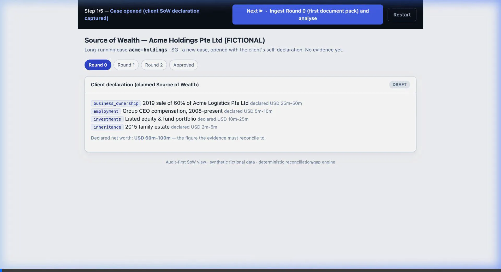
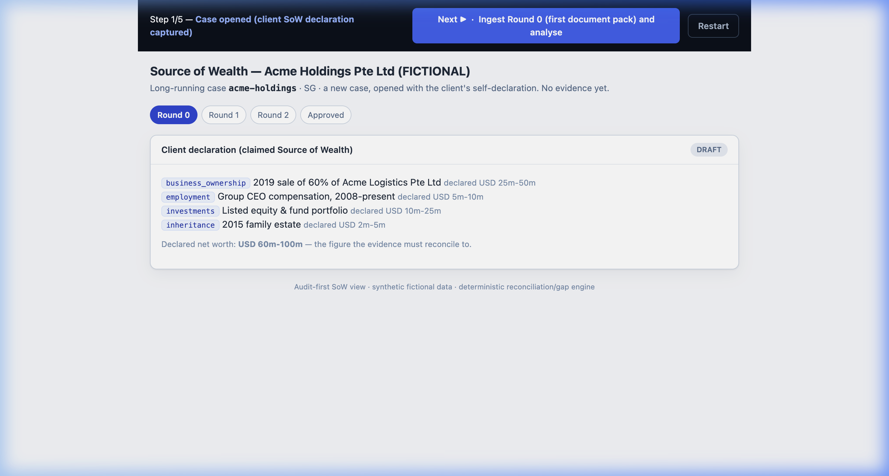
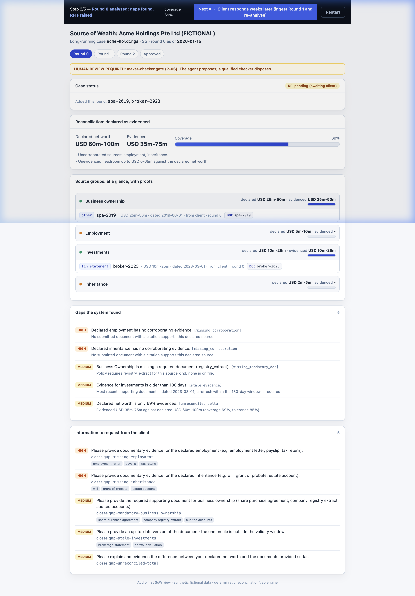
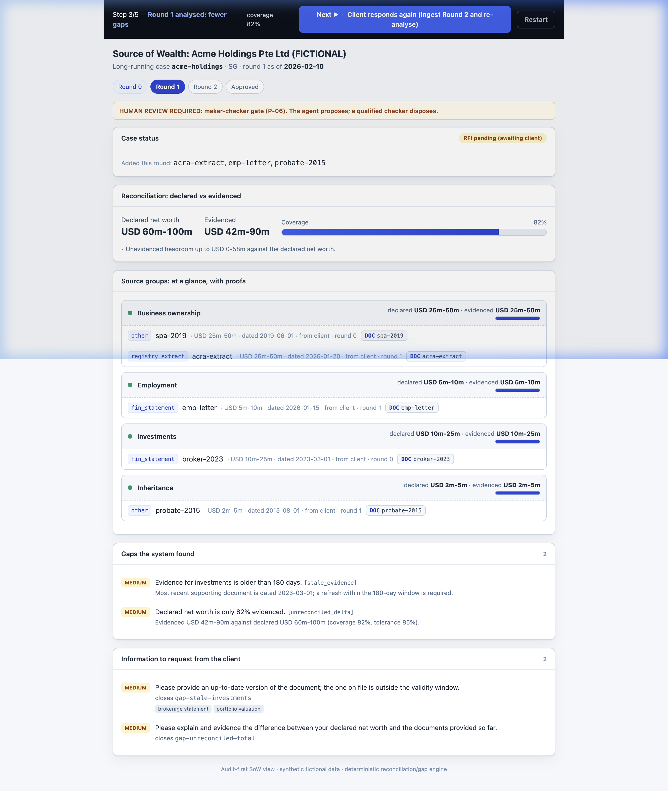
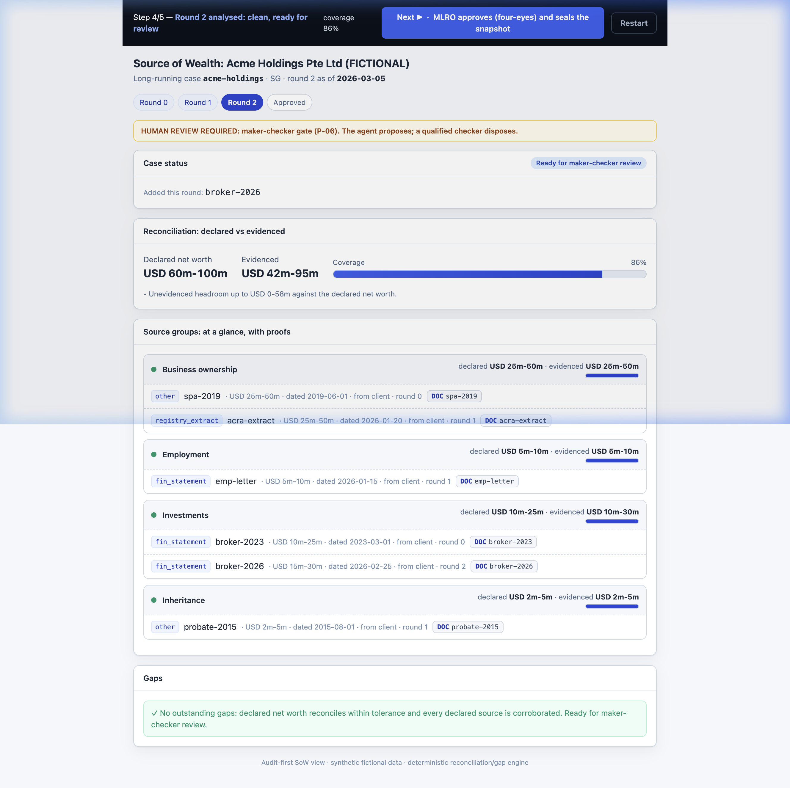
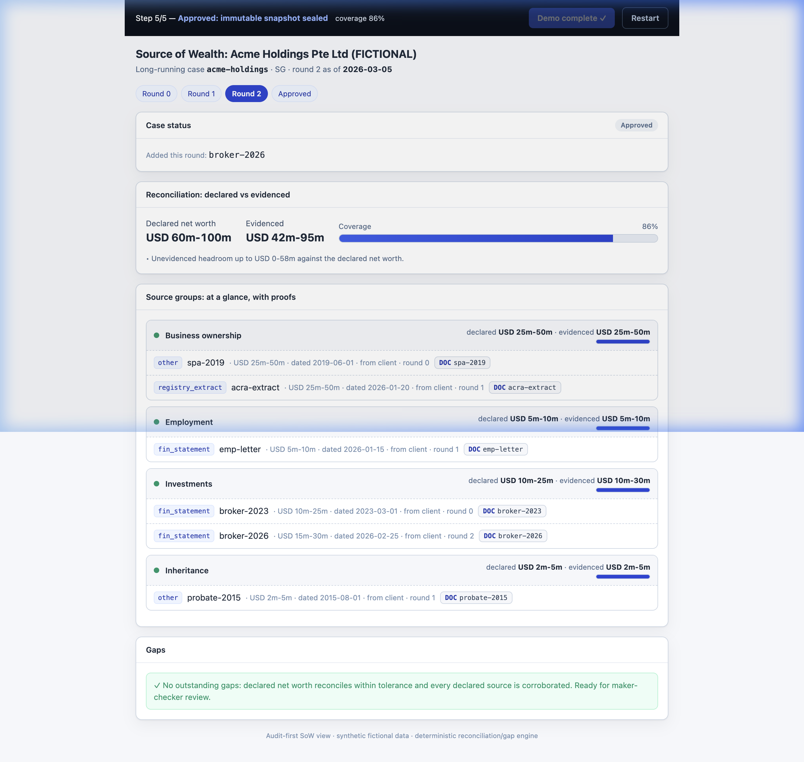

# Local Execution & Demo Guide: `cdd-sow-research` CDD + Source-of-Wealth Agent

This guide describes how to run and demonstrate **`cdd-sow-research` (CDD + Source-of-Wealth Agent)** in local mode. The local profile runs fully offline without requiring Google Cloud SDK or API keys, using SQLite and a deterministic schema-driven mock LLM engine.

---

## 1. Local Environment Setup

### 1.1 Prerequisites
- **Python 3.12+**
- **Node.js 18+ & npm** (optional, for the Next.js UI)
- **Playwright** (optional, for automated presenter walkthrough)

### 1.2 Installation Steps
Initialize the Python virtual environment and install the development dependencies:

```bash
# 1. Recreate/initialize virtual environment
python3 -m venv .venv
source .venv/bin/activate

# 2. Install package in editable mode with development dependencies
pip install -e ".[dev]"
```

### 1.3 Verifying the Setup
Verify that the package builds and tests pass cleanly:

```bash
# Run Ruff linting and Mypy type-checking
make lint

# Run the unit and contract tests on the local profile
make test

# Run the evaluation quality gate (sow_groundedness, risk_band, etc.)
make eval
```

> [!NOTE]
> The offline evaluation gate (`make eval`) runs assessments over the golden cases in `eval/datasets/golden_cases.jsonl` to ensure heuristics, risk bandings, and citation structures conform to expectations.

---

## 2. Interactive Demo: Multi-Round Source-of-Wealth Case

The headline demo showcases a long-running Source-of-Wealth reconciliation where a Relationship Manager (RM) clears evidence gaps with a client across multiple rounds.

### 2.1 Starting the Server
Start the live, click-through demo server:

```bash
export PYTHONPATH=src:tests
.venv/bin/python scripts/sow_demo_server.py
```
*The server starts on port `8099` by default.*

### 2.2 Live Walkthrough
Below is the screen recording of the automated walkthrough running on the local server:



---

## 3. Demo Walkthrough Phases & Screenshots

### Phase 1: Case Opened (Declaration Captured)
- **State**: The case is created for the fictional client **Acme Holdings Pte Ltd**. The declared net worth is **USD 60m–100m** across 4 sources (Employment, Investment, Inheritance, and Business Ownership).
- **Evidence**: USD 0m (0% coverage).
- **Action**: RM reviews the declaration.



---

### Phase 2: Round 0 Analysed (Gaps Found & RFIs Raised)
- **State**: Ingested first document pack.
- **Evidence**: USD 35m–75m (69% coverage).
- **Gaps Found (5)**:
  - `HIGH`: Employment declared but not corroborated.
  - `HIGH`: Inheritance declared but not corroborated.
  - `MEDIUM`: Business Ownership lacks the required `registry_extract` document.
  - `MEDIUM`: Investment statements are older than 180 days (`stale_evidence`).
  - `MEDIUM`: Net worth reconciliation coverage is only 69% (below the 85% safety tolerance).
- **Action**: System drafts 5 precise Client Information Requests (RFIs).



---

### Phase 3: Round 1 Analysed (Fewer Gaps)
- **State**: Client responds with an ACRA extract, an employment verification letter, and a grant of probate.
- **Evidence**: USD 42m–90m (82% coverage).
- **Gaps Remaining (2)**:
  - `MEDIUM`: Stale investment statements (older than 180 days).
  - `MEDIUM`: Total evidenced wealth is at 82% coverage (still below the 85% tolerance).
- **Action**: Gaps drop from 5 to 2; RFIs are updated.



---

### Phase 4: Round 2 Analysed (Clean & Ready for Review)
- **State**: Client submits a fresh 2026 brokerage statement.
- **Evidence**: USD 42m–95m (86% coverage).
- **Gaps Remaining**: `0` gaps. The total evidenced coverage of 86% is within the 85% safety tolerance, and every source of wealth has been corroborated.
- **Action**: Status shifts to **Ready for maker-checker review**.



---

### Phase 5: Approved (Immutable Snapshot Sealed)
- **State**: The Money Laundering Reporting Officer (MLRO) performs the four-eyes maker-checker verification and signs off.
- **Outcome**: The case status transitions to **Approved**, and an immutable, read-only WORM snapshot is sealed.



---

## 4. Other Local CLI Commands

You can run single assessment workflows directly from your terminal using the CLI tool:

```bash
export CDD_PROFILE=local

# Generate a one-shot dossier for a fictional entity:
cdd-sow assess "Acme Holdings Pte Ltd (FICTIONAL)" --type entity --jurisdiction SG
```

To run the Next.js UI locally (connecting to the FastAPI backend running on port `8090`):

```bash
# Terminal 1: Run backend API
export CDD_PROFILE=local
make run-api

# Terminal 2: Run frontend UI
make run-ui
```
