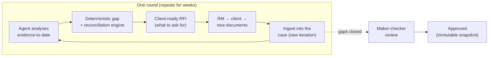
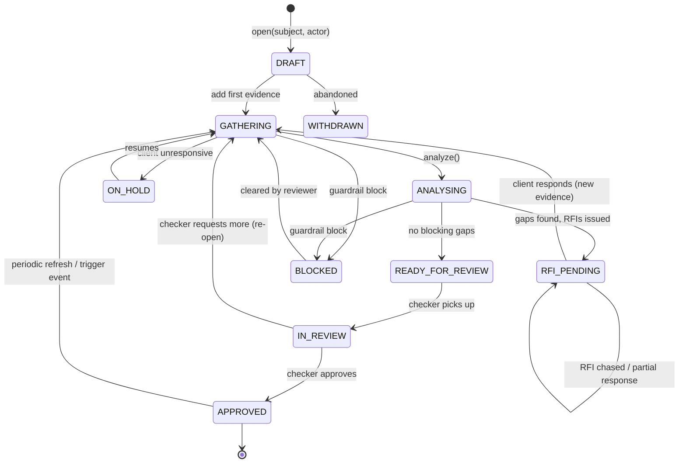
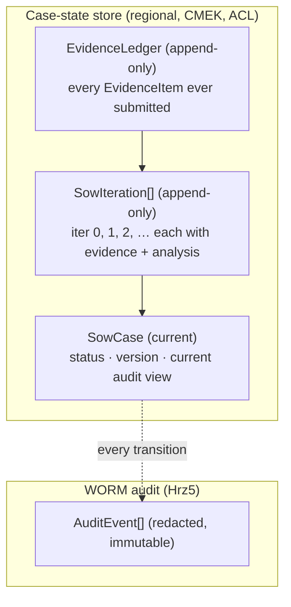
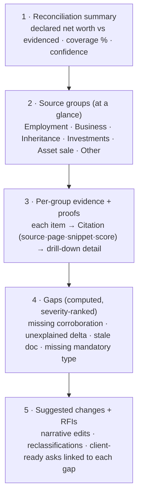
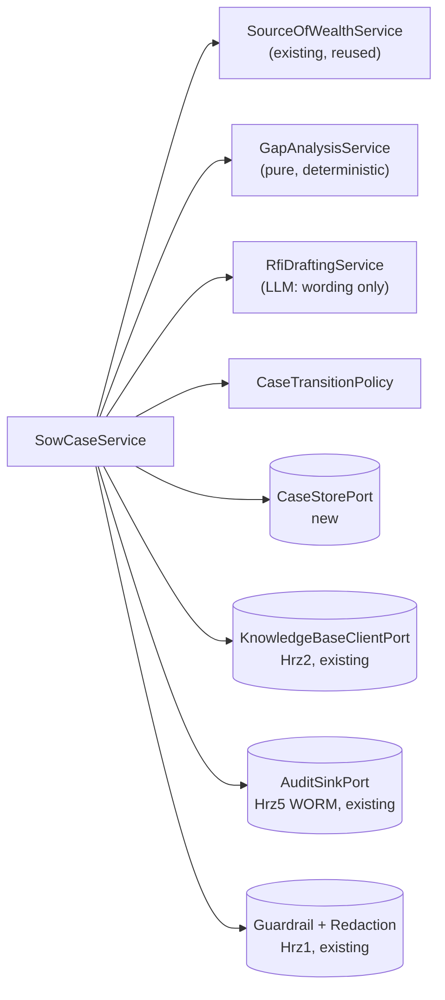

# Design: Long-Running, Auditable Source-of-Wealth Cases

> **Status: Phases 1–2 implemented; surfaces in progress.** This document extends Doc1's
> *one-shot* assessment (`CddService.assess()` → `CDDCase`) with a **stateful,
> multi-iteration Source-of-Wealth (SoW) case** that lives for weeks while a
> Relationship Manager (RM) closes evidence gaps with the client, and with an
> **audit-first output** that shows every source at a glance, proves each one, and
> tells the RM exactly what to go back to the client for.
>
> **What is now built** (pure domain, fully unit-tested, runs offline): the domain types
> (§7), the deterministic reconciliation + gap engine (`domain/gap_analysis.py`), the
> value-band arithmetic (`domain/value_bands.py`), the state-machine guard
> (`domain/case_policy.py`), the RFI drafter (`domain/rfi_drafting.py`), the orchestrator
> (`domain/sow_case_service.py`), and the 14th port `CaseStorePort` with an on-prem
> placeholder + an in-memory store for tests/demo. A runnable demo
> (`scripts/sow_demo.py`) drives a 3-round Acme case end-to-end; a renderer
> (`scripts/render_sow_ui.py`) and a React component (`ui/components/SowAuditView.tsx`)
> present the audit-first view. **Still pending:** the managed (gcp/platform) case-store
> adapters, the HTTP endpoints (§9), and the multi-iteration eval metrics (§12).
>
> Nothing here weakens an existing invariant (R1 redact-before-everything, R2 WORM audit,
> R3 case ACL, P-06 maker-checker, residency).

---

## 1. Why the one-shot pipeline is not enough

The shipped pipeline (SPEC §5) is a single synchronous pass: redact → screen →
extract+ingest → retrieve → SoW/risk/media/ownership → assemble → screen → audit. It
assumes **all the evidence is already in hand**. `SourceOfWealthService.build(subject,
passages, actor)` takes the case's passages and returns one
[`SourceOfWealthNarrative`](../src/cdd_sow_research/domain/models.py).

That is not how Source of Wealth actually gets cleared in a private bank:

- The first pack is **almost always incomplete**. The declared net worth does not
  reconcile to the evidenced sources; a business-sale claim has no SPA; a property
  disposal has a contract but no bank credit showing the proceeds landing.
- The RM **analyses the gap, then goes back to the client** for the missing document
  or a clarification. The client replies days or **weeks** later, often partially.
- This repeats for **several rounds**. Evidence accrues; the narrative, the value
  bands, and the risk picture all shift as it does.
- An MLRO/checker eventually signs off, and a regulator may ask, a year later, *"on
  what evidence, provided when, did you clear this?"* The answer has to be
  reconstructable to the page.

So SoW is a **long-running, append-only, multi-actor workflow**, and its output is an
**audit artifact**, not a paragraph. This design adds exactly that on top of (not
instead of) the existing services.



---

## 2. Design goals and non-goals

**Goals**

1. **State persistence across weeks.** A case survives process restarts, is resumable
   by any authorised RM, and records *when each piece of evidence arrived and from whom*.
2. **Iterative by construction.** Every round (analysis → RFI → client response →
   re-analysis) is a first-class, append-only `SowIteration`.
3. **Audit-first output.** A single `SowAuditView` shows all sources grouped, each with
   its proofs and drill-down detail, the system's calculations, the gaps it found, the
   changes it suggests, and the information to request from the client.
4. **Deterministic gap math.** Reconciliation and gap detection are pure, replayable
   functions (*not* an LLM judgement), so an auditor can recompute them. The LLM only
   *narrates* and *drafts RFI wording*.
5. **No invariant regression.** Redaction, guardrail screening both directions, WORM
   audit, case ACL, maker-checker, and `us-central1`/CMEK residency all still hold.

**Non-goals**

- Not a workflow/BPM engine. State lives in a small, explicit case aggregate, not a
  generic orchestrator.
- Not a new retrieval backend. The governed RAG store is still **Hrz2** (R3); evidence
  bytes still live in the case vault and get ingested into Hrz2 with case ACL tags.
- Not autonomous approval. The agent is still decision-support (P-06); only a human
  checker moves a case to `APPROVED`.

---

## 3. Core concepts and vocabulary

| Concept | Type (proposed) | What it is |
|---------|-----------------|------------|
| **SoW case** | `SowCase` | The long-lived aggregate root: subject, status, current analysis, version. |
| **Iteration / round** | `SowIteration` | One append-only cycle: evidence added + analysis produced + RFIs issued. |
| **Evidence ledger** | `EvidenceLedger` / `EvidenceItem[]` | Append-only record of *every* source ever submitted, with provenance and the iteration it arrived in. |
| **Source group** | `SourceGroup` | All evidence supporting one wealth source (employment, business, inheritance…), grouped for at-a-glance audit. |
| **Proof** | `Citation` (existing) | Source + page + snippet + score behind a single claim or value. |
| **Reconciliation** | `WealthReconciliation` | Deterministic claimed-vs-evidenced math, per source and in total, with coverage %. |
| **Gap** | `Gap` | A computed shortfall (missing corroboration, unexplained delta, stale/expired doc, missing mandatory doc type). |
| **RFI** | `InformationRequest` | A client-ready ask, linked to the gap that motivates it, with priority and suggested doc types. |
| **Audit view** | `SowAuditView` | The materialised, audit-first output bundling all of the above. |
| **Snapshot** | `SowSnapshot` | An immutable, versioned point-in-time view (what the checker approved). |

---

## 4. The case state machine

A case is an explicit state machine. Transitions are the *only* way state changes, each
transition emits a WORM `AuditEvent`, and illegal transitions are rejected (so the audit
trail can never show an impossible history).



| State | Meaning | Who advances it |
|-------|---------|-----------------|
| `DRAFT` | Case opened, no evidence yet. | RM |
| `GATHERING` | Accepting/ingesting evidence into the open iteration. | RM / client upload |
| `ANALYSING` | Agent is computing the analysis for the iteration. | Agent (async) |
| `RFI_PENDING` | Awaiting client response to one or more open RFIs. | (waits on client) |
| `READY_FOR_REVIEW` | No blocking gaps; awaiting maker-checker. | Agent |
| `IN_REVIEW` | A checker (MLRO) has the case. | Checker |
| `APPROVED` | Checker signed off; an immutable snapshot is sealed. | Checker |
| `BLOCKED` | Hrz1 guardrail blocked an input/output; needs human clearing. | Reviewer |
| `ON_HOLD` | Client unresponsive past SLA; parked. | RM |
| `WITHDRAWN` | Case abandoned. | RM |

**Invariants.** Moving to `APPROVED` requires sign-off by a *different* identity than the
maker that produced the analysis (P-06, four-eyes). Any HIGH/PROHIBITED band or sanctions/terrorism
hit forces escalation, exactly as `CddReviewPolicy.escalates()` does today. A case can
**always** be re-opened from `APPROVED` (periodic SoW refresh is a regulatory norm), which
starts a new iteration rather than mutating the sealed snapshot.

---

## 5. Persistence model

### 5.1 What is stored where

The defining residency rule (R1/R2, `us-central1`, CMEK, VPC-SC) and the
redact-before-everything invariant (P-04) drive a **three-tier** split. Each tier has a
different sensitivity and a different store:

| Tier | Holds | Store (gcp profile) | PII? | Mutability |
|------|-------|---------------------|------|------------|
| **Case state** | `SowCase` aggregate, iterations, ledger metadata, gaps, RFIs, reconciliation, current audit view. | Regional document store (Firestore-in-Datastore-mode or Spanner) in `us-central1`, CMEK-encrypted, ACL-scoped to case principals. | Operational PII allowed **inside the perimeter** (the RM works the real client). | Mutable, **versioned** (optimistic concurrency). |
| **Evidence bytes** | Raw KYC documents the client sends each round. | Case vault object store (existing pattern) + ingested into **Hrz2** with `case:<subject_id>` ACL tags (R3). | Yes (encrypted at rest, CMEK). | Append-only. |
| **Audit trail** | Every transition + analysis as an `AuditEvent`. | Cloud Logging locked WORM bucket (existing, 180-day default retention). | **Redacted only** (P-04). | Immutable / WORM. |

Key boundary: **the case-state tier may hold un-redacted operational data** because the
RM legitimately works with the real client inside the VPC-SC perimeter, but **anything
sent to the model, a trace span, or the WORM audit is still redacted first**, exactly as
today. The redaction boundary moves *with the data leaving the perimeter*, not with
persistence. This is the one subtle point a reviewer must check in implementation.

### 5.2 Append-only iterations + materialised view (light event sourcing)

The ledger and iterations are **append-only**; the "current" analysis is a
**materialised view** recomputed from the ledger. This gives audit for free: the WORM
trail plus the iteration log can reconstruct exactly what was known at any past instant.



### 5.3 Concurrency, idempotency, resumability

- **Optimistic concurrency.** `SowCase.version` is checked on every write
  (`save(case, expected_version)`); a stale write loses and re-reads. RMs and the async
  analyser never clobber each other.
- **Idempotent evidence intake.** Each upload carries a client-supplied
  `idempotency_key`; re-delivery (the client emails the same PDF twice) is a no-op that
  still records the duplicate attempt in the ledger.
- **Resumable.** Because the aggregate is durable and keyed by `case_id`, any authorised
  RM can `GET` the case weeks later and continue. Nothing lives only in an ADK session.
- **ADK session vs case.** The existing `Session`/`MemoryItem` models stay for
  *conversational/agent* working state (ephemeral). The `SowCase` is the *durable
  business* aggregate. They are linked by `Session.case_id` but have different lifetimes.

---

## 6. The audit-first output (`SowAuditView`)

This is the second half of the brief: *"all sources shown at a glance in relevant groups,
proofs and details visible easily; the system calculates, highlights gaps, suggests
changes, and suggests what to get from the client."*

The output is one structured artifact with five bands, top to bottom:



### 6.1 Sources grouped at a glance

Evidence is grouped by `WealthSourceKind` (the existing enum). Each `SourceGroup` rolls up
its evidenced value band, its corroboration status (a colour the UI can render), and a
count of supporting items, so an MLRO sees the whole picture in one screen before
drilling in.

### 6.2 Proofs and drill-down

Every value and claim carries the **existing `Citation`** (`source_id`, `source_type`,
`title`, `url`, `page`, `snippet`, `score`). "Proof at a glance" = the citation chip
(already rendered by [`CitationCard.tsx`](../ui/components/CitationCard.tsx)); "more
detail" = expand to the `EvidenceItem` showing the Document AI extracted fields, the
ingestion record (chunks, Hrz2 doc id), which iteration it arrived in, and who supplied it.
No new citation primitive is needed: the audit view *reuses* `Citation` everywhere, which
is also what keeps `citation_accuracy` measurable by the existing eval.

### 6.3 The system does the calculations (deterministic)

`WealthReconciliation` is computed by a **pure function**, not the LLM. Its *claimed*
side comes from the `WealthDeclaration` captured when the case opens (§7); its
*evidenced* side comes from the corroborated ledger:

- **Per source**: the matching `DeclaredSource` band vs the evidenced band (the sum of
  corroborated `EvidenceItem` value bands), and the delta.
- **Total**: `declared_net_worth_band` vs total evidenced, with a **coverage %**
  (evidenced ÷ declared).
- **Consistency checks**: e.g. employment income × tenure plausibility vs accumulated
  wealth; proceeds-landed checks (does a bank credit corroborate a claimed asset sale).

Because it is deterministic, the reconciliation is **replayable and auditable**: the same
ledger always yields the same numbers, and the eval can assert them exactly.

### 6.4 Gaps, suggested changes, and client RFIs

The gap engine emits ranked `Gap`s (also deterministic). For each gap the agent proposes:

- a **suggested change** (narrative edit, value-band correction, or source
  reclassification, LLM-drafted, citation-checked), and
- a client-ready **`InformationRequest` (RFI)**: *what to ask for*, mapped to the gap,
  with a priority and the document types that would close it.

| `GapKind` | Trigger (deterministic) | Typical RFI |
|-----------|-------------------------|-------------|
| `MISSING_CORROBORATION` | A declared source has no document/registry citation. | "Provide an SPA / valuation for the business sale." |
| `UNRECONCILED_DELTA` | Declared total − evidenced total exceeds tolerance. | "Explain and evidence the USD X gap in declared net worth." |
| `STALE_EVIDENCE` | A document is older than the policy window. | "Provide a bank statement from the last 3 months." |
| `MISSING_MANDATORY_DOC` | A source kind lacks a policy-required doc type. | "Provide the title deed for the property disposal." |
| `INCONSISTENT_VALUE` | Two sources disagree beyond tolerance. | "Reconcile the differing valuations in docs A and B." |
| `UNVERIFIED_PEP_LINK` | Ownership shows a PEP without source-of-funds. | "Provide source-of-funds for the PEP-linked holding." |

---

## 7. Proposed domain types

Pure-stdlib, frozen, slotted, consistent with
[`domain/models.py`](../src/cdd_sow_research/domain/models.py). Sketches (not final):

```python
class CaseStatus(enum.Enum):
    DRAFT = "draft"
    GATHERING = "gathering"
    ANALYSING = "analysing"
    RFI_PENDING = "rfi_pending"
    READY_FOR_REVIEW = "ready_for_review"
    IN_REVIEW = "in_review"
    APPROVED = "approved"
    BLOCKED = "blocked"
    ON_HOLD = "on_hold"
    WITHDRAWN = "withdrawn"


class GapKind(enum.Enum):
    MISSING_CORROBORATION = "missing_corroboration"
    UNRECONCILED_DELTA = "unreconciled_delta"
    STALE_EVIDENCE = "stale_evidence"
    MISSING_MANDATORY_DOC = "missing_mandatory_doc"
    INCONSISTENT_VALUE = "inconsistent_value"
    UNVERIFIED_PEP_LINK = "unverified_pep_link"


class RfiStatus(enum.Enum):
    DRAFT = "draft"
    SENT = "sent"
    PARTIALLY_ANSWERED = "partially_answered"
    ANSWERED = "answered"
    OVERDUE = "overdue"
    WAIVED = "waived"


@dataclass(frozen=True, slots=True)
class EvidenceItem:
    """One source ever submitted to the case, with provenance and arrival round."""
    id: str
    document: KycDocument                 # existing
    extract: DocumentExtract | None = None  # existing (Document AI output)
    ingest: IngestResult | None = None      # existing (Hrz2 ingestion record)
    iteration_no: int = 0                 # which round it arrived in
    received_at: datetime = field(default_factory=utcnow)
    provided_by: str = ""                 # "client" | RM identity
    supports_kinds: tuple[WealthSourceKind, ...] = ()
    idempotency_key: str = ""


@dataclass(frozen=True, slots=True)
class DeclaredSource:
    """A wealth source the client *claims*, captured in the SoW declaration at open.

    This is the 'claimed' side of every reconciliation line. Without it, the
    declared-vs-evidenced math (§6.3) has no left-hand side, so the declaration is a
    first-class case input, not an afterthought.
    """
    kind: WealthSourceKind                # existing enum
    description: str = ""
    declared_band: str = ""               # what the client says it is worth


@dataclass(frozen=True, slots=True)
class WealthDeclaration:
    """The client's self-declared Source of Wealth, captured when the case opens."""
    sources: tuple[DeclaredSource, ...] = ()
    declared_net_worth_band: str = ""
    captured_at: datetime = field(default_factory=utcnow)


@dataclass(frozen=True, slots=True)
class ReconciliationLine:
    kind: WealthSourceKind
    declared_band: str = ""               # from the matching DeclaredSource
    evidenced_band: str = ""              # from corroborated EvidenceItems
    delta_note: str = ""                  # human-readable computed delta
    corroborated: bool = False
    citations: tuple[Citation, ...] = ()


@dataclass(frozen=True, slots=True)
class WealthReconciliation:
    lines: tuple[ReconciliationLine, ...] = ()
    declared_total_band: str = ""
    evidenced_total_band: str = ""
    coverage_pct: float = 0.0             # evidenced / declared, deterministic
    consistency_notes: tuple[str, ...] = ()


@dataclass(frozen=True, slots=True)
class Gap:
    id: str
    kind: GapKind
    severity: Severity                    # existing shared scale
    summary: str
    related_kind: WealthSourceKind | None = None
    evidence_ids: tuple[str, ...] = ()    # ledger items implicated
    detail: str = ""                      # the calculation behind it


@dataclass(frozen=True, slots=True)
class InformationRequest:
    id: str
    gap_id: str                           # the gap this RFI closes
    ask: str                              # client-ready wording (LLM-drafted)
    suggested_doc_types: tuple[str, ...] = ()  # see note below on DocType
    priority: Severity = Severity.MEDIUM
    status: RfiStatus = RfiStatus.DRAFT
    due_date: str | None = None
    created_at: datetime = field(default_factory=utcnow)


@dataclass(frozen=True, slots=True)
class SuggestedChange:
    target: str                           # "narrative" | "source:<kind>" | "value_band"
    rationale: str
    proposed: str
    citations: tuple[Citation, ...] = ()


@dataclass(frozen=True, slots=True)
class SourceGroup:
    """All evidence supporting one wealth source, grouped for at-a-glance audit."""
    kind: WealthSourceKind
    evidenced_band: str = ""
    corroborated: bool = False
    evidence_ids: tuple[str, ...] = ()
    citations: tuple[Citation, ...] = ()


@dataclass(frozen=True, slots=True)
class SowAuditView:
    """The audit-first output: groups, proofs, calculations, gaps, suggestions, RFIs."""
    subject_id: str
    narrative: SourceOfWealthNarrative    # existing (reused unchanged)
    groups: tuple[SourceGroup, ...] = ()
    reconciliation: WealthReconciliation = field(default_factory=WealthReconciliation)
    gaps: tuple[Gap, ...] = ()
    suggested_changes: tuple[SuggestedChange, ...] = ()
    rfis: tuple[InformationRequest, ...] = ()
    generated_at: datetime = field(default_factory=utcnow)


@dataclass(frozen=True, slots=True)
class SowIteration:
    no: int
    added_evidence_ids: tuple[str, ...] = ()
    audit_view: SowAuditView | None = None
    rfi_ids: tuple[str, ...] = ()
    actor: str = ""
    created_at: datetime = field(default_factory=utcnow)


@dataclass(frozen=True, slots=True)
class SowCase:
    """The long-lived aggregate root for a Source-of-Wealth case."""
    id: str
    subject: Subject                      # existing
    status: CaseStatus = CaseStatus.DRAFT
    version: int = 0                      # optimistic concurrency
    declaration: WealthDeclaration | None = None  # the client's claimed SoW
    ledger: tuple[EvidenceItem, ...] = ()
    iterations: tuple[SowIteration, ...] = ()
    current: SowAuditView | None = None
    requires_human_review: bool = True
    opened_at: datetime = field(default_factory=utcnow)
    updated_at: datetime = field(default_factory=utcnow)


@dataclass(frozen=True, slots=True)
class SowSnapshot:
    """Immutable, versioned point-in-time view (what a checker approved)."""
    case_id: str
    version: int
    audit_view: SowAuditView
    approved_by: str
    sealed_at: datetime = field(default_factory=utcnow)
```

> **Note on `DocType`.** `InformationRequest.suggested_doc_types` is typed `tuple[str,
> ...]` rather than `tuple[DocType, ...]` on purpose: real RFIs ask for documents the
> coarse existing enum (`PASSPORT`/`FIN_STATEMENT`/`REGISTRY_EXTRACT`/`BANK_STATEMENT`/
> `OTHER`) cannot name: an SPA, a title deed, a valuation, a tax return. Implementation
> should either **extend `DocType`** with the SoW-specific kinds or keep free-form
> strings; this design does not force the enum to carry meanings it was not built for.

The existing `SourceOfWealthNarrative`, `Citation`, `WealthSource`, `KycDocument`,
`DocumentExtract`, `IngestResult`, `Subject`, `DocType`, `Severity`, and
`WealthSourceKind` are **reused verbatim**: the long-running layer wraps them.

---

## 8. Proposed ports and services

### 8.1 One new port: `CaseStorePort`

Durable case persistence is the only genuinely new outbound concern. It is a 14th
`@runtime_checkable` Protocol, bound per profile like the other 13 (gcp → regional
document store with CMEK; platform → HTTP client to a case-store service; onprem →
placeholder stub satisfying the Protocol).

```python
@runtime_checkable
class CaseStorePort(Protocol):
    def open(self, case: SowCase) -> SowCase: ...
    def load(self, case_id: str, principals: tuple[str, ...]) -> SowCase: ...
    def save(self, case: SowCase, expected_version: int) -> SowCase: ...  # optimistic
    def list_for(self, principals: tuple[str, ...]) -> list[SowCase]: ...
    def seal(self, snapshot: SowSnapshot) -> SowSnapshot: ...  # immutable write
    def get_snapshot(self, case_id: str, version: int) -> SowSnapshot: ...
```

Evidence bytes and retrieval stay on the existing `KnowledgeBaseClientPort` (Hrz2, R3); the
audit trail stays on `AuditSinkPort` (Hrz5, WORM). No other new ports are required.

### 8.2 Domain services

- **`SowCaseService`**: orchestrates the long-running workflow: `open()`,
  `add_evidence()` (extract → ingest to Hrz2 → append to ledger, opening/extending an
  iteration), `analyze()` (retrieve → call the existing `SourceOfWealthService.build()`,
  then the gap engine, then RFI drafting → produce a `SowAuditView` → legal state
  transition → `audit.record`), `review()` (checker decision → `seal()` snapshot). It
  applies the same R1 safety pipeline (redact, screen both directions) on every round.
- **`GapAnalysisService`**: *pure, deterministic* reconciliation + gap detection. No LLM.
  This is the auditable core; it is unit-testable to exact numbers.
- **`RfiDraftingService`**: turns each `Gap` into a client-ready `InformationRequest`
  (LLM for wording only; the *what* and *why* come from the deterministic gap).
- **`CaseTransitionPolicy`**: the state-machine guard (legal transitions, four-eyes,
  escalation), the longitudinal sibling of the existing `CddReviewPolicy`.

The split keeps **all consequential math deterministic and replayable**; the LLM is
confined to narration and RFI phrasing, both citation-checked by the existing groundedness
self-critique.



---

## 9. Proposed HTTP contracts (SPEC §6 style)

Additive; the existing `POST /v1/source-of-wealth` one-shot endpoint is unchanged (it
becomes the degenerate single-iteration case).

- `POST /v1/sow/cases {subject, actor}` → `SowCase` (opens a case).
- `GET /v1/sow/cases/{id}` → `SowCase` (resume; ACL-checked).
- `POST /v1/sow/cases/{id}/evidence {documents[], provided_by, idempotency_key, actor}`
  → `SowCase` (ingest a round of evidence).
- `POST /v1/sow/cases/{id}/analyze {actor}` → `SowAuditView` (run the round's analysis).
- `GET /v1/sow/cases/{id}/audit-view` → `SowAuditView` (the current at-a-glance output).
- `POST /v1/sow/cases/{id}/rfi {rfi_ids[], action, actor}` → `InformationRequest[]`
  (issue / chase / waive).
- `POST /v1/sow/cases/{id}/review {decision, actor}` → `SowSnapshot` (maker-checker).
- `GET /v1/sow/cases/{id}/snapshots` / `…/snapshots/{version}` → `SowSnapshot`.

All JSON field names mirror the domain dataclasses (enums as strings) via `to_jsonable`,
exactly as the existing endpoints do. A new AgentCard skill `manage_sow_case` advertises
the workflow alongside the existing `build_source_of_wealth`.

---

## 10. The audit / UI surface

The existing UI ([`CddCaseView.tsx`](../ui/components/CddCaseView.tsx),
[`CitationCard.tsx`](../ui/components/CitationCard.tsx), `RiskBadge.tsx`) already renders
panels with inline citation chips. The audit view extends that vocabulary:

- A **reconciliation header** (declared vs evidenced, coverage %, a confidence band).
- A **source-group accordion**: one collapsible per `WealthSourceKind`, showing the
  group's evidenced band + corroboration colour; expand to the `EvidenceItem` cards, each
  with its citation chip ("proof") and a "details" expander (extracted fields, Hrz2 doc id,
  iteration, provider).
- A **gaps panel**, severity-ranked, each gap linking to the source group and the evidence
  it implicates.
- An **RFI panel** the RM can act on (mark sent / answered), each ask traceable to its gap.
- An **iteration timeline** showing the weeks-long history: which evidence arrived when,
  which RFIs were open, and how coverage % moved round over round.

Nothing here changes the maker-checker `ReviewBanner`; the audit view is what the checker
reads before disposing.

---

## 11. Compliance and invariant mapping

| Concern | How this design preserves it |
|---------|------------------------------|
| **R1 redact-before-everything** | Every round runs redact → screen(INPUT) before extraction/ingest; screen(OUTPUT) before the audit view leaves the perimeter. Case-state tier may hold operational PII inside VPC-SC; the WORM audit stores **redacted** records only (§5.1). |
| **R2 WORM audit** | Every transition and analysis emits an immutable, redacted `AuditEvent`; snapshots are sealed write-once. The iteration log + WORM trail reconstruct any past state. |
| **R3 case ACL / governed RAG** | Evidence bytes are still ingested into **Hrz2** with `case:<subject_id>` tags and retrieved by case principals only; the case store is ACL-scoped to the same principals. |
| **P-06 maker-checker** | `APPROVED` requires four-eyes (checker ≠ maker); HIGH/PROHIBITED or sanctions/terrorism still escalate via the same policy logic. |
| **Residency** | The case-state and snapshot stores are regional (`us-central1`), CMEK-encrypted, inside VPC-SC, same posture as the existing services. |
| **P-02 no lock-in** | `CaseStorePort` follows the 18-port convention (gcp / platform / onprem adapters); the domain stays pure stdlib. |
| **Auditability** | Gap math and reconciliation are **deterministic pure functions**: recomputable by an auditor; the LLM is confined to narration and RFI wording, both citation-checked. |

---

## 12. Eval additions (Hrz4 / P-08)

The existing metrics (`sow_groundedness` ≥ 0.80, `risk_band_accuracy` ≥ 0.80,
`citation_accuracy` ≥ 0.90, `pii_safety` ≥ 0.99) still apply per round. The longitudinal
layer adds, over a synthetic *multi-iteration* golden set:

- **`gap_recall` (≥ 0.90)**: seeded gaps the engine catches (deterministic, so high bar).
- **`reconciliation_accuracy` (≥ 0.95)**: computed coverage/deltas vs the golden math.
- **`rfi_precision` (≥ 0.85)**: issued RFIs that map to a real seeded gap.
- **`transition_legality` (= 1.0)**: no illegal state transition ever occurs.

Because the gap and reconciliation engines are pure, their two metrics are exact equality
checks, not LLM-judged, keeping the gate cheap and stable.

---

## 13. Backwards compatibility and rollout

1. **Phase 1, types + pure engine.** Add the domain types (§7), `GapAnalysisService`,
   and `CaseTransitionPolicy` with full unit tests. No I/O, no new infra. The one-shot
   pipeline is untouched.
2. **Phase 2, persistence.** Add `CaseStorePort` + the three adapters (onprem placeholder
   first, for contract tests), and `SowCaseService` wrapping the existing services.
3. **Phase 3, surfaces.** HTTP endpoints (§9), AgentCard skill, UI audit view (§10).
4. **Phase 4, eval.** Multi-iteration golden set and the four new metrics (§12).

The existing `assess()` / `build()` calls remain valid throughout: a case with a single
iteration and no open gaps is exactly today's behaviour, so nothing regresses.

---

## 14. Open questions for sign-off

- **Value bands vs figures.** Reconciliation deltas need arithmetic, but the domain
  deliberately stores *bands* (`est_value_band`, never spurious precision). Proposal:
  keep bands as the display/storage form and derive a private numeric midpoint+range for
  the deterministic math, surfacing only bands and a qualitative delta. Needs MLRO sign-off.
- **Stale-evidence windows.** The `STALE_EVIDENCE` policy window (e.g. bank statements ≤ 3
  months) is jurisdiction-specific: should it live in `config/settings.yaml` or come from
  Rsk1 (compliance)? Leaning Rsk1, cached.
- **Case-state PII boundary.** Confirm with security that operational PII may persist in
  the regional, CMEK, ACL-scoped case store inside VPC-SC (§5.1); the design hinges on it.
- **Snapshot retention.** Should sealed `SowSnapshot`s share the 180-day default WORM retention,
  or a longer SoW-specific window?

---

## 15. Related parties — one system for companies *and* their key individuals

`Subject.type` is `INDIVIDUAL | ENTITY`, so a HNW private-banking person and a company are
both first-class subjects, and the same SoW engine serves both. Onboarding a **company**,
however, also requires CDD/SoW on its **key individuals**. This is implemented as a
related-party layer on top of the case (`domain/related_party.py`, `domain/models.py`):

- **`RelatedParty`** — a `Subject` (individual or intermediate entity) linked to the parent
  with a `PartyRole` (beneficial owner / director / controller / …) and `pct`. Derived from
  the corporate `OwnershipSummary` via `RelatedPartyService.derive_from_ownership`.
- **Scope** — `in_scope()` selects **UBOs/shareholders ≥ 25%** plus **directors/controllers**
  (the FATF/MAS control perimeter; threshold configurable).
- **Per-party assessment** — each in-scope party gets a **`PartyScreening`** (identity + PEP
  + adverse media). **Source-of-funds** individuals (controlling owners) additionally get
  their **own long-running SoW sub-case** (the same `SowCaseService`), so a company UBO's
  wealth is reconciled exactly like a direct private-banking client.
- **Roll-up (soft)** — `RelatedPartyService.assess` produces a `RelatedPartyReview`: each
  outcome is `cleared`/`escalates` with reasons; a PEP, sanctions/high adverse-media hit, an
  unverified identity, or an uncleared source-of-funds SoW **escalates the parent to enhanced
  review**. It never auto-blocks — the checker still disposes under four-eyes (P-06). Bound by
  `RelatedPartyPolicy.requires_enhanced_review`.
- **Surfaced** — the review attaches to the case via `SowCaseService.attach_related_parties`
  and rides on `SowCase.related_parties` / `SowAuditView.related_parties`; the audit view
  renders a **"Key individuals — CDD + SoW"** panel (each person with scope, screening flags,
  and their SoW sub-case status). Run it: `scripts/related_party_demo.py`.

All of this is **deterministic and pure** (no LLM in the roll-up), so the company decision and
its dependency on each key individual are recomputable by an auditor. *Still open:* recursive
cascade through multiple layers of intermediate holding entities (today: direct owners +
explicitly supplied directors), and pulling director/controller lists from the registry
adapter rather than as case input.

---

## 16. Sanctions / PEP / watchlist screening

A dedicated name-screening control (the most standard CDD check), separate from adverse
media. Implemented deterministic-first (`domain/name_match.py`, `domain/screening.py`,
`ports/screening.py`, the `local`/`gcp`/`onprem` `sanctions_provider` adapters):

- **Reference data — synced, point-in-time.** Screening reads a *versioned snapshot* of the
  watchlists, never the publishers live. A scheduled job
  (`scripts/sync_sanctions.py`, infra in `infra/terraform/sanctions_sync.tf`: Cloud
  Scheduler → Cloud Run job → regional CMEK bucket) pulls **OFAC SLS (SDN + Consolidated)**
  plus **UN / EU / UK (HMT)**, diffs, and writes the snapshot the `gcp` provider reads. The
  `local` provider reads a bundled **fictional** snapshot (refreshable by the same script),
  so the offline demo and CI screen against real-shaped data. OFAC has no fixed publish
  cadence, so the job **polls daily and diffs**; OFAC data is public-domain.
- **Deterministic matcher.** `name_match` normalises (case/accents/punctuation/org
  suffixes) and scores with Jaro-Winkler + an order-independent token-set ratio, combined
  with a DOB signal (exact / same-year / conflict). The threshold (default 0.85, OFAC-style
  fuzzy) is configurable. Same inputs → same score, so an alert is reproducible; every
  alert records the **snapshot version** it was raised against.
- **Alerts + disposition.** Each hit is a `ScreeningAlert` (PENDING → true/false positive)
  an analyst dispositions under four-eyes. Disposition is **soft** (your decision): any
  *open* alert escalates the case to enhanced review, but never auto-blocks — the checker
  disposes (`ScreeningPolicy`, P-06). Attached via `SowCaseService.attach_screening`; rides
  on `SowCase.screening` / `SowAuditView.screening`; rendered as a **"Sanctions / PEP /
  watchlist screening"** panel. Both the subject and the company's key individuals are
  screened (`scripts/related_party_demo.py`).

*Open:* country/jurisdiction-risk lists feeding the risk scorecard (next slice), secondary
identifiers (passport/national-id) in matching, and an alert-history store for recurring
re-screening.

---

## 17. Risk-based scorecard + CDD tiering (SDD / CDD / EDD)

A deterministic, auditable customer-risk **scorecard** that complements the LLM
`RiskRatingService` and drives the **due-diligence tier** (`domain/scorecard_service.py`,
`domain/country_risk.py`):

- **Dimensions (weighted, configurable):** customer type, **geography/country**, product,
  channel/delivery, PEP exposure, adverse media. Country risk comes from a deterministic
  FATF-based table (`country_risk.py`: call-for-action / increased-monitoring / elevated /
  baseline) — refreshable, public lists.
- **Signals fold in** the sanctions/PEP screening (§16) and adverse media: an *open*
  sanctions hit, a PEP, a FATF call-for-action jurisdiction, or sanctions/terrorism media
  are **hard signals** that force **EDD** and raise the band — the score can never soften
  them.
- **Output:** a weighted `score` (0–1) → `RiskBand` + **`CddTier`** (SDD / CDD / EDD) with a
  rationale and the hard-signal list. Pure and replayable, so the due-diligence decision is
  recomputable by an auditor. Attached via `SowCaseService.attach_scorecard`; rides on
  `SowCase.scorecard` / `SowAuditView.scorecard`; rendered as a **"Risk scorecard — CDD
  tier"** panel. Decision-support only — a checker still disposes (P-06); EDD escalates the
  audit decision.

*Open:* SDD-driven lighter evidence requirements (feeding the gap engine's mandatory-doc
matrix off the tier), and per-product/channel policy tables sourced from compliance (Rsk1).

## 18. Source of Funds (SoF) — distinct from Source of Wealth

**Source of Wealth (SoW)** explains the origin of the customer's *total accumulated
wealth*; **Source of Funds (SoF)** explains the origin of the *specific funds* flowing
into the relationship and whether the actual inflows match the **declared
expected-activity profile**. They are complementary checks, so SoF gets its own
deterministic engine and audit panel (`domain/source_of_funds_service.py`):

- **Inputs:** a `FundsDeclaration` (expected funding `sources` by `FundsOriginKind`, a
  total `expected_inflow_band`, and an `expected_activity` narrative) plus the evidenced
  `FundsFlow` inflows (e.g. bank credit advices, each corroborated by citations).
- **Reconciliation:** per-origin declared-vs-evidenced lines with coverage, reusing the
  SoW band arithmetic (`value_bands`), and a total declared-vs-evidenced coverage figure.
- **Gaps (severity-ranked, deterministic):** `UNEVIDENCED_INFLOW` (declared funding with no
  evidenced flow), `UNEXPECTED_INFLOW` (evidenced flow with no declared origin),
  `MISSING_ORIGIN_DOC` (declared origin with an uncorroborated flow), and
  `ACTIVITY_MISMATCH` (evidenced inflows materially exceed the expected activity, default
  >25%). No LLM, no I/O — same inputs, same result.
- **Output:** a `SourceOfFundsAssessment` attached via
  `SowCaseService.attach_source_of_funds`; rides on `SowCase.source_of_funds` /
  `SowAuditView.source_of_funds`; rendered as a **"Source of Funds — declared inflows vs
  evidenced"** panel. Any gap escalates softly to enhanced review — a checker still
  disposes (P-06); SoF never auto-blocks.

*Open:* expected-activity time-series monitoring (per-period inflow vs profile, feeding the
ongoing-monitoring trigger engine) and product-specific expected-activity templates (Rsk1).

## 19. Ongoing monitoring + periodic review

CDD is not one-and-done: an approved relationship must be kept current. A deterministic
`PeriodicReviewService` (`domain/periodic_review_service.py`) computes both forces that
drive a re-review and folds them into one auditable outcome:

- **Risk-based schedule.** A cadence keyed off the **CDD tier** (§17): EDD reviewed
  annually (12 months), CDD every 3 years (36), SDD every 5 years (60) — configurable. From
  the last-reviewed date it computes `next_review_due` (with month-end clamping) and a
  `ReviewStatus` of `current` / `due_soon` (within a 90-day look-ahead) / `overdue`.
- **Event triggers.** Out-of-cycle re-review reasons (`ReviewTriggerKind`): `PERIODIC_DUE`,
  `SANCTIONS_HIT`, `PEP_STATUS`, `ADVERSE_MEDIA`, `OWNERSHIP_CHANGE`, `UNUSUAL_ACTIVITY`
  (an SoF gap), `MATERIAL_CHANGE`, `DOCUMENT_EXPIRY`. `triggers_from_signals` derives them
  deterministically from a case's attached screening / Source-of-Funds / PEP signals;
  callers can add external triggers (e.g. a registry-filed ownership change). Triggers are
  severity-ranked.
- **Output.** A `MonitoringAssessment` (tier, cadence, last/next review dates,
  `days_until_due`, status, ranked triggers) attached via `SowCaseService.attach_monitoring`;
  rides on `SowCase.monitoring` / `SowAuditView.monitoring`; rendered as an **"Ongoing
  monitoring — periodic review"** panel. Any trigger, or an overdue review, **escalates
  softly** to enhanced review — a checker still disposes (P-06); monitoring never
  auto-blocks. Pure and replayable, so an auditor can recompute the review schedule.

*Open:* a scheduler/runbook to enqueue due reviews (Cloud Scheduler → the case store) and
perpetual-KYC event ingestion (transaction-monitoring + registry-change webhooks) feeding
the trigger engine (Rsk1).
